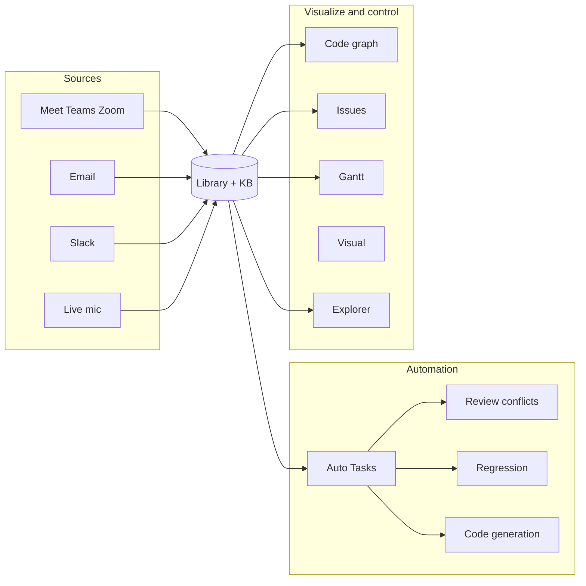
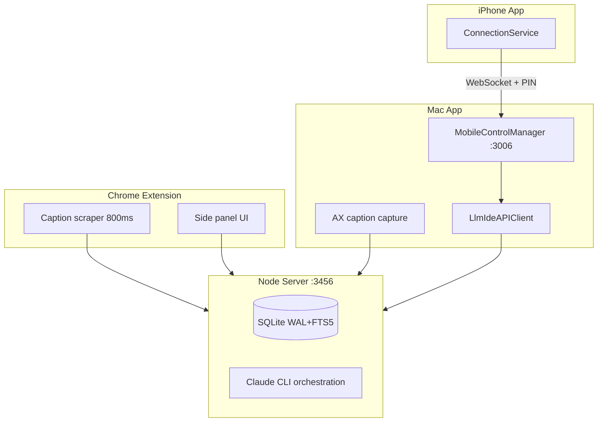

# LLM-IDE

> End-to-end AI meeting intelligence — from live transcription to dispatched tickets, draft PRs, and a self-learning knowledge base. Runs entirely on `127.0.0.1`.

[](./extension/package.json)
[](./docs/reference/api/openapi.yaml)
[](./extension/manifest.json)
[](#license)

## What this is

A Chrome extension + native macOS app + local Node server that captures meetings, generates plans, and dispatches the work. Nothing leaves your machine unless you approve a delivery action.

## System at a glance

**Library is the hub.** Every source (meetings, email, Slack, files) lands in the knowledge base. From there you search, plan, automate, visualize, and dispatch — all on `127.0.0.1`.

<p align="center">
  
</p>

<p align="center">
  
</p>

| Pillar | What you get | Mac | Extension | iPhone |
|--------|----------------|-----|-----------|--------|
| **Sources** | Meet · Teams · Zoom · live mic · **Email** · **Slack** → notes in Library | ✅ full ingest | ✅ web CC capture | — |
| **Library** | Unified notes, code, data, plugins · FTS5 search · re-summarize | ✅ hub | ✅ meetings | — |
| **Automation** | **Auto Tasks**: review code/doc/conflicts, regression, doc & knowledge gen, issue/plan updates | ✅ run + configure | — | ✅ monitor + run |
| **Code** | Explorer chat, codegen, workflows, guardrails, PR/ticket dispatch | ✅ | — | ✅ Explorer |
| **Visualize** | **Code graph**, **Issues**, **Gantt**, **Visual**, conflicts, regression panel | ✅ | — | — |
| **Control** | Source control, search, live session, settings, mobile pairing | ✅ | side panel | companion |



**Auto Tasks (scheduled on Mac, mirror on iPhone):** review code · review doc · review conflicts · regression sweep · generate documentation · generate knowledge · update issues · update plan status.

**Integrations (opt-in dispatch):** GitHub · GitLab · Backlog · Linear · Slack webhooks.

## Architecture (reality check)

Four surfaces share one local backend. All traffic stays on `127.0.0.1` unless you explicitly allow remote bind.



| Surface | Role | Default port |
|---------|------|--------------|
| Chrome extension | Meet/Teams/Zoom web CC capture + side panel | talks to `:3456` |
| Node server | Auth, KB, AI orchestration, persistence | `127.0.0.1:3456` |
| macOS app | Full KB, code assistant, AX capture, mobile server | `:3456` client; `:3006` mobile |
| iPhone app | Companion — chat, explorer, auto-tasks (no remote desktop) | WebSocket to Mac `:3006` |

Deep dive: [Architecture overview](docs/explanation/architecture.md) · [Engineering invariants](docs/explanation/invariants.md) · [Naming convention](docs/decisions/0016-naming-convention.md)

### Naming

| Context | Form | Example |
|---------|------|---------|
| User-visible brand | **LLM-IDE** | menus, extension title, docs |
| Repo / package slug | **llm-ide** | `github.com/…/llm-ide`, npm package |
| Code identifiers | **LlmIde** | `LlmIdeMac`, `LlmIdeAPIClient` |
| Wire / bundle | **llmide** | `com.llmide.macapp`, `llmide://` |

## Quick Start (3 Minutes)

```bash
git clone git@github.com:dnsmalla/llm-ide.git
cd llm-ide
./setup.sh
cd extension && npm run server
```

Then load `extension/dist/` as an unpacked Chrome extension. Full tutorial: [Record your first meeting](docs/tutorials/01-first-meeting.md).

---

## Complete Installation Guide (For Beginners)

### Prerequisites

Before installing LLM-IDE, you need:

- **macOS 14+** (for native macOS app)
- **Node.js 20+** - [Download](https://nodejs.org/) (includes npm)
- **Claude CLI** - [Install guide](https://docs.claude.com/en/docs/claude-code/quickstart)
- **Git** - Usually pre-installed on macOS
- **Chrome Browser** - For the extension

**Check what you have:**
```bash
node --version        # Should be v20+
npm --version         # Should be v10+
claude --version      # Should work
git --version         # Should work
```

---

### Step 1: Clone the Repository

```bash
# Clone the repo (replace URL with your fork/remote)
git clone git@github.com:dnsmalla/llm-ide.git
cd llm-ide

# Verify the structure
ls -la
# Should see: docs/, extension/, mac/, CLAUDE.md, README.md, setup.sh
```

---

### Step 2: Run Setup (Installs Everything)

```bash
# This installs Node dependencies and verifies requirements
./setup.sh

# Wait for it to complete. You should see:
# ✅ Node.js detected: v20.x.x
# ✅ npm detected: v10.x.x
# ✅ Backend dependencies compiled successfully!
# ✅ Claude CLI detected
```

If setup fails, see [Troubleshooting](#troubleshooting) below.

---

### Step 3: Start the Node Server (One Terminal)

The Node server handles API requests and meetings storage.

```bash
cd extension
npm run server

# You should see:
# Server listening on http://127.0.0.1:3456
# ✓ Database initialized
```

**Keep this terminal running** — the server must stay active.

---

### Step 4: Load Chrome Extension (Browser)

The extension captures meeting audio and sends it to the server.

1. **Open Chrome** and go to: `chrome://extensions`
2. **Enable** "Developer mode" (toggle in top-right)
3. **Click** "Load unpacked"
4. **Select folder:** `llm-ide/extension/dist/`
5. **Verify:** Extension appears in toolbar, small icon visible

---

### Step 5: Build macOS App (Another Terminal)

```bash
cd mac
swift build

# You should see:
# Build complete! (X.XXs)
# Product: .build/debug/LlmIdeMac (executable)
```

To run the app:
```bash
swift build
# Then open the built app from Finder:
# llm-ide/mac/.build/debug/LlmIdeMac

# Or build and run in one step:
swift run LlmIdeMac
```

---

## Usage

### 1. **Web Version (Chrome Extension)**
   - Open any Google Meet, Microsoft Teams, or Zoom call
   - Extension auto-captures captions
   - Click extension icon to see notes and generate AI outputs
   - Download results as DOCX or Markdown

### 2. **macOS App**
   - Standalone app for meetings, code workflows, and AI assistance
   - Full knowledge base with search
   - Access to Issues, Gantt, and Code Assistant
   - Launch from Applications or via `swift run LlmIdeMac`

### 3. **Server API**
   - REST API runs on `http://127.0.0.1:3456`
   - Used by both extension and macOS app
   - Full docs: [API Reference](docs/reference/api/overview.md)

---

## After Pulling New Code

If you pull updates from git, always run setup again:

```bash
git pull origin main
./setup.sh          # Reinstalls dependencies if needed
cd extension && npm run server  # Restart server
```

See [FIRST_TIME_SETUP.md](FIRST_TIME_SETUP.md) for detailed post-pull guide.

---

## Development Commands

```bash
# Terminal 1: Start Node server
cd extension && npm run server

# Terminal 2: (Optional) Run tests
cd extension && npm test

# Terminal 3: Build/run macOS app
cd mac && swift build
cd mac && swift run LlmIdeMac

# Mac unit tests (requires full Xcode — not Command Line Tools alone)
cd mac && swift test --filter ChatSessionStoreTests

# Extension development
cd extension
npm run dev          # Watch mode with hot reload
npm run build        # Production build
npm run type-check   # TypeScript check only
```

---

## Troubleshooting

### ❌ "Cannot find module 'docx'"
**Solution:** Run setup again
```bash
./setup.sh
```

### ❌ "node: command not found"
**Solution:** Install Node.js from https://nodejs.org/
```bash
node --version  # Should work after install
```

### ❌ "claude: command not found"
**Solution:** Install Claude CLI
```bash
# Follow: https://docs.claude.com/en/docs/claude-code/quickstart
claude login    # Then authenticate
```

### ❌ "Port 3456 already in use"
**Solution:** Another server instance is running
```bash
# Kill existing process
lsof -i :3456
kill -9 <PID>

# Then restart
cd extension && npm run server
```

### ❌ "Swift build fails" (macOS)
**Solution:** Update Xcode Command Line Tools
```bash
xcode-select --install
# Then retry: swift build
```

### ❌ "Chrome extension not updating"
**Solution:** 
1. Go to `chrome://extensions`
2. Click refresh button on LLM-IDE extension
3. Hard refresh the page (Cmd+Shift+R)

### ❌ "Settings/data lost after pull"
**Solution:** Your local data is safe
- Local meetings in `kb/data.db` (gitignored)
- Settings in `~/.llmide/` (user-specific)
- Only code is pulled, never your data

---

## Project Structure

```
llm-ide/
├── extension/          Chrome extension + Node server
│   ├── server.mjs      Main HTTP server (127.0.0.1:3456)
│   ├── kb/             SQLite knowledge base
│   ├── src/            React UI (Chrome panel)
│   ├── dist/           Built extension (load in Chrome)
│   └── package.json    Node dependencies
│
├── mac/                SwiftUI macOS app
│   ├── Sources/        Swift source code
│   ├── Tests/          Test suite
│   └── Package.swift   Swift configuration
│
├── docs/               Engineering documentation
├── CLAUDE.md           Project instructions
└── setup.sh            Automated setup script
```

---

## Next Steps

1. ✅ Completed setup? → [Record your first meeting](docs/tutorials/01-first-meeting.md)
2. Want to understand the system? → [Architecture overview](docs/explanation/architecture.md)
3. Want to contribute? → [How to contribute](docs/how-to/contribute.md)
4. Need help? → Check [Troubleshooting](#troubleshooting) above

---

## Mobile control

Use your iPhone as an LLM-IDE companion via the **native Mac WebSocket server** (no external Node agent):

- **LLM-IDE Chat** — Ask questions from iPhone (streamed via Mac → local server)
- **Explorer** — Browse and chat with Mac explorer sessions
- **Auto Tasks** — Toggle and inspect scheduled auto-code tasks
- **Pairing** — Bonjour discovery, Direct IP + PIN, or QR scan from Mac Settings

📱 **Quick start:** [docs/mobile/quick-start.md](docs/mobile/quick-start.md)

**Loopback check:** `swift scripts/mobile/verify-native-pairing.swift` — verifies native server pairing on `127.0.0.1:3006`

## Documentation

📚 **Full docs:** https://grid-devs.gitlab.io/personal/dinesh/notes-extension/

Common entry points:

- [System architecture](docs/explanation/architecture.md)
- [API overview](docs/reference/api/overview.md)
- [Engineering invariants](docs/explanation/invariants.md) — read before changing the hot paths
- [Decisions index](docs/decisions/) — ADRs 0001–0015
- [How to contribute](docs/how-to/contribute.md)

## Project layout

```
llm-ide/
├── docs/         engineering docs — see docs site
├── extension/    Chrome extension + local Node server
├── mac/          SwiftUI macOS app
└── kb/           per-install SQLite (gitignored content)
```

## License

MIT.
