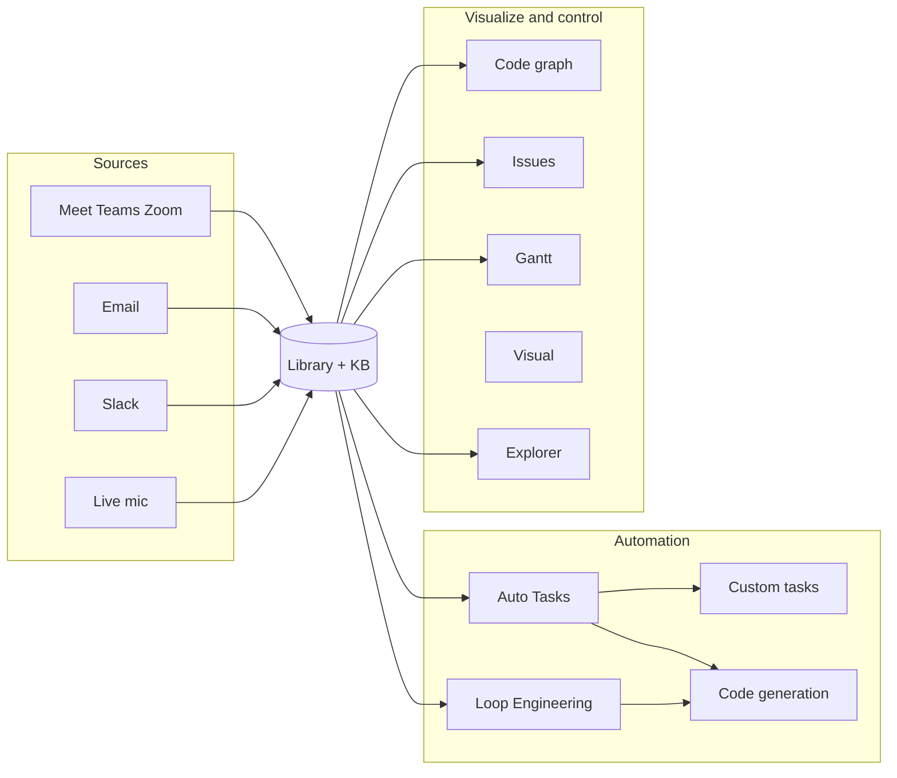
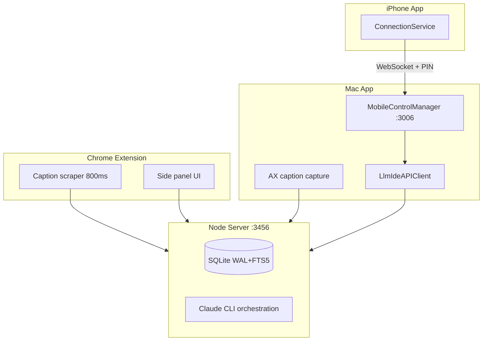

# LLM-IDE

> Local-first AI workspace — capture meetings and sources, plan in a searchable library, automate code review and implementation, and dispatch to GitHub/GitLab/tickets. Everything runs on `127.0.0.1` unless you approve an outbound action.

[](./extension/package.json)
[](./docs/reference/api/openapi.yaml)
[](./extension/manifest.json)
[](#license)

## What this is

A **Chrome extension**, **native macOS app**, **iPhone companion**, and **local Node server** that share one knowledge base. Capture from meetings, email, Slack, and files; search and plan; run scheduled **Auto Tasks** (review, implement, regression, doc gen); visualize code and issues; dispatch work when you approve it.

Nothing leaves your machine unless you explicitly trigger a delivery action.

## System at a glance

**Library is the hub.** Every source (meetings, email, Slack, Box, repos) lands in the KB. From there you search, plan, automate, visualize, and dispatch — all on `127.0.0.1`.

<p align="center">
  
</p>

<p align="center">
  
</p>

| Pillar | What you get | Mac | Extension | iPhone |
|--------|----------------|-----|-----------|--------|
| **Sources** | Meet · Teams · Zoom · live mic · **Email** · **Slack** · Box → notes in Library | ✅ full ingest | ✅ web CC capture | — |
| **Library** | Unified notes, code, data, plugins · FTS5 search · re-summarize | ✅ hub | ✅ meetings | — |
| **Automation** | **13 built-in Auto Tasks** + **custom tasks** (review/implement mode, per-task cron) · **Loop Engineering** | ✅ run + configure | — | ✅ monitor + run |
| **Code** | Explorer chat, codegen, workflows, guardrails, PR/ticket dispatch | ✅ | — | ✅ Explorer |
| **Visualize** | **Code graph**, **Issues**, **Gantt**, **Visual**, conflicts, **Loop Engineering** | ✅ | — | — |
| **Control** | Source control, search, live session, settings, mobile pairing | ✅ | side panel | companion |



**Built-in Auto Tasks (13, cron-schedulable on Mac, mirrored on iPhone):**

| Pipeline | Tasks |
|----------|--------|
| Ingest → issues | Source Update · Sources → Issue · Implement Issues · Review & Merge |
| Review | Review Code · Review Doc · Review Conflicts · Regression |
| Generate | Knowledge · Generate Documentation |
| Maintain | Update Issues · Update Plan Status · **Loop Engineering** |

**Custom Auto Tasks** — create your own name + prompt; choose **Review** (discard edits) or **Implement** (commit on `fix/custom-*` branch); optional **cron** per task.

**Integrations (opt-in dispatch):** GitHub · GitLab · Backlog · Linear · Slack webhooks.

## Architecture

Four surfaces share one local backend. All traffic stays on `127.0.0.1` unless you set `LLMIDE_ALLOW_REMOTE=1`.



| Surface | Role | Default port |
|---------|------|--------------|
| Chrome extension | Meet/Teams/Zoom web CC capture + side panel | talks to `:3456` |
| Node server | Auth, KB, AI orchestration, persistence | `127.0.0.1:3456` |
| macOS app | Full KB, code assistant, AX capture, mobile server | `:3456` client; `:3006` mobile |
| iPhone app | Companion — chat, explorer, auto-tasks (no remote desktop) | WebSocket to Mac `:3006` |

Deep dive: [Architecture overview](docs/explanation/architecture.md) · [Engineering invariants](docs/explanation/invariants.md) · [Project folder layout](docs/reference/project-layout.md) · [Naming convention](docs/decisions/0016-naming-convention.md)

### Naming

| Context | Form | Example |
|---------|------|---------|
| User-visible brand | **LLM-IDE** | menus, extension title, docs |
| Repo / package slug | **llm-ide** | `github.com/…/llm-ide`, npm package |
| Code identifiers | **LlmIde** | `LlmIdeMac`, `LlmIdeAPIClient` |
| Wire / bundle | **llmide** | `com.llmide.macapp`, `llmide://` |

## Quick Start (3 Minutes)

```bash
git clone --recurse-submodules git@github.com:dnsmalla/llm-ide.git
cd llm-ide
./setup.sh          # npm install, .skills submodule, agent symlinks, git hooks
cd extension && npm run server
```

Then load `extension/dist/` as an unpacked Chrome extension. Full tutorial: [Record your first meeting](docs/tutorials/01-first-meeting.md).

> Already cloned without `--recurse-submodules`? Run `./setup.sh` — it initializes `.skills` automatically.

---

## Complete Installation Guide (For Beginners)

### Prerequisites

- **macOS 14+** (for native macOS app; iPhone app needs Xcode + physical device)
- **Node.js 20+** — [Download](https://nodejs.org/)
- **Claude CLI** — [Install guide](https://docs.claude.com/en/docs/claude-code/quickstart) (`claude login`)
- **Git** — pre-installed on macOS
- **Chrome** — for the extension
- **Xcode** (optional) — required for `swift test` / full Mac unit tests; `swift build` works with Command Line Tools

**Check what you have:**

```bash
node --version        # v20+
npm --version         # v10+
claude --version      # should work
git --version
swift --version       # optional, for Mac app
```

### Step 1: Clone the Repository

```bash
git clone --recurse-submodules git@github.com:dnsmalla/llm-ide.git
cd llm-ide
ls -la   # docs/ extension/ mac/ ios_app/ .skills/ setup.sh
```

### Step 2: Run Setup

```bash
./setup.sh
# ✅ Node.js, npm, backend deps (better-sqlite3)
# ✅ Claude CLI
# ✅ .skills submodule + agent symlinks (Claude / Cursor / Codex / …)
# ✅ git hooks (pre-push runs make regression when mac/ changes)
```

If setup fails, see [Troubleshooting](#troubleshooting).

### Step 3: Start the Node Server

```bash
cd extension && npm run server
# Server listening on http://127.0.0.1:3456
```

Keep this terminal running.

### Step 4: Load Chrome Extension

1. Open `chrome://extensions`
2. Enable **Developer mode**
3. **Load unpacked** → select `llm-ide/extension/dist/`
4. Pin the extension icon in the toolbar

### Step 5: Build macOS App

```bash
cd mac && swift build
swift run LlmIdeMac    # or open .build/debug/LlmIdeMac
```

---

## Usage

### Chrome Extension
- Open Google Meet, Microsoft Teams, or Zoom (web)
- Extension captures **live captions** (not microphone audio)
- Side panel: notes, questions, entities, DOCX export

### macOS App
- Native AX caption capture, full Library, Issues, Gantt, Code Assistant
- **Auto Tasks** page: built-in + custom tasks, cron schedules, Loop Engineering
- **Explorer** + codegen workflows with guardrails

### iPhone Companion
- Pair via Bonjour or Direct IP + PIN (Mac Settings → Mobile Control)
- Chat, Explorer sessions, Auto Task monitor/run
- See [Mobile quick start](docs/mobile/quick-start.md)

### Server API
- REST on `http://127.0.0.1:3456` — used by extension, Mac, and mobile proxy
- [API Reference](docs/reference/api/overview.md)

---

## After Pulling New Code

```bash
git pull origin main
./setup.sh                    # deps, submodule, skills symlinks
cd extension && npm run build # refresh extension/dist if UI changed
cd extension && npm run server
```

See [FIRST_TIME_SETUP.md](FIRST_TIME_SETUP.md) for the post-pull checklist.

---

## Development Commands

```bash
# Terminal 1: Node server
cd extension && npm run server

# Terminal 2: Extension dev (hot reload)
cd extension && npm run dev

# Terminal 3: Mac app
cd mac && swift run LlmIdeMac

# Tests
make test              # extension (Node test runner)
make test-mac          # macOS (requires full Xcode)
make regression        # pre-push gate (build + tests where available)

# Lint / docs
make lint && make format
make docs-serve        # localhost:8000
```

Central agent skills live in the [`.skills`](https://github.com/dnsmalla/skills) submodule. Refresh after pull:

```bash
git submodule update --init --recursive .skills
bash scripts/install-skills.sh
cd extension && npm run sync:skills   # agent tool defs only
```

---

## Troubleshooting

### ❌ "Cannot find module 'docx'" or other npm errors
```bash
./setup.sh
# or: rm -rf extension/node_modules && npm ci --prefix extension
```

### ❌ "node: command not found"
Install Node.js 20+ from https://nodejs.org/

### ❌ "claude: command not found"
Install and authenticate: https://docs.claude.com/en/docs/claude-code/quickstart → `claude login`

### ❌ "Port 3456 already in use"
```bash
lsof -i :3456 && kill -9 <PID>
cd extension && npm run server
```

### ❌ "Swift build fails"
```bash
xcode-select --install
cd mac && swift build
```

### ❌ "No such module 'XCTest'" when running swift test
Full **Xcode** is required (Command Line Tools alone is not enough). `swift build` still works.

### ❌ Chrome extension not updating
Refresh on `chrome://extensions`, then hard-reload the meeting tab (Cmd+Shift+R).

### ❌ Settings/data lost after pull
Your data is safe — only code is pulled:
- Meetings/KB: `kb/` (gitignored per install)
- User settings: `~/.llmide/`

---

## Project Structure

```
llm-ide/
├── extension/          Chrome extension + Node server (:3456)
│   ├── server.mjs      HTTP entry (no framework)
│   ├── kb/             SQLite + FTS5 + migrations
│   ├── connectors/     GitHub, GitLab, Slack, Box, …
│   ├── agents/         Planner, codegen, dispatch pipelines
│   ├── src/            React side panel + content scripts
│   └── dist/           Built extension (load in Chrome)
├── mac/                SwiftUI macOS app
│   ├── Sources/LlmIdeMac/
│   └── Tests/
├── ios_app/            iPhone companion (SwiftUI)
├── .skills/            Central agent skills submodule
├── scripts/            setup helpers, mobile verify, install-skills
├── docs/               MkDocs site (architecture, API, ADRs)
├── kb/                 Runtime SQLite (gitignored content)
├── setup.sh            One-shot install + skills wiring
└── CLAUDE.md           Agent/developer guide
```

Inside each **project**, LLM-IDE scaffolds `source/{meetings,emails,documents}/`, `llm-doc/`, `code/`, `system/`, etc. See [Project folder layout](docs/reference/project-layout.md).

---

## Mobile Control

Native Mac WebSocket server on `:3006` (Bonjour `_llmide._tcp` + PIN pairing). No external Node agent.

| Feature | Description |
|---------|-------------|
| **LLM-IDE Chat** | Ask from iPhone; Mac proxies to `:3456` |
| **Explorer** | List and chat with Mac explorer sessions |
| **Auto Tasks** | Toggle and inspect scheduled tasks |
| **Pairing** | QR / PIN from Mac Settings → Mobile Control |

📱 [docs/mobile/quick-start.md](docs/mobile/quick-start.md)

**Loopback check:** `swift scripts/mobile/verify-native-pairing.swift`

---

## Documentation

📚 **Full docs site:** https://grid-devs.gitlab.io/personal/dinesh/notes-extension/

| Topic | Link |
|-------|------|
| Architecture | [docs/explanation/architecture.md](docs/explanation/architecture.md) |
| Invariants (read before changing hot paths) | [docs/explanation/invariants.md](docs/explanation/invariants.md) |
| API overview | [docs/reference/api/overview.md](docs/reference/api/overview.md) |
| Project folder layout | [docs/reference/project-layout.md](docs/reference/project-layout.md) |
| Architecture decisions | [docs/decisions/](docs/decisions/) (ADRs 0001–0016) |
| Central skills install | [docs/how-to/install-central-skills.md](docs/how-to/install-central-skills.md) |
| Contribute | [docs/how-to/contribute.md](docs/how-to/contribute.md) |

---

## Next Steps

1. ✅ Setup done → [Record your first meeting](docs/tutorials/01-first-meeting.md)
2. Configure Auto Tasks → Mac app → **Auto Tasks** (built-in + custom)
3. Pair iPhone → [Mobile quick start](docs/mobile/quick-start.md)
4. Understand the system → [Architecture overview](docs/explanation/architecture.md)

---

## License

MIT.
