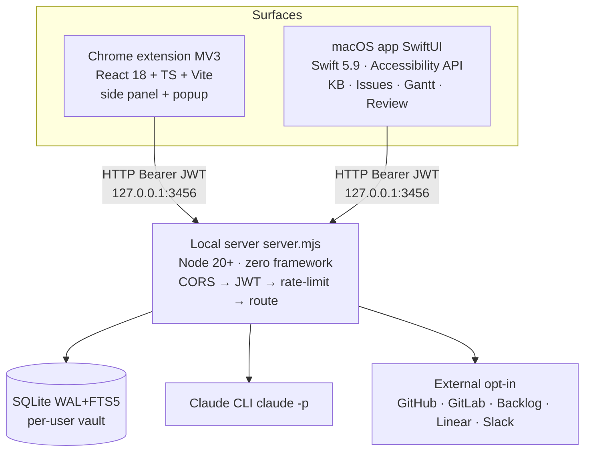

# System architecture

System-wide architecture for LLM IDE. For server-internal details (request pipeline, vault, audit log, tenancy invariants), see [`server-internals.md`](server-internals.md).

## Goals

- **Local-first.** All data and AI calls run through a server bound to `127.0.0.1`. Nothing leaves the machine unless the user approves a delivery action (GitHub PR, Slack webhook, ticket dispatch).
- **Multi-surface, one backend.** A Chrome extension and a native macOS app talk to the same local HTTP API and the same SQLite knowledge base.
- **AI as a tool, not a service.** The Claude CLI is the always-available baseline — the server shells out to it when a user has no stored key. Users may **optionally** add a per-user API key (Claude / OpenAI / Google / OpenAI-compatible) via the encrypted vault, which the server then prefers so multi-user installs bill each user's own account. See [ADR-0015](../decisions/0015-multi-provider-vaulted-api-keys.md).
- **Outcome-aware.** Dispatched work (PRs, tickets) is polled and the result lands back in the KB, so future planning is grounded in what actually happened.

## Components



## Data flow — meeting to outcome

1. **Capture.** The content script in `extension/src/content/caption-scraper.ts` reads platform CC every 800 ms, applies content filters, and emits `CAPTION_FINAL { sessionId, speaker, text, lang }` messages. On macOS, the Swift app uses the Accessibility API for the same purpose.
2. **Live ingest.** Each finalised utterance POSTs to `/kb/live/<id>/append`. The server writes to `meetings` + `entities` and refreshes the FTS5 index.
3. **Notes & extraction.** When the meeting ends, the client calls `/generate-notes`, `/extract-entities`, and (on request) `/generate-questions`. The server wraps user content in `<<<BEGIN>>>…<<<END>>>` fences and shells out to `claude -p`.
4. **Planning.** `/kb/generate-plan` grounds the planner in KB search results. `/kb/analyze-risks` and `/kb/code-sync` (FTS5 against indexed code) annotate each task.
5. **Action.** `/kb/generate-code` produces a diff; the guardrail engine inspects it for secrets, PII, path traversal, and destructive ops. Findings push the item to the review queue (`review_items`).
6. **Dispatch.** On approval, agents in `extension/agents/` open a draft GitHub PR (`llmide/auto/<task>` branch, files under `.llmide-auto/<task>/`), file a ticket, or send a Slack webhook.
7. **Outcome polling.** `outcome-watcher.mjs` polls GitHub / Backlog / Linear at a slow cadence and writes the result back into the `outcomes` table.

## Tenancy

Every owned row carries a `user_id` foreign key. Three invariants:

1. **No bare-user functions.** Every state-mutating helper in `kb/db.mjs` takes `userId` as its first parameter. `requireUser` panics if missing.
2. **FTS5 is shared but hydration is scoped.** Cross-tenant hits exist in the index; the `findContext` / `search` paths drop any hit whose hydration query (filtered by `user_id`) returns nothing.
3. **The router enforces the gate.** `kb/router.mjs` reads `req.user.id` and threads it through every call. Missing user → 401.

Pre-existing rows from earlier single-user installs are back-filled to `user_id = 'legacy'` by migration `0002_multitenancy.sql`.

## Security model

| Control | Implementation |
|---|---|
| Network | Bound to `127.0.0.1`. CORS allowlist: `chrome-extension://<id>`, `localhost`, `127.0.0.1`. Origin is echoed, never `*`. |
| Auth | JWT HS256, 15-minute access tokens. Refresh tokens are opaque base64url, hashed (sha256) at rest, rotate on every refresh. |
| Password | Bcrypt cost 12. Unknown-email login compares against a sentinel hash so timing can't reveal account existence. |
| Vault | `user_secrets(user_id, key, ciphertext)` where ciphertext = `version \|\| iv(12) \|\| aes-256-gcm(plaintext) \|\| tag(16)`. Per-user data key =`HKDF-SHA256(masterKey, salt=userId, info='llmide-vault-v1')`. |
| Allowed secret keys | 11 total — `github.token`, `backlog.apiKey`, `linear.apiKey`, `slack.webhookUrl`, `slack.botToken`, `email.imapPassword`, `claude.apiKey`, `openai.apiKey`, `google.apiKey`, `custom.apiKey`, `custom.baseUrl`. Authoritative list in `server/vault.mjs`; see [`spec/knowledge-base.md`](../spec/knowledge-base.md) §6. |
| Rate limiting | Token-bucket per `(profile, scope)`. Scope = `userId` for authed routes, remote IP for unauthed. 429 carries `Retry-After`. |
| Guardrails | 7 secret patterns, 5 PII patterns, 5 destructive-op patterns. Run at submit AND at approval. |
| Prompt injection | User content fenced with `<<<BEGIN>>>…<<<END>>>`; sanitizer strips those delimiters from input. |
| Audit log | `audit_log(user_id, request_id, ip, ua, action, resource, outcome, detail)` — register, login (success/fail), password change, secret set/delete, logout, high-blast-radius KB ops. JSON `detail` redacts credentials by key name. |

## Storage

SQLite, WAL mode, FTS5, foreign keys on. There is no single schema-version number — each migration under `extension/kb/migrations/` (currently `0001`–`0018`) is recorded in the `schema_migrations` table and applied on server start. The head migration is the effective schema version.

| Table | Contents |
|---|---|
| `meetings`, `entities` | Transcripts, actions, decisions, blockers |
| `sources` | Code chunks, tickets, QA results |
| `plans`, `plan_tasks` | Generated plans and individual tasks |
| `review_items` | Pending and resolved review queue |
| `outcomes` | Dispatch outcomes from GitHub / Backlog / Linear |
| `users`, `user_secrets`, `user_repos`, `user_flags` | Per-user account, vault, allowlist, prefs |
| `agent_feedback` | 👍 / 👎 / 💤 verdicts on agent questions |
| `search` | FTS5 virtual table across the above |

## Key design choices

- **Pure Node `http`, no framework.** Reduces dependency surface and keeps cold start fast. Trade-off: routing and middleware are hand-rolled in `server.mjs`.
- **Claude CLI shell-out instead of API.** Users keep one auth (their Claude login). The server cannot accept an API key. Trade-off: prompt size capped at 500 k chars; concurrency capped by what the CLI can absorb.
- **One SQLite database per install, not per surface.** The macOS app and Chrome extension see the same data because they share the server.
- **Side panel and floating popup mount the same React bundle** and synchronise via `chrome.storage.local` + `chrome.runtime.onMessage`. No separate component tree. (The floating popup was subsequently removed; the pop-out button now deep-links into the native macOS app via `/launch-app` — see ADR-0010.)

## Surface-by-surface

Each top-level directory owns one surface. Start reading where the
description says to start.

- **`extension/server/`** — local HTTP server (Node 20+, pure `http`,
  no framework). Owns the CORS → JWT → rate-limit → route pipeline,
  config (`config.mjs`), and request middleware. Start at
  `server.mjs` and follow the router into `kb/router.mjs`.
- **`extension/kb/`** — SQLite knowledge base. WAL+FTS5, per-user
  vault, append-only migrations under `migrations/`. Start at
  `db.mjs`; every state-mutating helper takes `userId` first.
- **`extension/agents/`** — markdown agent skills. One file per
  skill; YAML frontmatter declares `name`, `description`, `tools`,
  `applies_to`. The planner discovers skills by reading this
  directory.
- **`extension/llm_agent/`** — Claude CLI orchestrator. Wraps `claude
  -p` shell-outs and fences user content with
  `<<<BEGIN>>>…<<<END>>>`. No state of its own.
- **`extension/connectors/`** — outbound integrations (GitHub,
  GitLab, Backlog, Linear, Slack). One file per service; each
  exposes a small set of intent-shaped functions (e.g.
  `openPullRequest`).
- **`extension/guardrails/`** — secret / PII / destructive-op pattern
  scanners. Run at submit AND at approval; findings push to
  `review_items`.
- **`extension/src/`** — React 18 + TS + Vite. The side panel mounts
  the bundle (the floating popup was removed — ADR-0010). Start at
  `src/main.tsx`.
- **`mac/Sources/LlmIdeMac/`** — SwiftUI app. Sub-divides into
  `Models/`, `Services/`, `Views/`, `ViewModels/`. Services follow
  the suffix taxonomy in `CONTRIBUTING.md` (`*Store`, `*Service`,
  `*Client`, `*Manager`, `*Mirror`, `*Router`). Start at
  `LlmIdeMacApp.swift`. See [`spec/macos-app.md`](../spec/macos-app.md) for rebuild-grade detail.
- **`kb/`** — runtime data only: SQLite db, dev secrets, per-user
  vault payloads. Never read this directly from code; go through
  `extension/kb/db.mjs`.

## Wire formats

### HTTP routes by client

The Chrome extension and the Mac app speak to the same server.
The split below is not enforced — either client could call any
route — but reflects what's actually wired today.

**Chrome extension** uses:

- `POST /auth/{login,register,refresh,logout}`
- `POST /kb/live/<id>/append` — streaming caption ingest
- `POST /generate-notes`, `/extract-entities`, `/generate-questions`
- `POST /kb/generate-plan`, `/kb/analyze-risks`, `/kb/code-sync`
- `POST /kb/generate-code` — guardrail-scanned diff producer
- `POST /agents/<name>/dispatch` — ticket / PR / webhook delivery
- `GET  /kb/outcomes/<sessionId>` — poll outcome-watcher results

**Mac app** uses (subset; full list in
`LlmIdeAPIClient.swift`):

- `POST /auth/{login,refresh}`
- `GET  /kb/sessions` — list captured meetings
- `POST /code-assist` — Code Assistant chat turn
- `POST /kb/generate-plan`
- `GET  /kb/library` — meeting note library index

All routes accept `Authorization: Bearer <jwt>` and return JSON.
Errors carry `{ error: { code, message } }`; see
`docs/reference/error-codes.md`.

### Skill markdown

Each file under `extension/agents/` looks like:

```markdown
---
name: open-gitlab-issue
description: Create a new GitLab issue from a meeting action.
tools: [gitlab.createIssue]
applies_to: [extension, mac]
---

# When to use

…prose the planner reads to decide whether to dispatch…
```

How-to: `docs/how-to/add-an-agent-skill.md`.

### `pendingTool` JSON

The Mac app's Code Assistant emits tool-use intents back over a
WebSocket-style channel. Each `pendingTool` message has the shape:

```json
{
  "type": "pendingTool",
  "id": "tool_01H...",
  "name": "update-file",
  "input": {
    "path": "src/foo.ts",
    "diff": "@@ -1,3 +1,3 @@\n-old\n+new\n"
  }
}
```

The client renders the diff in `UpdateFileSheet`, the user
approves, and the result is POSTed back as a `toolResult` message
keyed by the same `id`.

## Cross-references

| Choice | Decision |
|---|---|
| Claude CLI default; optional vaulted API keys | [ADR-0001](../decisions/0001-claude-cli-not-api-key.md) (superseded by [ADR-0015](../decisions/0015-multi-provider-vaulted-api-keys.md)) |
| No HTTP framework | [ADR-0002](../decisions/0002-no-server-framework.md) |
| SQLite FTS5 vs Elastic | [ADR-0003](../decisions/0003-sqlite-fts5-not-elastic.md) |
| Loopback-only bind | [ADR-0004](../decisions/0004-bind-to-localhost-only.md) |
| Strict CORS allowlist | [ADR-0005](../decisions/0005-strict-cors-allowlist.md) |
| Per-user vault key derivation | [ADR-0007](../decisions/0007-per-user-vault-key-hkdf.md) |
| Append-only migrations | [ADR-0008](../decisions/0008-append-only-migrations.md) |
| Global ↔ ask-internal agent split | [ADR-0012](../decisions/0012-global-internal-agent-split.md) |
| Multi-session chat store | [ADR-0013](../decisions/0013-multi-session-chat-store.md) |

## Out of scope (today)

- **Cloud deployment.** The architecture is local-first by design. Self-hosting on a VPS is possible but not the default path.
- **Self-hosted in-meeting bot.** Earlier drafts of the README described a `bot-worker/` Playwright service. That code is not yet in the tree; the [`meeting-agent`](https://github.com/dnsmalla/llm-ide/blob/main/extension/docs/meeting-agent-plan.md) currently ships as a co-pilot only (questions appear as `[agent ?]` rows in your transcript, never typed into the meeting).

## See also

- [`server-internals.md`](server-internals.md) — server internals
- [`../reference/api/overview.md`](../reference/api/overview.md) — HTTP API reference
- [`invariants.md`](invariants.md) — engineering invariants for the extension
