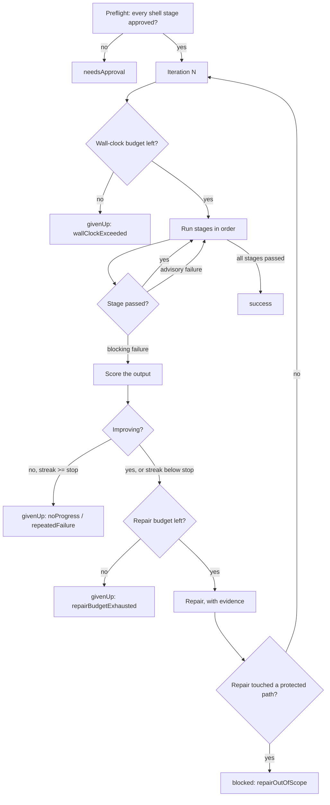

# Loop Engineering

> How LLM-IDE's agentic loop is built, what bounds it, and why a stage that turns green is not automatically a stage that passed.

**Naming.** The feature is **Loop** in the app — the toolbar section, the page
title, the Auto Task row, the Settings card. "Loop Engineering" is the engineering
name for the subsystem and stays in the code (`LoopEngine*` types,
`ShellState.Section.loopEngine`, `AutoTask.loopEngineering`) and in these docs. The
identifiers are deliberately *not* renamed: `Section.loopEngine.rawValue` is the
deep-link payload carried by `.openSection` notifications and stored on activity
feed rows, and `AutoTask.loopEngineering.rawValue` keys `taskErrors` and the
persisted Auto Task toggles — renaming either would break links already written to
disk.

## Why a loop needs engineering

An agent that calls tools until it thinks it is done is a *retry loop*. It has no
notion of whether it is getting closer, no ceiling on what it spends, no record of
what it did, and no defence against the cheapest way to satisfy any check: change
the check. Turning that into a harness means adding four things that have nothing
to do with model capability.

The industry framing that matches this system's shape is a nesting of four loops:

| Level | Loop | LLM-IDE |
|---|---|---|
| 1 | **Agent loop** — call tools until done | Repair via `AgentLoopStageRepairer`; `.skill` generate stages |
| 2 | **Verification loop** — a grader gates the output, failures feed back | Every stage is a grader; failures return to the agent with measured evidence |
| 3 | **Event-driven loop** — cron/webhook, not a human pressing Run | Auto Tasks cron, manual Run |
| 4 | **Hill-climbing loop** — analyse traces, improve the harness itself | Not built. The run journal is its prerequisite and exists now |

## The loop

One run repeats an ordered stage list until every stage passes, a budget is
exhausted, or the run is blocked.



Every iteration re-runs **every** stage from the top, so a fix to a later stage
cannot silently leave an earlier one broken.

## The contract pane

Everything above is decided before a run starts, so the Loop Engineering page puts
it in one place. Panel 1 is the stage list, panel 3 is the live log plus past
runs, and panel 2 answers the questions a user actually has before pressing Run:

| Section | Answers |
|---|---|
| **Overview** | What will run, in what order, which steps generate vs gate, which working tree it runs in, and what bounds it |
| **Template** | Start from a recipe, or save this one for the next project |
| **Selected stage** | Edit the stage picked on the left |
| **Settings** | The four budgets and the protected-path policy |
| **Output** | Every artifact a run writes, with a link to it |

The sections are one scroll rather than four tabs on purpose: "what is this loop
going to do to my repo?" is a single question, and an answer split across tabs is
not an answer. The Overview deliberately says the awkward things out loud — a
pipeline with no gating stage is reported as "nothing gates this run, so it will
pass after one iteration without repairing anything", and a shell stage that has
not been approved is labelled as such, because that stops the run in preflight.

## Where the settings live

Two scopes, and the split matters because the config is never re-derived once a
project has one:

- **Per project** — the stage list and this project's budgets, edited on the Loop
  page. Stages are detected from that repo's own test tooling, which is why they
  cannot be an app-wide setting.
- **App-wide defaults** (`LoopEngineDefaults`, Settings → Loop) — the budgets and
  protected-path policy a project inherits **the first time** its config is
  created. Before this existed, every new project silently started at
  `LoopEngineConfig`'s hardcoded values and had to be re-tuned by hand.

Both surfaces that can create a fresh config — the Loop page and the Auto Task
sweep — seed it through `LoopEngineDefaults.newConfig(stages:)`. If either built
a config directly, the defaults would apply or not depending on which surface the user
happened to open a project from first. The defaults store deliberately holds a
stage-*less* config: a default stage list would override per-project detection,
and reusable stage lists are what templates are for.

## Templates

A `LoopTemplate` is a named stage list plus the budgets and policy it expects —
the knowledge "this is what a docs-refresh loop looks like", made portable. Nine
starters ship:

| Template | Pipeline |
|---|---|
| **Test & Fix** | Regression → Test. The default, and what the loop did before templates existed |
| **Full Verify** | Lint (advisory) → Test → Regression. The pre-merge gate |
| **Regression** | The fault sweep alone |
| **Test** | The test suite alone |
| **Skill Loop** | Skill → Test → Regression. The generate-then-verify shape |
| **Docs Refresh** | Skill → `make docs-check` |
| **Operation App Diagnosis** | Server health → extension build → Mac build → Regression (llm-ide-specific) |
| **System Check** | One stage per llm-ide subsystem (llm-ide-specific) |
| **Plan Director** | Structure-index skill → plan-director skill: consolidate `llm-doc/plans/` into one indexed master plan |

`LoopTemplateStore` holds these plus the user's own saved recipes. It is
**app-wide, not per-project** — carrying a recipe to the next project is the whole
point — and built-ins live in a static constant rather than being persisted, so an
improved starter still reaches a user who has already opened the page.

Two details that matter more than they look:

- A template carries a whole `LoopEngineConfig` rather than a parallel list of
  fields, so a field added to the config is automatically part of every template
  instead of being silently dropped on apply.
- A built-in cannot hardcode `swift test`. Its test stage carries the
  `LoopTemplate.detectedTestCommand` sentinel, which `applied(to:)` replaces using
  `LoopStageDetector` — or **drops the stage entirely** when nothing is detected,
  rather than shipping a command that could never run.

Applying regenerates every stage id, because ids key `VerifyApprovalStore`
approvals: reusing them would let a command approved in one project run unapproved
in another. Apply persists like any other edit, via the Loop page's debounced
autosave — the earlier design deliberately kept Apply unsaved so recipes could be
compared, but edits silently dying on a project switch proved the worse trap, so
the TEMPLATE section now warns that applying replaces and saves.

## Loops

A project holds **several independent loops**, not one pipeline. Each
`LoopDefinition` has its own stage list, budgets, goal/acceptance criteria,
scope allowlist and run history, and each is run on its own — from its row in
the Loop page's LOOPS pane, or by the scheduled Auto Task.

This is the shape the built-in checks take. `LoopStageDetector.defaultLoops`
seeds four, every one of them gated so a repo that is not this one gets
only what applies to it:

| Loop | Its process | Created when |
| --- | --- | --- |
| **Regression** | The fault sweep, then the test suite — find the code behind a fault, repair it, then prove the repair did not break anything | always |
| **Test** | The project's own test command, alone | test tooling is recognised (`swift test`, `npm test`, `make test`, `pytest`) |
| **System Check** | One marker-gated stage per subsystem (Skills, Plugins, Connectors, GitHub dispatch, Backend, iOS ↔ Mac shared protocol, Mac app) | that subsystem's own files are present |
| **Plan** | Two generate-only skill stages: refresh the structure indexes (`llm-doc/plans/INDEX.md` — folder, file, and function indexes), then consolidate every plan collected in `llm-doc/plans/` into the hierarchical, line-limited master plan `PLAN.md` (the `plan-structure-index` and `plan-director` central skills). With no plans collected yet, both stages bootstrap from the code alone — index the codebase and derive a first `proposed` master plan from real signals (oversized files, missing tests, TODOs) — and those indexes ground every plan written later | a git working tree resolves (like Regression — `llm-doc/` lives at the *project* root, which in the clone-into-code layout is not under the git root, so no filesystem marker would be safe) |

They used to be pinned *stages inside one loop*, which meant one iteration
re-ran all of them from the top: a failing Mac-app check dragged the fault
sweep and the whole test suite round again, and the budgets could not tell the
two jobs apart. Splitting them gives each its own iteration count, its own
"what does done mean", and its own place in the journal.

- **A default loop cannot be deleted** (`LoopDefinition.defaultKey` marks it;
  `ensureDefaultLoops` recreates it if it goes missing) — the same invariant
  the pinned stages had. It stays fully editable, and the escape hatches are
  per-stage `enabled` and the loop's own **Runs on schedule**.
- **`runsOnSchedule`** decides whether the scheduled `.loopEngineering` Auto
  Task includes the loop, and it is **opt-in**: every loop is created with it
  off, because creating a loop describes work — it does not consent to that
  work running unattended on a cron. Turn it on per loop from the Loop page
  (⋯ → *Run on schedule*). Loops saved before this was opt-in are switched off
  once per project by `LoopEngineConfigStore.normalizeScheduleOptIn`, which
  records that it ran so a later opt-in is never reverted. Each scheduled loop
  is a **separate run** with its own budgets and journal record; they go one at
  a time only because one working tree cannot host two runs (the runner's
  per-git-root guard).
- **One editable loop is guaranteed.** The built-ins cannot be deleted, so a
  project always keeps a loop of the user's own — "Main Loop", seeded on first
  setup and preserved by the migration below (its built-in stages move out; the
  loop itself stays). It is seeded, not enforced: deleting it later sticks.
- **Exactly one loop is Primary (★), and never a stage-less one.** The phone
  addresses that one — its Start runs *that* loop, not the whole sweep, because
  it only ever shows one loop's stages, log and history. Everything else
  reaches its own loop from the Loop page or the scheduler.
- **A pre-split project is migrated, not re-detected.** The single "Main Loop"
  has its built-in stages moved into the three loops above — commands, renames,
  `enabled` flags and the project's budgets come with them — and survives as an
  ordinary user loop — kept even when the split leaves it with nothing, since it
  is the project's editable loop. `ensureDefaultLoops`
  is idempotent and runs on every load, so this happens once, silently, with no
  action from the user.

## Stages

A stage is one step of the run (`LoopStage`). Three kinds:

- **`regressionSweep`** — re-runs the `RegressionRunner` sweep over the project's
  fault reports. Its own score is the regressed-fault count.
- **`shellCommand`** — an arbitrary project command (`swift test`, `npm test`).
  Requires an explicit approval in `VerifyApprovalStore` before it will ever run.
- **`skill`** — a central skill executed as a *generate* step: it edits the tree,
  and the verify stages decide whether that helped.

Which stages a default loop starts with is `LoopStageDetector`'s decision — see
[Loops](#loops) above.

Three per-stage properties shape how a stage participates:

- **`enabled`** — `true` (default) or `false`. A disabled stage is skipped
  entirely: not run, not preflighted for approval, never gating the run. This is
  the escape hatch for pinned default stages, which cannot be deleted (the
  detector re-adds them on load) — disabling is how a project runs a smaller
  loop than its detected defaults. `ensureDefaultStages` preserves the flag, so
  a disabled default stays disabled across loads.
- **`severity`** — `blocking` (default) or `advisory`. An advisory stage runs, is
  logged, and is journalled, but never triggers repair, never counts toward a
  stall, and never fails the run. This is what makes it safe to put a linter or a
  formatter in the list; as a blocking stage, one formatting nit would consume
  every iteration.
- **`timeoutSeconds`** — per-stage override of the runner's 600 s default. A full
  build-and-test cycle and a two-second format check do not belong under one
  number.

## Verification steers on a measured score

`StageOutputParser` extracts a failing-test count from recognised runners (XCTest,
swift-testing, `node --test`, pytest, jest, `go test`). `ProgressWatch` then
compares successive failures for that stage:

- **Score strictly decreased** → progress. The streak resets and the loop keeps
  going.
- **Score equal or worse** → no progress. The streak increments; at
  `consecutiveFailureStop` the run gives up with `noProgress`.
- **No score** (an unrecognised runner) → fall back to comparing a normalised hash
  of the failure output, which is the pre-score behaviour: identical output
  increments, different output resets. Giving up this way reports
  `repeatedFailure`.

The distinction between the two give-up reasons is diagnostic, and it is the whole
reason for scoring. A hash comparison cannot tell "three failures, then three
*different* failures" (thrashing — stop) from "three failures, then one failure"
(working — continue); both simply look like "the output changed".

The measured delta is also handed to the repair agent as `RepairEvidence`, which
turns a retry into an iteration: the agent is told its last change reduced the
count from 7 to 4, or that the count is unchanged and the change did not work.
Without that, the agent sees the same failure every round and has no way to know
its previous edit did nothing.

## Repairs cannot edit the verifier

The repair prompt asks the agent not to weaken tests. That instruction is
unenforceable on its own — the agent has write access to the whole tree, and for a
stubborn failure the cheapest way to make `swift test` exit 0 is to delete the
failing test. The loop would then observe exit 0 and report success, certifying a
regression as fixed.

`RepairScopeGuard` therefore snapshots the working tree around every repair and
every skill stage, and compares the **newly** dirty paths against a protected set:

1. **Tests** — the assertions that define "passing".
2. **Build and verify config** — `Makefile`, `Package.swift`, `package.json`,
   `pytest.ini`, `.githooks/`. The stage command resolves through these.
3. **The harness's own state** — `system/faults.csv`, `system/faults/`,
   `system/loop-runs/`. Editing the fault list makes a sweep pass directly.

`LoopEngineConfig.extraProtectedGlobs` widens the set per project; it cannot
narrow the built-ins.

| Policy | Effect |
|---|---|
| `revert` (default) | Undo the offending paths, end the run as `blocked` |
| `stop` | Leave the edits for inspection, end the run as `blocked` |
| `warn` | Log it and keep looping |
| `off` | Skip the check entirely (pre-guard behaviour) |

The load-bearing half is that **a stage which turns green only after a protected
edit is not a pass**. Under `revert` and `stop` the run ends immediately and the
stage is never re-verified, so the exit 0 the violation bought is never observed.

Two deliberate limits, both recorded rather than hidden:

- A file that was **already dirty before** the repair is not attributed to the
  agent. Otherwise every run started from a tree with uncommitted test edits — the
  normal state while developing — would be blocked, and the guard would simply be
  switched off.
- When git cannot report (not a working tree, git unavailable) the check is
  **`indeterminate`, never `clean`**, is logged as a warning, and the run
  continues. Refusing to loop at all in those projects would be a worse outcome
  than an unverified repair, which is what every run did before the guard existed.

## Four budgets

| Budget | Field | Terminal status |
|---|---|---|
| Iterations | `maxIterations` (10) | `givenUp(maxIterations)` |
| Non-improving streak per stage | `consecutiveFailureStop` (2) | `givenUp(noProgress)` / `givenUp(repeatedFailure)` / `givenUp(regressionStalled)` |
| Wall clock | `wallClockBudgetSeconds` (3600, `nil` = unlimited) | `givenUp(wallClockExceeded)` |
| Repairs per stage | `maxRepairsPerStage` (3) | `givenUp(repairBudgetExhausted)` |

`maxIterations` alone is not a time budget: ten iterations of a three-minute suite
plus ten LLM repairs is most of an hour, and on the cron trigger nobody is
watching. The wall clock is checked between iterations — "stop starting new work",
not a hard kill of a running stage; that is the per-stage timeout's job. A run
always gets one complete pass, so a budget too small to finish startup produces a
fast failure rather than a confusing no-op.

## Every run is journalled

`LoopEngineRunner`'s live log is in-memory and dies with the app process. The
journal is what survives, written beneath the project root that already holds the
fault reports:

```
system/loop-runs/index.jsonl          # one LoopRunIndexEntry per line, append-only
system/loop-runs/2026-08/<runId>.json # the full LoopRunRecord
```

A record carries the trigger (`manual` / `chat` / `autoTask`), a snapshot of the
config the run actually executed under, and per-iteration per-stage attempts:
duration, exit code, output tail, output hash, score, whether a repair ran, what
it changed, and the scope verdict. The config snapshot matters because the stage
list and its budgets are user-editable — "why did this give up at three
iterations" is unanswerable against today's config.

Two invariants make it trustworthy:

- **Journalling is fail-open.** A write failure is logged and ignored. Telemetry
  observes the work; it never gates it. A full disk is not a reason to refuse to
  fix a failing test.
- **Every exit from `run` journals.** A run rejected at preflight for a missing
  approval still writes a record, so "the cron ran and did nothing" is
  distinguishable from "the cron never ran".

The index is append-only JSONL rather than a rewritten array so a crash mid-append
costs one unparseable line — skipped on read — instead of the whole history.

## Output

The journal is machine-shaped. Everything a run produces is also *findable*, which
is what the Output section is for — each row is a real path with a Reveal link,
and a path nothing has written yet says "not yet" rather than pretending:

| Output | Where |
|---|---|
| Run journal | `system/loop-runs/` — always written |
| Fault state | `system/faults.csv` — refreshed by the Regression stage |
| Working tree | the git root — repair edits land here, review with git before committing |
| Run log | live, panel 3 |
| Summary note | `llm-doc/loop/<yyyy>/<MM>/` — opt-in |

The **summary note** (`LoopRunSummaryWriter`, off by default) is the journal's
human-readable counterpart: a markdown note carrying the outcome, the pipeline,
a per-stage table with failing counts and durations, the files the run changed,
and any protected-path violations called out as violations rather than folded into
"a repair ran". It goes through the same `NoteService` the Source Connectors use,
under its own `loop` note type, so a run lands in the Library — searchable and
filterable by outcome tag alongside meeting and email notes — instead of as a file
you have to know to go looking for. It shares the journal's fail-open contract.

## Finding it in the UI

The Loop is a top-bar section, and its button can be hidden like any other tool
section via **Settings → Menu Bar**. Hiding removes the *button*, not the page —
`.openSection` sets the section directly without consulting the hidden set, so
every other route still works:

- **Settings → Loop → Open Loop** (the deliberate way back in)
- the menu-bar dropdown's open-fault and last-regression rows
- the Code Assistant chat's loop command

Library, Live and Settings remain non-hideable: Library is the fallback landing
every redirect assumes exists, Settings is the only way back once everything else
is hidden, and Live is already gated on capture state. If Loop is set as the Home
landing and then hidden, `resolveHome` falls back to Library.

## Triggers

Both construct their own `LoopEngineRunner` and share one `LoopEngineConfig`
per project (keyed by the stable `Project.id`):

| Trigger | Entry point |
|---|---|
| `manual` | `LoopEngineView` Run button |
| `autoTask` | `AutoCodeUpdateService+PipelineTasks` (cron) |

`LoopRunTrigger` also has a `chat` case, which nothing writes any more: the Code
Assistant chat header carried a Run Loop button until it was removed. The case
stays so journal records written by earlier builds still decode.

A process-wide lock keyed on the symlink-resolved git root rejects a second run
against the same working tree, whichever trigger starts it.

## What is deliberately not built

- **Held-out regression split.** Accepting a fix only at zero regression on a
  held-out set would be stronger than today's single fault list, but it changes
  the `faults.csv` format the in-app Regression view and the release checklist
  both read.
- **Level-4 hill climbing.** Failure clustering, per-stage pass rates, and
  mean-iterations-to-green over the journal, surfaced as harness-change
  *suggestions* requiring approval. Worth building once real journal data exists.

## See also

- [Engineering invariants](invariants.md) — the do-not-regress list, including the
  three Loop Engineering entries.
- [macOS app](macos-app.md) — where the Loop Engine sits in the app.
