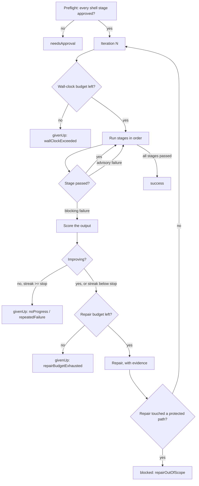

# Loop Engineering

> How LLM-IDE's agentic loop is built, what bounds it, and why a stage that turns green is not automatically a stage that passed.

## Why a loop needs engineering

An agent that calls tools until it thinks it is done is a *retry loop*. It has no
notion of whether it is getting closer, no ceiling on what it spends, no record of
what it did, and no defence against the cheapest way to satisfy any check: change
the check. Turning that into a harness means adding four things that have nothing
to do with model capability.

The industry framing that matches this system's shape is a nesting of four loops:

| Level | Loop | LLM-IDE |
|---|---|---|
| 1 | **Agent loop** — call tools until done | Repair via `AgentLoopStageRepairer`; `.skill` generate stages |
| 2 | **Verification loop** — a grader gates the output, failures feed back | Every stage is a grader; failures return to the agent with measured evidence |
| 3 | **Event-driven loop** — cron/webhook, not a human pressing Run | Auto Tasks cron, chat command, manual Run |
| 4 | **Hill-climbing loop** — analyse traces, improve the harness itself | Not built. The run journal is its prerequisite and exists now |

## The loop

One run repeats an ordered stage list until every stage passes, a budget is
exhausted, or the run is blocked.



Every iteration re-runs **every** stage from the top, so a fix to a later stage
cannot silently leave an earlier one broken.

## Stages

A stage is one step of the run (`LoopStage`). Three kinds:

- **`regressionSweep`** — re-runs the `RegressionRunner` sweep over the project's
  fault reports. Its own score is the regressed-fault count.
- **`shellCommand`** — an arbitrary project command (`swift test`, `npm test`).
  Requires an explicit approval in `VerifyApprovalStore` before it will ever run.
- **`skill`** — a central skill executed as a *generate* step: it edits the tree,
  and the verify stages decide whether that helped.

`LoopStageDetector` seeds two pinned defaults on first use — **Regression**
always, plus a **Test** stage when it recognises the project's test tooling
(`swift test`, `npm test`, `make test`, `pytest`). Both remain editable; neither
can be deleted.

Two per-stage properties shape how a stage participates:

- **`severity`** — `blocking` (default) or `advisory`. An advisory stage runs, is
  logged, and is journalled, but never triggers repair, never counts toward a
  stall, and never fails the run. This is what makes it safe to put a linter or a
  formatter in the list; as a blocking stage, one formatting nit would consume
  every iteration.
- **`timeoutSeconds`** — per-stage override of the runner's 600 s default. A full
  build-and-test cycle and a two-second format check do not belong under one
  number.

## Verification steers on a measured score

`StageOutputParser` extracts a failing-test count from recognised runners (XCTest,
swift-testing, `node --test`, pytest, jest, `go test`). `ProgressWatch` then
compares successive failures for that stage:

- **Score strictly decreased** → progress. The streak resets and the loop keeps
  going.
- **Score equal or worse** → no progress. The streak increments; at
  `consecutiveFailureStop` the run gives up with `noProgress`.
- **No score** (an unrecognised runner) → fall back to comparing a normalised hash
  of the failure output, which is the pre-score behaviour: identical output
  increments, different output resets. Giving up this way reports
  `repeatedFailure`.

The distinction between the two give-up reasons is diagnostic, and it is the whole
reason for scoring. A hash comparison cannot tell "three failures, then three
*different* failures" (thrashing — stop) from "three failures, then one failure"
(working — continue); both simply look like "the output changed".

The measured delta is also handed to the repair agent as `RepairEvidence`, which
turns a retry into an iteration: the agent is told its last change reduced the
count from 7 to 4, or that the count is unchanged and the change did not work.
Without that, the agent sees the same failure every round and has no way to know
its previous edit did nothing.

## Repairs cannot edit the verifier

The repair prompt asks the agent not to weaken tests. That instruction is
unenforceable on its own — the agent has write access to the whole tree, and for a
stubborn failure the cheapest way to make `swift test` exit 0 is to delete the
failing test. The loop would then observe exit 0 and report success, certifying a
regression as fixed.

`RepairScopeGuard` therefore snapshots the working tree around every repair and
every skill stage, and compares the **newly** dirty paths against a protected set:

1. **Tests** — the assertions that define "passing".
2. **Build and verify config** — `Makefile`, `Package.swift`, `package.json`,
   `pytest.ini`, `.githooks/`. The stage command resolves through these.
3. **The harness's own state** — `system/faults.csv`, `system/faults/`,
   `system/loop-runs/`. Editing the fault list makes a sweep pass directly.

`LoopEngineConfig.extraProtectedGlobs` widens the set per project; it cannot
narrow the built-ins.

| Policy | Effect |
|---|---|
| `revert` (default) | Undo the offending paths, end the run as `blocked` |
| `stop` | Leave the edits for inspection, end the run as `blocked` |
| `warn` | Log it and keep looping |
| `off` | Skip the check entirely (pre-guard behaviour) |

The load-bearing half is that **a stage which turns green only after a protected
edit is not a pass**. Under `revert` and `stop` the run ends immediately and the
stage is never re-verified, so the exit 0 the violation bought is never observed.

Two deliberate limits, both recorded rather than hidden:

- A file that was **already dirty before** the repair is not attributed to the
  agent. Otherwise every run started from a tree with uncommitted test edits — the
  normal state while developing — would be blocked, and the guard would simply be
  switched off.
- When git cannot report (not a working tree, git unavailable) the check is
  **`indeterminate`, never `clean`**, is logged as a warning, and the run
  continues. Refusing to loop at all in those projects would be a worse outcome
  than an unverified repair, which is what every run did before the guard existed.

## Four budgets

| Budget | Field | Terminal status |
|---|---|---|
| Iterations | `maxIterations` (10) | `givenUp(maxIterations)` |
| Non-improving streak per stage | `consecutiveFailureStop` (2) | `givenUp(noProgress)` / `givenUp(repeatedFailure)` / `givenUp(regressionStalled)` |
| Wall clock | `wallClockBudgetSeconds` (3600, `nil` = unlimited) | `givenUp(wallClockExceeded)` |
| Repairs per stage | `maxRepairsPerStage` (3) | `givenUp(repairBudgetExhausted)` |

`maxIterations` alone is not a time budget: ten iterations of a three-minute suite
plus ten LLM repairs is most of an hour, and on the cron trigger nobody is
watching. The wall clock is checked between iterations — "stop starting new work",
not a hard kill of a running stage; that is the per-stage timeout's job. A run
always gets one complete pass, so a budget too small to finish startup produces a
fast failure rather than a confusing no-op.

## Every run is journalled

`LoopEngineRunner`'s live log is in-memory and dies with the app process. The
journal is what survives, written beneath the project root that already holds the
fault reports:

```
system/loop-runs/index.jsonl          # one LoopRunIndexEntry per line, append-only
system/loop-runs/2026-08/<runId>.json # the full LoopRunRecord
```

A record carries the trigger (`manual` / `chat` / `autoTask`), a snapshot of the
config the run actually executed under, and per-iteration per-stage attempts:
duration, exit code, output tail, output hash, score, whether a repair ran, what
it changed, and the scope verdict. The config snapshot matters because the stage
list and its budgets are user-editable — "why did this give up at three
iterations" is unanswerable against today's config.

Two invariants make it trustworthy:

- **Journalling is fail-open.** A write failure is logged and ignored. Telemetry
  observes the work; it never gates it. A full disk is not a reason to refuse to
  fix a failing test.
- **Every exit from `run` journals.** A run rejected at preflight for a missing
  approval still writes a record, so "the cron ran and did nothing" is
  distinguishable from "the cron never ran".

The index is append-only JSONL rather than a rewritten array so a crash mid-append
costs one unparseable line — skipped on read — instead of the whole history.

## Triggers

All three construct their own `LoopEngineRunner` and share one `LoopEngineConfig`
per project (keyed by the stable `Project.id`):

| Trigger | Entry point |
|---|---|
| `manual` | `LoopEngineView` Run button |
| `chat` | `CodeAssistantPanel+LoopEngine` |
| `autoTask` | `AutoCodeUpdateService+PipelineTasks` (cron) |

A process-wide lock keyed on the symlink-resolved git root rejects a second run
against the same working tree, whichever trigger starts it.

## What is deliberately not built

- **Held-out regression split.** Accepting a fix only at zero regression on a
  held-out set would be stronger than today's single fault list, but it changes
  the `faults.csv` format the in-app Regression view and the release checklist
  both read.
- **Level-4 hill climbing.** Failure clustering, per-stage pass rates, and
  mean-iterations-to-green over the journal, surfaced as harness-change
  *suggestions* requiring approval. Worth building once real journal data exists.

## See also

- [Engineering invariants](invariants.md) — the do-not-regress list, including the
  three Loop Engineering entries.
- [macOS app](macos-app.md) — where the Loop Engine sits in the app.
