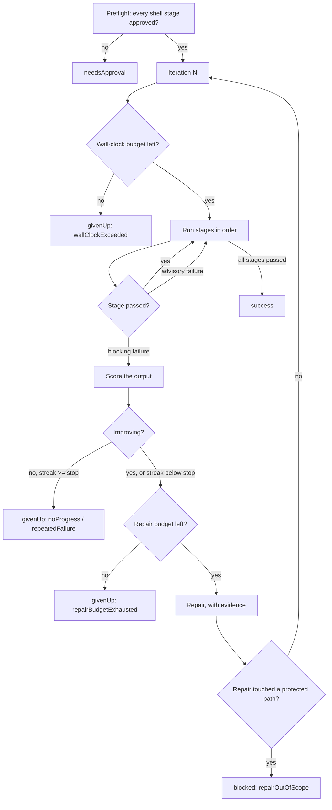

# Loop Engineering

> How LLM-IDE's agentic loop is built, what bounds it, and why a stage that turns green is not automatically a stage that passed.

**Naming.** The feature is **Loop** in the app — the toolbar section, the page
title, the Auto Task row, the Settings card. "Loop Engineering" is the engineering
name for the subsystem and stays in the code (`LoopEngine*` types,
`ShellState.Section.loopEngine`, `AutoTask.loopEngineering`) and in these docs. The
identifiers are deliberately *not* renamed: `Section.loopEngine.rawValue` is the
deep-link payload carried by `.openSection` notifications and stored on activity
feed rows, and `AutoTask.loopEngineering.rawValue` keys `taskErrors` and the
persisted Auto Task toggles — renaming either would break links already written to
disk.

## Why a loop needs engineering

An agent that calls tools until it thinks it is done is a *retry loop*. It has no
notion of whether it is getting closer, no ceiling on what it spends, no record of
what it did, and no defence against the cheapest way to satisfy any check: change
the check. Turning that into a harness means adding four things that have nothing
to do with model capability.

The industry framing that matches this system's shape is a nesting of four loops:

| Level | Loop | LLM-IDE |
|---|---|---|
| 1 | **Agent loop** — call tools until done | Repair via `AgentLoopStageRepairer`; `.skill` generate stages |
| 2 | **Verification loop** — a grader gates the output, failures feed back | Every stage is a grader; failures return to the agent with measured evidence |
| 3 | **Event-driven loop** — cron/webhook, not a human pressing Run | Auto Tasks cron, manual Run |
| 4 | **Hill-climbing loop** — analyse traces, improve the harness itself | Not built. The run journal is its prerequisite and exists now |

## The loop

One run repeats an ordered stage list until every stage passes, a budget is
exhausted, or the run is blocked.


```mermaid
flowchart TD
    A[Preflight: every shell stage approved?] -->|no| N[needsApproval]
    A -->|yes| B[Iteration N]
    B --> C{Wall-clock budget left?}
    C -->|no| W[givenUp: wallClockExceeded]
    C -->|yes| D[Run stages in order]
    D --> E{Stage passed?}
    E -->|yes| D
    E -->|advisory failure| D
    E -->|blocking failure| F[Score the output]
    F --> G{Improving?}
    G -->|no, streak >= stop| H[givenUp: noProgress / repeatedFailure]
    G -->|yes, or streak below stop| I{Repair budget left?}
    I -->|no| J[givenUp: repairBudgetExhausted]
    I -->|yes| K[Repair, with evidence]
    K --> L{Repair touched a protected path?}
    L -->|yes| M[blocked: repairOutOfScope]
    L -->|no| B
    D -->|all stages passed| S[success]
```

Every iteration re-runs **every** stage from the top, so a fix to a later stage
cannot silently leave an earlier one broken.

## The contract pane

Everything above is decided before a run starts, so the Loop Engineering page puts
it in one place. Panel 1 is the stage list, panel 3 is the live log plus past
runs, and panel 2 answers the questions a user actually has before pressing Run:

| Section | Answers |
|---|---|
| **Overview** | What will run, in what order, which steps generate vs gate, which working tree it runs in, and what bounds it |
| **Template** | Start from a recipe, or save this one for the next project |
| **Selected stage** | Edit the stage picked on the left |
| **Settings** | The four budgets and the protected-path policy |
| **Output** | Every artifact a run writes, with a link to it |

The sections are one scroll rather than four tabs on purpose: "what is this loop
going to do to my repo?" is a single question, and an answer split across tabs is
not an answer. The Overview deliberately says the awkward things out loud — a
pipeline with no gating stage is reported as "nothing gates this run, so it will
pass after one iteration without repairing anything", and a shell stage that has
not been approved is labelled as such, because that stops the run in preflight.

## Where the settings live

Two scopes, and the split matters because the config is never re-derived once a
project has one:

- **Per project** — the stage list and this project's budgets, edited on the Loop
  page. Stages are detected from that repo's own test tooling, which is why they
  cannot be an app-wide setting.
- **App-wide defaults** (`LoopEngineDefaults`, Settings → Loop) — the budgets and
  protected-path policy a project inherits **the first time** its config is
  created. Before this existed, every new project silently started at
  `LoopEngineConfig`'s hardcoded values and had to be re-tuned by hand.

Both surfaces that can create a fresh config — the Loop page and the Auto Task
sweep — seed it through `LoopEngineDefaults.newConfig(stages:)`. If either built
a config directly, the defaults would apply or not depending on which surface the user
happened to open a project from first. The defaults store deliberately holds a
stage-*less* config: a default stage list would override per-project detection,
and reusable stage lists are what templates are for.

## Templates

A `LoopTemplate` is a named stage list plus the budgets and policy it expects —
the knowledge "this is what a docs-refresh loop looks like", made portable. Eleven
starters ship:

| Template | Pipeline |
|---|---|
| **Test & Fix** | Regression → Test. The default, and what the loop did before templates existed |
| **Full Verify** | Lint (advisory) → Test → Regression. The pre-merge gate |
| **Regression** | The fault sweep alone |
| **Test** | The test suite alone |
| **Skill Loop** | Skill → Test → Regression. The generate-then-verify shape |
| **Docs Refresh** | Skill → `make docs-check` |
| **Operation App Diagnosis** | Server health → extension build → Mac build → Regression (llm-ide-specific) |
| **System Check** | One stage per llm-ide subsystem (llm-ide-specific) |
| **Plan Director** | Structure-index skill → plan-director skill: consolidate `llm-doc/plans/` into one indexed master plan |
| **Refactoring** | Refactor-planner skill → refactor-apply skill → Test: plan the restructuring in batches, apply one, prove behaviour held |
| **Doc Optimization** | Doc-structure-index skill → doc-writer skill: a generated, code-cited doc tree under `llm-doc/loop/docs/` |

`LoopTemplateStore` holds these plus the user's own saved recipes. It is
**app-wide, not per-project** — carrying a recipe to the next project is the whole
point — and built-ins live in a static constant rather than being persisted, so an
improved starter still reaches a user who has already opened the page.

Two details that matter more than they look:

- A template carries a whole `LoopEngineConfig` rather than a parallel list of
  fields, so a field added to the config is automatically part of every template
  instead of being silently dropped on apply.
- A built-in cannot hardcode `swift test`. Its test stage carries the
  `LoopTemplate.detectedTestCommand` sentinel, which `applied(to:)` replaces using
  `LoopStageDetector` — or **drops the stage entirely** when nothing is detected,
  rather than shipping a command that could never run.

Applying regenerates every stage id, because ids key `VerifyApprovalStore`
approvals: reusing them would let a command approved in one project run unapproved
in another. Apply persists like any other edit, via the Loop page's debounced
autosave — the earlier design deliberately kept Apply unsaved so recipes could be
compared, but edits silently dying on a project switch proved the worse trap, so
the TEMPLATE section now warns that applying replaces and saves.

## Loops

A project holds **several independent loops**, not one pipeline. Each
`LoopDefinition` has its own stage list, budgets, goal/acceptance criteria,
scope allowlist and run history, and each is run on its own — from its row in
the Loop page's LOOPS pane, or by the scheduled Auto Task.

This is the shape the built-in checks take. `LoopStageDetector.defaultLoops`
seeds six, every one of them gated so a repo that is not this one gets
only what applies to it:

| Loop | Its process | Created when |
| --- | --- | --- |
| **Regression** | The fault sweep, then the test suite — find the code behind a fault, repair it, then prove the repair did not break anything | always |
| **Test** | Grow and guard the suite. With a runner: `Test Structure` (native; finds the test roots and writes `llm-doc/loop/test/TEST-STRUCTURE.{md,json}`), `Test Setup` (skill `test-structure-setup`, **disabled** because a runner exists), `Test Structure Check` (fails if Setup ran this run and detection still reports a missing runner or root), `Test Map` (native; ranks untested functions from `system/graph/graph.json`, falling back to file-level matching when the graph is absent, into `TEST-MAP.{md,json}`), `Test Write` (skill `test-gap-writer`; may only create test files), `Test` (the detected command), `Test Ledger` (native; diffs failing tests against `ledger.json`) and `Test Map Check` (fails if Test Write reported changes and the untested-function count did not fall). Without a runner only the first five stages exist, Setup is enabled and Test Write is disabled, and the loop is manual-only; with a runner it stays schedulable because the writer is `testWriteOnly`. A repo with no tests at all gets its structure set up first, then tests written against the map. The pre-upgrade stage set was just the detected command; saved Test loops are upgraded in place (the `test` stage family is at revision 2) and receive the new goal and acceptance criteria unless they were edited | test tooling is recognised (`swift test`, `npm test`, `make test`, `pytest`, `go test ./...` from `go.mod`, `cargo test` from `Cargo.toml`) |
| **System Check** | One marker-gated stage per subsystem (Skills, Plugins, Connectors, GitHub dispatch, Backend, iOS ↔ Mac shared protocol, Mac app) | that subsystem's own files are present |
| **Plan** | Two generate-only skill stages: refresh the structure indexes (`llm-doc/loop/plan/INDEX.md` — folder, file, and function indexes), then consolidate every plan collected in `llm-doc/plans/` into the hierarchical, line-limited master plan `llm-doc/loop/plan/PLAN.md` (the `plan-structure-index` and `plan-director` central skills). With no plans collected yet, both stages bootstrap from the code alone — index the codebase and derive a first `proposed` master plan from real signals (oversized files, missing tests, TODOs) — and those indexes ground every plan written later | a git working tree resolves (like Regression — `llm-doc/` lives at the *project* root, which in the clone-into-code layout is not under the git root, so no filesystem marker would be safe) |
| **Refactoring** | *Plan, apply, verify.* `Refactor Plan` (`refactor-planner` skill) writes `llm-doc/loop/refactor/REFACTOR.md`: small, behaviour-preserving batches `R1`, `R2`, … each `todo`/`done`/`skipped`, toward a professional, AI-friendly structure (CLAUDE.md/AGENTS.md, module boundaries, small focused files, consistent naming, an entry-point index). `Refactor Apply` (`refactor-apply` skill) applies the FIRST `todo` batch only and marks it; `Test` runs the detected test command, so a batch that broke something goes through the ordinary repair/retry — and a retry never re-applies: a code-applying stage runs at most once per run ("… already applied its batch this run; skipped"), so iteration 2 repairs the batch already applied instead of stacking the next one. The loop keeps the normal protected-path policy, but a **code-applying stage** sees `revert`/`stop` as `warn` (`LoopEngineRunner.effectivePolicy`): a move may rewrite the imports in tests and build config, which `revert` would undo alone and leave the tree half-moved, so `Refactor Apply`'s edits are kept, logged and journalled for the Run Changes review (its row still reads passed, listing the touched paths) and `Test` verifies them. `off` stays off and `warn` stays warn. The `Test` stage's repair — and every other stage — keeps the loop's policy, so a repair that edits a test to make it pass is still reverted and blocks the run (weakening, skipping or deleting a test is never allowed). Only a blocking shell stage counts as the verify stage after `Refactor Apply` — the regression sweep and advisory stages do not. Nothing is committed — the changes land in Run Changes for review. **Manual only**: created off the schedule, offered no *Run on schedule*, and skipped by `scheduledLoops` even if the flag is forced on (`LoopDefaultLoopKey.manualOnly`) | a git working tree resolves; **plan-only** (the apply and test stages are omitted) when no test command is detected — code is never edited without a verify stage |
| **Doc Optimization** | `Doc Index` (`doc-structure-index` skill) writes `llm-doc/loop/docs/INDEX.md` — each area of the codebase, its page, and the files/symbols it must cover; `Doc Writer` (`doc-writer` skill) writes or updates every listed page (purpose, logic step by step, key files and functions, invariants, how to change it safely). A **generated** tree — hand-written docs are never edited — whose every code claim is cited as a backticked repo-relative path, `path:line`, or bare symbol name, so the code graph can link each page to the code it explains. The Input and Output resolve against the **repo (git) root only** — the tree lives inside the repo, never the project root's `llm-doc/` (they land in `<repo>/llm-doc/loop/docs/`), because docs outside the git tree are never scanned and so could never be linked. The citation edges reach the server's find-code ("documented by") through the code-graph upload's citation overlay; the graph views keep rendering the code graph without doc nodes | a git working tree resolves |

They used to be pinned *stages inside one loop*, which meant one iteration
re-ran all of them from the top: a failing Mac-app check dragged the fault
sweep and the whole test suite round again, and the budgets could not tell the
two jobs apart. Splitting them gives each its own iteration count, its own
"what does done mean", and its own place in the journal.

- **A default loop cannot be deleted** (`LoopDefinition.defaultKey` marks it;
  `ensureDefaultLoops` recreates it if it goes missing) — the same invariant
  the pinned stages had. It stays fully editable, and the escape hatches are
  per-stage `enabled` and the loop's own **Runs on schedule**.
- **`runsOnSchedule`** decides whether the scheduled `.loopEngineering` Auto
  Task includes the loop, and it is **opt-in**: every loop is created with it
  off, because creating a loop describes work — it does not consent to that
  work running unattended on a cron. Turn it on per loop from the Loop page
  (⋯ → *Run on schedule*). Loops saved before this was opt-in are switched off
  once per project by `LoopEngineConfigStore.normalizeScheduleOptIn`, which
  records that it ran so a later opt-in is never reverted. Each scheduled loop
  is a **separate run** with its own budgets and journal record; they go one at
  a time only because one working tree cannot host two runs (the runner's
  per-git-root guard).
- **One editable loop is guaranteed.** The built-ins cannot be deleted, so a
  project always keeps a loop of the user's own — "Main Loop", seeded on first
  setup and preserved by the migration below (its built-in stages move out; the
  loop itself stays). It is seeded, not enforced: deleting it later sticks.
- **Exactly one loop is Primary (★), and never a stage-less one.** The phone
  addresses that one — its Start runs *that* loop, not the whole sweep, because
  it only ever shows one loop's stages, log and history. Everything else
  reaches its own loop from the Loop page or the scheduler.
- **A pre-split project is migrated, not re-detected.** The single "Main Loop"
  has its built-in stages moved into the three loops above — commands, renames,
  `enabled` flags and the project's budgets come with them — and survives as an
  ordinary user loop — kept even when the split leaves it with nothing, since it
  is the project's editable loop. `ensureDefaultLoops`
  is idempotent and runs on every load, so this happens once, silently, with no
  action from the user.

## Stages

A stage is one step of the run (`LoopStage`). Four kinds:

- **`testMap`** — a native, deterministic step of the Test loop; the model never runs it. Its `testOp` is one of three operations. `structure` detects the test roots and runners (`mac/Tests/LlmIdeMacTests` with `swift test`, `extension/tests` with `npm test`, and so on) and writes `llm-doc/loop/test/TEST-STRUCTURE.{md,json}`; it fails when Test Setup ran this run and detection still reports a missing runner. `map` reads the code graph at `<repo>/system/graph/graph.json` (or, when absent, falls back to file-level stem matching, recorded as `source: files`) and writes `TEST-MAP.{md,json}`. A function counts as tested when its exact name appears as an identifier or string-literal token in a test file under the matching test root whose name or tokens also match the source file's stem. Untested functions rank first, by fan-in (the `usedBy` count), then file size. A `map` stage placed after Test Write fails when Test Write reported changes and `untestedFunctions` did not fall. `ledger` diffs the Test stage's failing ids against `llm-doc/loop/test/ledger.json` (see "Regressions become faults"). In a worktree run these outputs are written to the main checkout root while reads use the run root; the ledger stage reads and writes `ledger.json`, faults and approvals under that main checkout root.

- **`regressionSweep`** — re-runs the `RegressionRunner` sweep over the project's
  fault reports. Its own score is the failing-fault count (every fault not
  `unchanged` or `repaired`). The sweep's own fault repairs run inside the same
  protected-path guard and transport retry as a stage repair; a repair the
  policy rejects is recorded `repairFailed` without being re-verified. Those
  repairs also honour the loop's scope allowlist (`scopeGlobs`): a fault repair
  that edits outside it is a violation, as a stage repair's would be. A fault
  whose verify command still needs approval ends the run `needs approval`
  instead of retrying.
- **`shellCommand`** — an arbitrary project command (`swift test`, `npm test`).
  Requires an explicit approval in `VerifyApprovalStore` before it will ever run.
- **`skill`** — a central skill executed as a *generate* step: it edits the tree,
  and the verify stages decide whether that helped. When the agent call fails
  (retried once first only when the request provably never reached a running
  agent — could not connect / `ECONNREFUSED`; a timeout, a dropped connection
  or any 5xx is not retried, since the agent may already have edited) the stage is recorded
  **errored**, and a run in which any stage's last attempt errored ends
  `error`, never `success` — a passing verify stage does not launder it (tests
  passing on an untouched tree, or a check passing on an earlier run's files,
  prove nothing about this run); only that stage running cleanly in a later
  iteration does.

Which stages a default loop starts with is `LoopStageDetector`'s decision — see
[Loops](#loops) above.

Three per-stage properties shape how a stage participates:

- **`enabled`** — `true` (default) or `false`. A disabled stage is skipped
  entirely: not run, not preflighted for approval, never gating the run. This is
  the escape hatch for pinned default stages, which cannot be deleted (the
  detector re-adds them on load) — disabling is how a project runs a smaller
  loop than its detected defaults. `ensureDefaultStages` preserves the flag, so
  a disabled default stays disabled across loads.
- **`severity`** — `blocking` (default) or `advisory`. An advisory stage runs, is
  logged, and is journalled, but never triggers repair, never counts toward a
  stall, and never fails the run. This is what makes it safe to put a linter or a
  formatter in the list; as a blocking stage, one formatting nit would consume
  every iteration.
- **`timeoutSeconds`** — per-stage override of the runner's 600 s default. A full
  build-and-test cycle and a two-second format check do not belong under one
  number.

### Where a loop writes what it generates

Everything the default Plan, Refactoring and Doc Optimization loops **generate** lives
under `llm-doc/loop/<loop key>/` — `llm-doc/loop/plan/` (`INDEX.md`, `PLAN.md`,
`areas/`), `llm-doc/loop/refactor/` (`REFACTOR.md`) and `llm-doc/loop/docs/` (the doc
tree, inside the **repo**). The paths come from one place, `LoopOutputLayout`.
`llm-doc/plans/` is **not** loop output: chat's "Save Plan" and the knowledge-base
export write plans there, and the Plan loop reads them from there as its Input — so it
does not move. (`llm-doc/loop/<yyyy>/<MM>/` still holds the dated run-summary notes;
loop keys are never four digits, so the two do not collide.)

A project saved by an older build is brought forward by the ordinary default-stage
revision mechanism (`DefaultRevisionCatalog`, revision 2): a stage whose content still
equals its recorded revision-1 content is replaced, an edited stage is left alone and
shows "update available" with a one-click reset. The loop's goal / acceptance text moves
with it **only if it still equals the text the loop was created with**. At the same time
`LoopOutputMigration` moves the files the upgraded stages had generated (see the
invariant in `invariants.md`).

### How a skill stage's paths are resolved

The Mac resolves a skill stage's Input/Output to **absolute** paths
(`LoopStagePaths`) and sends both forms ("Input: /abs/llm-doc/plans
(llm-doc/plans)"), so the agent never has to infer a folder. The rule mirrors the
stage prompts: absolute paths as given, `.` is the git root, doc stages resolve
against the git root only, and every other stage uses the git root when the
Input (or the Output's parent directory) exists there, else the project root
(an LLM-IDE project, git root at most 3 levels below it). If a resolved path is
outside the git root and the project's `llm-doc`, the stage fails **before** the
agent is called (`Input|Output path … is outside the repo and the project's
llm-doc`) instead of silently writing nothing. The artifact check applies the same parent-folder rule (repo when the file's
parent folder exists there, else the project root). A non-doc stage writing
`llm-doc/…` inside a throwaway sibling worktree is refused up front; a leading
`~` is expanded and containment is case-insensitive.

### How a shell stage runs

A shell stage (and every verify command) runs through `GroupedSubprocess`: `/bin/sh -c`
in its own **process group**, stdin from `/dev/null`. Stop, a timeout, and the
resource guard send SIGTERM and then SIGKILL to the **whole group** (plus any
descendant that left it), so `swift test`'s compiler and test processes stop, not
only the shell. Output is captured as the first 64 KB plus the last 192 KB with an
elision marker between them, and decoded leniently (a non-UTF-8 byte cannot empty
it).

When the shell exits normally, a background process it left behind that **still
holds the output pipe** is stopped after a 2 s drain window, so the stage's result
never waits on it. Background members that **do not** hold the pipe (for example
`server >/dev/null 2>&1 &`) **survive** a normal exit — by design, since a stage
may legitimately start a server for a later stage.

## Verification steers on a measured score

`StageOutputParser` extracts a failing-test count from recognised runners (XCTest,
swift-testing, `node --test`, pytest, jest, `go test`). `ProgressWatch` then
compares successive failures for that stage:

- **Score strictly decreased** → progress. The streak resets and the loop keeps
  going.
- **Score equal or worse** → no progress. The streak increments; at
  `consecutiveFailureStop` the run gives up with `noProgress`.
- **No score** (an unrecognised runner) → fall back to comparing a normalised hash
  of the failure output, which is the pre-score behaviour: identical output
  increments, different output resets. Giving up this way reports
  `repeatedFailure`.
- **Score disappeared** (the last failure had a count, this one has none) → worse,
  never progress: the change broke the build or the test run itself (a compile
  error prints no summary). The next repair is always granted, even at
  `consecutiveFailureStop`, and is told "your last change stopped the tests from
  running" with the first error lines. Count-less failures after that stay
  not-improved until a count returns; giving up this way reports
  `stoppedReporting` (`given_up.stopped_reporting`).

### Smarter run flow (flake gate, stop rules, stage-only re-verify)

- **Flake gate.** Before the FIRST repair of a failing shell stage in a run, the
  stage is re-run once. A pass is journalled (`flaky` on the attempt plus an
  `agentNote`), warned in the log, counts as passed for that iteration, no repair
  is spent, and the summary note and finish notification say "passed after a
  re-run — possibly flaky". A re-run that fails too is journalled, and the repair
  is shown the re-run's output when it failed differently. Timeouts and exit 127
  skip the gate; the budget is re-checked after the re-run.
- **Re-verify only the failed stage.** After a repair the runner starts the next
  iteration and re-runs just that stage; each repair round is charged as one
  iteration, so `maxIterations` still means at most `maxIterations - 1` repair
  rounds. Only once the stage passes does the full pipeline run again (in that
  same iteration); a code-applying stage still never re-runs in the same run and
  still needs an enabled, non-advisory verify stage after it.
- **Stop rules.** `consecutiveFailureStop` defaults to 3 for NEW loops (persisted
  configs keep their value). The first no-progress verdict after one repair always
  gets one informed repair (the attempt ledger is in its prompt). The run stops
  early (`repeatedFailure`) when the same failure set returns after two repairs
  with DIFFERENT diffs. A partial fix (a test fixed, another newly failing, no
  better count, and the failing set did not grow) is neutral: the streak is
  neither reset nor incremented.
- **Repair model tier.** `LoopEngineConfig.repairModel` (the loop's budgets
  editor and the new-project defaults, "Repair model"; picker fed by the live
  model list, plus Default) is passed, for stage repairs and the regression
  stage's fault repairs (skill stages keep the server default), to `/kb/loop/agent-run` as `model`;
  empty means the app's default model. Each repair's timeout stays
  min(stage/agent timeout, remaining run budget).

For XCTest only the run-wide total counts — the `Executed … with M failures` line
right after `Test Suite 'All tests'` / `'Selected tests'` — added to the
swift-testing issue count when both frameworks ran. Output with per-suite lines but
no total (a crash) scores as unknown, never as a partial count.

The distinction between the two give-up reasons is diagnostic, and it is the whole
reason for scoring. A hash comparison cannot tell "three failures, then three
*different* failures" (thrashing — stop) from "three failures, then one failure"
(working — continue); both simply look like "the output changed".

The measured delta is also handed to the repair agent as `RepairEvidence`, which
turns a retry into an iteration: the agent is told its last change reduced the
count from 7 to 4, or that the count is unchanged and the change did not work.
Without that, the agent sees the same failure every round and has no way to know
its previous edit did nothing.

## Repairs cannot edit the verifier

The repair prompt asks the agent not to weaken tests. That instruction is
unenforceable on its own — the agent has write access to the whole tree, and for a
stubborn failure the cheapest way to make `swift test` exit 0 is to delete the
failing test. The loop would then observe exit 0 and report success, certifying a
regression as fixed.

`RepairScopeGuard` therefore snapshots the working tree around every repair and
every skill stage, and compares the **newly** dirty paths against a protected set:

1. **Tests** — the assertions that define "passing".
2. **Build and verify config** — `Makefile`, `Package.swift`, `package.json`,
   `pytest.ini`, `.githooks/`. The stage command resolves through these.
3. **The harness's own state** — `system/faults.csv`, `system/faults/`,
   `system/loop-runs/`. Editing the fault list makes a sweep pass directly.

`LoopEngineConfig.extraProtectedGlobs` widens the set per project; it cannot
narrow the built-ins.

| Policy | Effect |
|---|---|
| `revert` (default) | Undo the offending paths, end the run as `blocked` |
| `stop` | Leave the edits for inspection, end the run as `blocked` |
| `warn` | Log it and keep looping |
| `off` | Skip the check entirely (pre-guard behaviour) |

The load-bearing half is that **a stage which turns green only after a protected
edit is not a pass**. Under `revert` and `stop` the run ends immediately and the
stage is never re-verified, so the exit 0 the violation bought is never observed.

Two deliberate limits, both recorded rather than hidden:

- A file that was **already dirty before** the repair is not attributed to the
  agent merely for being dirty. Otherwise every run started from a tree with
  uncommitted test edits — the normal state while developing — would be blocked,
  and the guard would simply be switched off. The snapshot does record each dirty
  path's `git hash-object`, so a repair that edits such a file *again* (or
  restores it) is caught; under `revert` that file is left in place rather than
  checked out (which would discard the earlier edits), and the run still blocks.
  Rename sources count as dirty paths (a reverted source is restored with
  `git checkout HEAD --`), and the check also runs when the agent call throws.
  Only dirty paths that could produce a violation — protected, or outside a
  non-empty scope allowlist — are hashed, in one `git hash-object --stdin-paths`
  process; files over 1 MB are judged by membership alone. The attribution is
  by content, not by author: if the user edits such an already-dirty file
  while the repair runs, that edit is attributed to the repair.
- When git cannot report (not a working tree, git unavailable) the check is
  **`indeterminate`, never `clean`**, is logged as a warning, and the run
  continues. Refusing to loop at all in those projects would be a worse outcome
  than an unverified repair, which is what every run did before the guard existed.
  The guard's git probes are captured **uncapped** (their output is paths and
  hashes); if one were ever elided anyway, the check is **`unverifiable`** and
  fails **closed** — the run is blocked like a violation, because an incomplete
  path list could hide exactly the protected edit.
- **Hidden tracked files.** A tracked file marked assume-unchanged or
  skip-worktree is invisible to `git status`, so its local content can differ
  from HEAD with no trace. The snapshot hashes such files (when they could
  violate); an unlisted write to one is restored from HEAD only if its pre-edit
  content equalled HEAD's blob — otherwise it is left in place and the run
  blocks (fail closed).
- **Late writes.** A client abort does not stop the server-side agent instantly,
  so after a cancelled or thrown agent call the scope check runs once more
  ~500 ms later and the two results are unioned.
- **Outside git — not guarded.** Edits under the project's `llm-doc/` extra
  root (the split layout, where it sits outside the git root) are outside git:
  they are never checked or reverted by this guard, and they persist when a
  worktree run is discarded.
- **Repo registration.** The Loop (and the Auto Task regression sweep's repair
  guard) register the run's repo root with the server's allow-list before an
  agent call. A too-broad root (`/`, the home folder, `/Users`, …) is refused on
  both sides — the stage fails with "repo root … is too broad for a Loop agent".


## Regressions become faults

The Test loop's `ledger` stage compares the failing test ids of the run's Test
stage against the previous `ledger.json`. It is gated on the Test stage's real
exit status, so a run where the suite never executed cannot record a clean
ledger. It also sees a Test stage that fails: the runner hands the failing
output to the ledger before the stage repairs or gives up (the ledger's own
position after Test is never reached once Test fails), so the faults are
written even when no repair succeeds; a flaky pass on the immediate re-run
records nothing, and the ledger reads the nearest preceding blocking shell
stage, not just any shell stage. Each newly failing test becomes a `FaultReport` in `system/faults/`
tagged `test:<id>`, whose `verify` command runs that single test through
`VerifyCommandBuilder`: `swift test --filter` for XCTest, `--test-name-pattern
'^leaf$'` for `node --test`, a node id for pytest, `-t` for jest and `-run` for
`go test`. Cargo, npm and make have no portable single-test form and fall back
to the suite command. The Loop pre-approves only these natively built commands
in `VerifyApprovalStore`, never a command from a file the agent can edit. A
test that passes again marks its fault `fixed`. Two faults created in the same
second get a hash suffix so neither overwrites the other. The run journal
records them as `LoopStageAttempt.newFaults`, and the change in each map counter
as `testMapDelta`; the run summary note prints the net `untestedFunctions`
change and the new fault ids.

Two guards keep the writers inside their job. Test Write may only **create**
files under a detected test root (or test-named files anywhere for a root-level
Go package). Test Setup may modify only manifest-named files (Package.swift, package.json, pytest.ini, pyproject.toml, setup.cfg, go.mod, Cargo.toml) and create
only test files, `__init__.py` under a tests directory, `pytest.ini` and
`pyproject.toml`. A violation is reverted, files the user had already modified
before the run are left in place, and the stage fails.

## Four budgets

| Budget | Field | Terminal status |
|---|---|---|
| Iterations | `maxIterations` (10) | `givenUp(maxIterations)` |
| Non-improving streak per stage | `consecutiveFailureStop` (3 for new loops and built-in templates; 2 in older configs) | `givenUp(noProgress)` / `givenUp(repeatedFailure)` / `givenUp(regressionStalled)` |
| Wall clock | `wallClockBudgetSeconds` (3600, `nil` = unlimited) | `givenUp(wallClockExceeded)` |
| Repairs per stage | `maxRepairsPerStage` (3) | `givenUp(repairBudgetExhausted)` |

`maxIterations` alone is not a time budget: ten iterations of a three-minute suite
plus ten LLM repairs is most of an hour, and on the cron trigger nobody is
watching. The wall clock is checked between iterations — "stop starting new work",
not a hard kill of a running stage; that is the per-stage timeout's job. A run
always gets one complete pass, so a budget too small to finish startup produces a
fast failure rather than a confusing no-op.

## Every run is journalled

`LoopEngineRunner`'s live log is in-memory and dies with the app process. The
journal is what survives, written beneath the project root that already holds the
fault reports:

```text
system/loop-runs/index-2026-08.jsonl # one LoopRunIndexEntry per line, append-only, one file per month
system/loop-runs/2026-08/<runId>.json # the full LoopRunRecord
```

A record carries the trigger (`manual` / `chat` / `autoTask`), a snapshot of the
config the run actually executed under, and per-iteration per-stage attempts:
duration, exit code, output tail, output hash, score, whether a repair ran, what
it changed, and the scope verdict. The config snapshot matters because the stage
list and its budgets are user-editable — "why did this give up at three
iterations" is unanswerable against today's config.

Two invariants make it trustworthy:

- **Journalling is fail-open.** A write failure is logged and ignored. Telemetry
  observes the work; it never gates it. A full disk is not a reason to refuse to
  fix a failing test.
- **Every exit from `run` journals.** A run rejected at preflight for a missing
  approval still writes a record, so "the cron ran and did nothing" is
  distinguishable from "the cron never ran".

The index is append-only JSONL rather than a rewritten array so a crash mid-append
costs one unparseable line — skipped on read — instead of the whole history. The
index rotates monthly (`index-YYYY-MM.jsonl`); an older single `index.jsonl` is still
read, as the oldest entries, and recent runs are found by reading each file from
its end rather than whole.

### Crash-safe event log

The final record is only written when a run ends, so a run also appends its
events (`started`, iteration and stage started/finished, repair requested/replied,
`verdict`) to a per-run JSONL as they happen, flushed per event and written off the
main actor. The log lives **outside the project**, at
`<Application Support>/llm-ide/loop-events/<hash of the project root path>/<runId>.jsonl`:
`system/loop-runs/**` is a protected path for the repair scope guard, so a log
appended to there during a repair would read as the repair editing the harness's
own state. When the final record is written the log is deleted.

At the next launch (once per project, off the main thread) and before the first run,
a log with a `started` event but no final record becomes an `aborted` record
("app quit or crashed") rebuilt from the stage results it had logged; a log whose
record exists but whose index line is missing gets that line appended first.

Limitation: the log folder is keyed by the project root's path. Moving or renaming
the project folder orphans any unreconciled log of an interrupted run — it is never
read for the new path (the run's record is not recovered), and the orphan stays in
Application Support until removed by hand.

### Run lanes and timeouts

Loop runs execute on their own lane in the Auto Task service, separate from the
other Auto Tasks: a running loop does not block them and they do not block it, while
two loop sweeps never overlap and runs on one git root still queue (`LoopRunQueue`).
Each lane has its own Stop. The Loop page also shows a lane run of the loop it is
open on — "Running (started from phone)" or "(started from schedule)" in the live
header — routes its Stop to the lane, and disables Run until that run ends
(`LoopRunService.laneRuns`, fed by `LoopRunnerProvider`). A stage with no `timeoutSeconds` inherits the app
defaults (Settings → Loop defaults: 30 min shell, 20 min agent; 0 = no
limit), every shell stage, agent call and regression-sweep verify is clamped to the
run's remaining wall-clock budget, and once the budget is used up no repair starts.
At run start, leftover loop worktrees no live run owns are pruned (clean ones whose
commits are already in the main checkout; dirty or divergent ones are kept and
logged).

## Output

The journal is machine-shaped. Everything a run produces is also *findable*, which
is what the Output section is for — each row is a real path with a Reveal link,
and a path nothing has written yet says "not yet" rather than pretending:

| Output | Where |
|---|---|
| Run journal | `system/loop-runs/` — always written |
| Fault state | `system/faults.csv` — refreshed by the Regression stage |
| Working tree | the git root — repair edits land here, review with git before committing |
| Run log | live, panel 3 |
| Summary note | `llm-doc/loop/<yyyy>/<MM>/` — opt-in |

The **summary note** (`LoopRunSummaryWriter`, off by default) is the journal's
human-readable counterpart: a markdown note carrying the outcome, the pipeline,
a per-stage table with failing counts and durations, the files the run changed,
and any protected-path violations called out as violations rather than folded into
"a repair ran". It goes through the same `NoteService` the Source Connectors use,
under its own `loop` note type, so a run lands in the Library — searchable and
filterable by outcome tag alongside meeting and email notes — instead of as a file
you have to know to go looking for. It shares the journal's fail-open contract.

## Finding it in the UI

The Loop is a top-bar section, and its button can be hidden like any other tool
section via **Settings → Menu Bar**. Hiding removes the *button*, not the page —
`.openSection` sets the section directly without consulting the hidden set, so
every other route still works:

- **Settings → Loop → Open Loop** (the deliberate way back in)
- the menu-bar dropdown's open-fault and last-regression rows
- the Code Assistant chat's loop command

Library, Live and Settings remain non-hideable: Library is the fallback landing
every redirect assumes exists, Settings is the only way back once everything else
is hidden, and Live is already gated on capture state. If Loop is set as the Home
landing and then hidden, `resolveHome` falls back to Library.

## Triggers

Both construct their own `LoopEngineRunner` and share one `LoopEngineConfig`
per project (keyed by the stable `Project.id`):

| Trigger | Entry point |
|---|---|
| `manual` | `LoopEngineView` Run button |
| `autoTask` | `AutoCodeUpdateService+PipelineTasks` (cron) |

`LoopRunTrigger` also has a `chat` case, which nothing writes any more: the Code
Assistant chat header carried a Run Loop button until it was removed. The case
stays so journal records written by earlier builds still decode.

A process-wide lock keyed on the symlink-resolved git root rejects a second run
against the same working tree, whichever trigger starts it.

## What is deliberately not built

- **Held-out regression split.** Accepting a fix only at zero regression on a
  held-out set would be stronger than today's single fault list, but it changes
  the `faults.csv` format the in-app Regression view and the release checklist
  both read.
- **Level-4 hill climbing.** Failure clustering, per-stage pass rates, and
  mean-iterations-to-green over the journal, surfaced as harness-change
  *suggestions* requiring approval. Worth building once real journal data exists.

## See also

- [Engineering invariants](invariants.md) — the do-not-regress list, including the
  three Loop Engineering entries.
- [macOS app](macos-app.md) — where the Loop Engine sits in the app.
