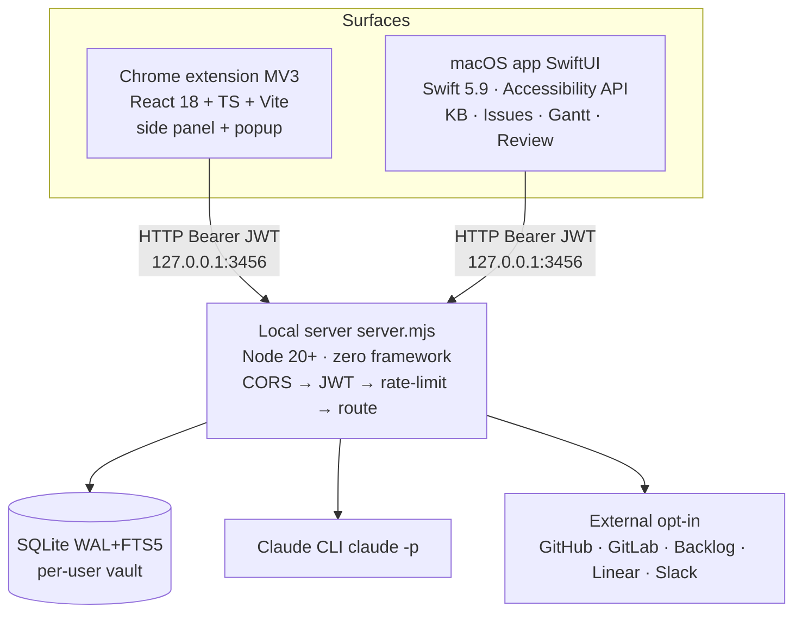

# Engineering Documentation System — Implementation Plan

> **For agentic workers:** REQUIRED SUB-SKILL: Use superpowers:subagent-driven-development (recommended) or superpowers:executing-plans to implement this plan task-by-task. Steps use checkbox (`- [ ]`) syntax for tracking.

**Goal:** Stand up a structured engineering documentation system backed by an MkDocs Material site, migrate all existing markdown into a Diátaxis-shaped layout, and generate six source-extracted reference pages — in three independently shippable phases.

**Architecture:** MkDocs Material rendering `docs/` to a static site. Diátaxis IA (`tutorials/` · `how-to/` · `reference/` · `explanation/`) plus `decisions/` for ADRs. Python venv at repo root holds the docs tooling; engineers interact through Make targets. CI lints on every PR and deploys to GitHub Pages on merge to `main`.

**Tech Stack:** Python 3.11+, MkDocs Material, `neoteroi-mkdocs` (OpenAPI), `mkdocs-mermaid2-plugin`, `mkdocs-glightbox`, `mkdocs-git-revision-date-localized-plugin`, `mkdocs-awesome-pages-plugin`, `markdownlint-cli2`, `lychee`, `pytest`, GitHub Actions, GitHub Pages.

**Spec:** [`docs/superpowers/specs/2026-05-18-engineering-docs-system-design.md`](../specs/2026-05-18-engineering-docs-system-design.md)

---

## Prerequisites and conventions

**Working directory.** All paths are relative to the repo root `/Users/dinesh.malla/Desktop/meet-notes`.

**Git.** The plan assumes the project is a git repo. Task 1 initialises git if missing. All commit steps use the conventional-commit style with a `docs:` or `chore(docs):` scope.

**Python venv.** Created at `.venv-docs/` at the repo root. Add `.venv-docs/` and `site/` to `.gitignore` in Task 1.

**Commit cadence.** Each task ends with a single commit grouping the files it touched. If a task spans multiple files for one logical change, one commit is fine. Never amend; never force-push.

**Building locally during the plan.** From Task 2 onward, `make docs-serve` works. Use it freely to verify each task visually. The plan explicitly calls out builds at phase boundaries.

**Stub files.** A "redirect stub" is a one-line markdown file:
```markdown
> Moved — see [`<new path>`](<new path>).
```

---

# Phase 1 — Skeleton + tooling

Goal: a buildable, deployable empty site with templates, one real page, lint and CI wired up.

---

### Task 1: Repo prep — git, .gitignore, directory skeleton

**Files:**
- Modify or create: `.gitignore`
- Create: `docs/index.md`, `docs/tutorials/.gitkeep`, `docs/how-to/.gitkeep`, `docs/reference/.gitkeep`, `docs/reference/api/.gitkeep`, `docs/explanation/.gitkeep`, `docs/decisions/.gitkeep`, `docs/_templates/.gitkeep`, `docs/_scripts/.gitkeep`, `docs/_stubs.txt`

- [ ] **Step 1: Initialise git if not present**

Run:
```bash
cd /Users/dinesh.malla/Desktop/meet-notes
[ -d .git ] || git init
git rev-parse --is-inside-work-tree
```
Expected: prints `true`. If `git init` ran, default branch is `main` (run `git branch -m master main` if your git defaults to master).

- [ ] **Step 2: Add docs-tooling entries to .gitignore**

Append to `.gitignore` (create if missing):
```gitignore
# Docs tooling
.venv-docs/
site/
docs/.cache/
```

- [ ] **Step 3: Create the Diátaxis skeleton**

Run:
```bash
mkdir -p docs/{tutorials,how-to,reference/api,explanation,decisions,_templates,_scripts}
touch docs/{tutorials,how-to,reference,reference/api,explanation,decisions,_templates,_scripts}/.gitkeep
touch docs/_stubs.txt
```

- [ ] **Step 4: Write a placeholder index.md (replaced in Task 8)**

Create `docs/index.md`:
```markdown
---
title: Meet Notes — Engineering Documentation
maintainer: TBD
---

# Meet Notes — Engineering Documentation

Internal engineering docs. Public end-user docs live elsewhere (planned).

- **[Tutorials](tutorials/)** — learning-oriented walkthroughs
- **[How-to](how-to/)** — task-oriented recipes
- **[Reference](reference/)** — schemas, env vars, API
- **[Explanation](explanation/)** — architecture, design rationale, invariants
- **[Decisions](decisions/)** — Architecture Decision Records
```

- [ ] **Step 5: Commit**

```bash
git add .gitignore docs/
git commit -m "chore(docs): scaffold Diátaxis directory skeleton"
```

---

### Task 2: Python venv + pinned dependencies

**Files:**
- Create: `docs-requirements.txt`

- [ ] **Step 1: Write docs-requirements.txt**

Create `docs-requirements.txt`:
```
# MkDocs Material — pin majors, allow patch updates
mkdocs-material[imaging]==9.5.*
neoteroi-mkdocs==1.0.*
mkdocs-mermaid2-plugin==1.1.*
mkdocs-glightbox==0.4.*
mkdocs-git-revision-date-localized-plugin==1.2.*
mkdocs-awesome-pages-plugin==2.9.*

# Dev tools for the docs scripts (frontmatter checker, extractors)
PyYAML==6.0.*
pytest==8.*
```

- [ ] **Step 2: Create the venv and install**

Run:
```bash
python3 -m venv .venv-docs
.venv-docs/bin/pip install --upgrade pip
.venv-docs/bin/pip install -r docs-requirements.txt
```
Expected: installs without errors. If `mkdocs-material[imaging]` fails on macOS, install `cairo` and `pango` via Homebrew (`brew install cairo pango`) and re-run.

- [ ] **Step 3: Verify the toolchain**

Run:
```bash
.venv-docs/bin/mkdocs --version
```
Expected: `mkdocs, version 1.x.x` or similar.

- [ ] **Step 4: Commit**

```bash
git add docs-requirements.txt
git commit -m "chore(docs): pin MkDocs Material toolchain"
```

---

### Task 3: mkdocs.yml — minimum viable config

**Files:**
- Create: `mkdocs.yml`

- [ ] **Step 1: Write mkdocs.yml**

Create `mkdocs.yml` at the repo root:
```yaml
site_name: Meet Notes — Engineering Docs
site_description: Internal engineering documentation for the Meet Notes system.
site_url: https://example.invalid/   # replaced when GH Pages URL is known (Task 10)
repo_url: https://github.com/ORG/REPO  # replaced when GH org/repo is known
edit_uri: edit/main/docs/
docs_dir: docs

theme:
  name: material
  features:
    - navigation.instant
    - navigation.tracking
    - navigation.sections
    - navigation.indexes
    - navigation.top
    - search.suggest
    - search.highlight
    - content.code.copy
    - content.action.edit
  palette:
    - media: "(prefers-color-scheme: light)"
      scheme: default
      primary: indigo
      accent: indigo
      toggle:
        icon: material/weather-night
        name: Switch to dark mode
    - media: "(prefers-color-scheme: dark)"
      scheme: slate
      primary: indigo
      accent: indigo
      toggle:
        icon: material/weather-sunny
        name: Switch to light mode

plugins:
  - search
  - awesome-pages
  - mermaid2
  - glightbox
  - git-revision-date-localized:
      enable_creation_date: true
      type: date
  - neoteroi.mkdocsoad:
      use_pymdownx: true

markdown_extensions:
  - admonition
  - attr_list
  - def_list
  - footnotes
  - tables
  - toc:
      permalink: true
  - pymdownx.details
  - pymdownx.superfences:
      custom_fences:
        - name: mermaid
          class: mermaid
          format: !!python/name:mermaid2.fence_mermaid_custom
  - pymdownx.tabbed:
      alternate_style: true
  - pymdownx.highlight:
      anchor_linenums: true
  - pymdownx.snippets
  - pymdownx.tasklist:
      custom_checkbox: true

exclude_docs: |
  _templates/
  _scripts/
  _stubs.txt
  superpowers/
```

- [ ] **Step 2: Run a build to validate config**

Run:
```bash
.venv-docs/bin/mkdocs build --strict
```
Expected: builds successfully into `site/`. Warnings about empty nav are fine at this stage; `--strict` will fail only on real config errors.

- [ ] **Step 3: Commit**

```bash
git add mkdocs.yml
git commit -m "chore(docs): add MkDocs Material configuration"
```

---

### Task 4: Makefile — engineer entry points

**Files:**
- Create: `Makefile` (or append to existing if one exists)

- [ ] **Step 1: Check for existing Makefile**

Run:
```bash
[ -f Makefile ] && echo "EXISTS" || echo "MISSING"
```
If `EXISTS`, open it and append the targets below into a `# --- docs ---` section. If `MISSING`, create the file with this full content.

- [ ] **Step 2: Write the Makefile**

Create or append to `Makefile`:
```makefile
# --- docs --------------------------------------------------------------------

VENV_DOCS := .venv-docs
PY        := $(VENV_DOCS)/bin/python
MKDOCS    := $(VENV_DOCS)/bin/mkdocs

.PHONY: docs-deps docs-serve docs-build docs-lint docs-refresh-reference

docs-deps:
	python3 -m venv $(VENV_DOCS)
	$(VENV_DOCS)/bin/pip install --upgrade pip
	$(VENV_DOCS)/bin/pip install -r docs-requirements.txt

docs-serve:
	$(MKDOCS) serve -a 127.0.0.1:8000

docs-build:
	$(MKDOCS) build --strict

docs-lint:
	@command -v markdownlint-cli2 >/dev/null || { echo "Install: npm i -g markdownlint-cli2"; exit 1; }
	@command -v lychee            >/dev/null || { echo "Install: brew install lychee or cargo install lychee"; exit 1; }
	markdownlint-cli2 "docs/**/*.md" "!docs/superpowers/**"
	lychee --no-progress --max-retries 3 --retry-wait-time 2 \
	  --exclude-path docs/superpowers \
	  --exclude '^https://github\.com/ORG/REPO' \
	  'docs/**/*.md' README.md
	$(PY) docs/_scripts/check_frontmatter.py

docs-refresh-reference:
	$(PY) docs/_scripts/extract_env_vars.py
	$(PY) docs/_scripts/extract_schema.py
	$(PY) docs/_scripts/extract_error_codes.py
	$(PY) docs/_scripts/extract_guardrails.py
	$(PY) docs/_scripts/extract_messages.py
	$(PY) docs/_scripts/extract_rate_limit.py
```

- [ ] **Step 3: Verify targets are listed**

Run:
```bash
make -np 2>/dev/null | grep -E '^(docs-deps|docs-serve|docs-build|docs-lint|docs-refresh-reference):' | sort -u
```
Expected: all five targets listed.

- [ ] **Step 4: Commit**

```bash
git add Makefile
git commit -m "chore(docs): add Make targets for docs lifecycle"
```

---

### Task 5: Page templates (5 files)

**Files:**
- Create: `docs/_templates/tutorial.md`, `docs/_templates/how-to.md`, `docs/_templates/reference.md`, `docs/_templates/explanation.md`, `docs/_templates/adr.md`

- [ ] **Step 1: Write the tutorial template**

Create `docs/_templates/tutorial.md`:
```markdown
---
title: <Verb>-ing <thing> — a <N>-minute tutorial
audience: <new contributor | server engineer | macOS engineer | …>
time: <N> minutes
---

# <Title>

> Learning-oriented. The reader follows along and ends with a working <thing>.

## What you'll build

<One sentence.>

## Prerequisites

- <Tool / access / knowledge>
- <…>

## Steps

### 1. <Action>

```bash
<command>
```

### 2. <Action>

…

## Verify it worked

<Concrete check the reader can run.>

## Next

- <Pointer to a related how-to or explanation.>
```

- [ ] **Step 2: Write the how-to template**

Create `docs/_templates/how-to.md`:
```markdown
---
title: How to <task>
applies_to: <extension | server | macOS | docs | all>
---

# How to <task>

> Task-oriented. The reader knows what they want; this page is the recipe.

## Goal

<One sentence.>

## Steps

1. <Action with the exact command or file edit.>
2. <Action.>
3. <Action.>

## Verification

<How to know it worked.>

## See also

- <Related how-to.>
- <Related explanation.>
```

- [ ] **Step 3: Write the reference template**

Create `docs/_templates/reference.md`:
```markdown
---
title: <Reference page title>
source: <relative/path/to/source-of-truth or omit for hand-written>
---

# <Title>

> Lookup-oriented. Flat, dense, scannable. No narrative.

<!-- generated from <source> — do not edit by hand
     (delete this line if the page is hand-written) -->

| Name | Type | Default | Notes |
|---|---|---|---|
| <key> | <type> | <default> | <notes> |
```

- [ ] **Step 4: Write the explanation template**

Create `docs/_templates/explanation.md`:
```markdown
---
title: <Topic>
status: draft
---

# <Topic>

> Understanding-oriented. Explains the *why*.

## Context

<What problem area this covers.>

## Design

<How the thing is structured.>

## Trade-offs

<What was given up; what alternatives were considered.>

## Open questions

<Known unknowns; mark resolved as they're answered.>
```

- [ ] **Step 5: Write the ADR template**

Create `docs/_templates/adr.md`:
```markdown
---
title: <NNNN. Imperative decision statement>
status: proposed
date: YYYY-MM-DD
---

# <NNNN. Imperative decision statement>

## Context

<2-4 sentences. What problem or forcing function led to this decision?>

## Decision

<2-4 sentences. The decision itself, stated unambiguously.>

## Consequences

<Bulleted list — positive, negative, neutral. Be honest.>

- <Consequence>
- <Consequence>
```

- [ ] **Step 6: Verify templates are excluded from the built site**

Run:
```bash
.venv-docs/bin/mkdocs build --strict
ls site/_templates/ 2>/dev/null && echo "LEAK" || echo "OK — excluded"
```
Expected: `OK — excluded`. The `exclude_docs` rule in `mkdocs.yml` should keep `_templates/` out of `site/`.

- [ ] **Step 7: Commit**

```bash
git add docs/_templates/
git commit -m "docs: add page templates for each Diátaxis type and ADR"
```

---

### Task 6: Frontmatter checker (with tests)

**Files:**
- Create: `docs/_scripts/check_frontmatter.py`
- Create: `docs/_scripts/test_check_frontmatter.py`

- [ ] **Step 1: Write the failing tests**

Create `docs/_scripts/test_check_frontmatter.py`:
```python
"""Tests for the frontmatter checker."""
from pathlib import Path

import pytest

from check_frontmatter import (
    check_file,
    REQUIRED_KEYS,
    DocType,
    classify,
)


def write(tmp_path: Path, rel: str, body: str) -> Path:
    p = tmp_path / rel
    p.parent.mkdir(parents=True, exist_ok=True)
    p.write_text(body)
    return p


def test_classify_by_top_folder(tmp_path: Path) -> None:
    p = write(tmp_path, "docs/tutorials/foo.md", "")
    assert classify(p, tmp_path / "docs") == DocType.TUTORIAL


def test_classify_unknown_returns_none(tmp_path: Path) -> None:
    p = write(tmp_path, "docs/random/foo.md", "")
    assert classify(p, tmp_path / "docs") is None


def test_check_passes_with_required_keys(tmp_path: Path) -> None:
    p = write(
        tmp_path,
        "docs/tutorials/foo.md",
        "---\ntitle: T\naudience: A\ntime: 5 minutes\n---\n# T\n",
    )
    errors = check_file(p, tmp_path / "docs", stubs=set())
    assert errors == []


def test_check_fails_when_required_key_missing(tmp_path: Path) -> None:
    p = write(
        tmp_path,
        "docs/tutorials/foo.md",
        "---\ntitle: T\n---\n# T\n",
    )
    errors = check_file(p, tmp_path / "docs", stubs=set())
    assert any("audience" in e for e in errors)
    assert any("time" in e for e in errors)


def test_check_fails_when_frontmatter_missing(tmp_path: Path) -> None:
    p = write(tmp_path, "docs/tutorials/foo.md", "# No frontmatter\n")
    errors = check_file(p, tmp_path / "docs", stubs=set())
    assert any("frontmatter" in e.lower() for e in errors)


def test_unresolved_todo_fails_for_non_stub(tmp_path: Path) -> None:
    p = write(
        tmp_path,
        "docs/how-to/foo.md",
        "---\ntitle: T\napplies_to: server\n---\n\nTODO: write this\n",
    )
    errors = check_file(p, tmp_path / "docs", stubs=set())
    assert any("TODO" in e for e in errors)


def test_unresolved_todo_allowed_for_stub(tmp_path: Path) -> None:
    p = write(
        tmp_path,
        "docs/how-to/foo.md",
        "---\ntitle: T\napplies_to: server\n---\n\nTODO: write this\n",
    )
    errors = check_file(p, tmp_path / "docs", stubs={"how-to/foo.md"})
    assert errors == []


def test_required_keys_cover_every_doctype() -> None:
    for t in DocType:
        assert t in REQUIRED_KEYS, f"missing REQUIRED_KEYS for {t}"
```

- [ ] **Step 2: Write the checker implementation**

Create `docs/_scripts/check_frontmatter.py`:
```python
"""Lint frontmatter completeness and unresolved TODOs across docs/.

Exits non-zero if any error is found. The set of intentionally-incomplete
pages is read from `docs/_stubs.txt` (one path per line, relative to docs/).
"""
from __future__ import annotations

import enum
import re
import sys
from pathlib import Path
from typing import Iterable

import yaml


class DocType(enum.Enum):
    TUTORIAL = "tutorial"
    HOW_TO = "how-to"
    REFERENCE = "reference"
    EXPLANATION = "explanation"
    ADR = "adr"


REQUIRED_KEYS: dict[DocType, set[str]] = {
    DocType.TUTORIAL: {"title", "audience", "time"},
    DocType.HOW_TO: {"title", "applies_to"},
    DocType.REFERENCE: {"title"},
    DocType.EXPLANATION: {"title", "status"},
    DocType.ADR: {"title", "status", "date"},
}

FOLDER_TO_TYPE: dict[str, DocType] = {
    "tutorials": DocType.TUTORIAL,
    "how-to": DocType.HOW_TO,
    "reference": DocType.REFERENCE,
    "explanation": DocType.EXPLANATION,
    "decisions": DocType.ADR,
}

FRONTMATTER_RE = re.compile(r"\A---\n(.*?)\n---\n", re.DOTALL)
TODO_RE = re.compile(r"\bTODO\b|\bTBD\b")


def classify(path: Path, docs_root: Path) -> DocType | None:
    try:
        rel = path.relative_to(docs_root)
    except ValueError:
        return None
    if not rel.parts:
        return None
    top = rel.parts[0]
    return FOLDER_TO_TYPE.get(top)


def _parse_frontmatter(text: str) -> dict | None:
    m = FRONTMATTER_RE.match(text)
    if not m:
        return None
    try:
        data = yaml.safe_load(m.group(1)) or {}
    except yaml.YAMLError:
        return None
    return data if isinstance(data, dict) else None


def check_file(path: Path, docs_root: Path, stubs: set[str]) -> list[str]:
    errors: list[str] = []
    doc_type = classify(path, docs_root)
    if doc_type is None:
        return errors  # not in a managed folder

    text = path.read_text()
    fm = _parse_frontmatter(text)
    rel = str(path.relative_to(docs_root))

    if fm is None:
        errors.append(f"{rel}: missing or unparseable frontmatter")
        return errors

    required = REQUIRED_KEYS[doc_type]
    missing = sorted(required - fm.keys())
    for key in missing:
        errors.append(f"{rel}: missing required frontmatter key '{key}'")

    if rel not in stubs and TODO_RE.search(text):
        errors.append(
            f"{rel}: contains TODO/TBD but is not in docs/_stubs.txt"
        )

    return errors


def iter_markdown(docs_root: Path) -> Iterable[Path]:
    excluded = {"_templates", "_scripts", "superpowers"}
    for path in docs_root.rglob("*.md"):
        if any(part in excluded for part in path.relative_to(docs_root).parts):
            continue
        yield path


def main(argv: list[str]) -> int:
    docs_root = Path(argv[1]) if len(argv) > 1 else Path("docs")
    docs_root = docs_root.resolve()

    stubs_file = docs_root / "_stubs.txt"
    stubs: set[str] = set()
    if stubs_file.exists():
        for line in stubs_file.read_text().splitlines():
            line = line.strip()
            if line and not line.startswith("#"):
                stubs.add(line)

    all_errors: list[str] = []
    for path in iter_markdown(docs_root):
        all_errors.extend(check_file(path, docs_root, stubs))

    for err in all_errors:
        print(err, file=sys.stderr)
    return 1 if all_errors else 0


if __name__ == "__main__":
    raise SystemExit(main(sys.argv))
```

- [ ] **Step 3: Run the tests**

Run:
```bash
cd /Users/dinesh.malla/Desktop/meet-notes
.venv-docs/bin/python -m pytest docs/_scripts/test_check_frontmatter.py -v
```
Expected: all 7 tests pass.

- [ ] **Step 4: Run the checker against the current docs/ (should pass)**

Run:
```bash
.venv-docs/bin/python docs/_scripts/check_frontmatter.py docs
echo "exit=$?"
```
Expected: `exit=0`. (`index.md` is in the docs root, not a managed folder, so it isn't checked.)

- [ ] **Step 5: Commit**

```bash
git add docs/_scripts/check_frontmatter.py docs/_scripts/test_check_frontmatter.py
git commit -m "docs: add frontmatter checker with pytest coverage"
```

---

### Task 7: Stub allow-list seed file

**Files:**
- Modify: `docs/_stubs.txt`

- [ ] **Step 1: Seed the stubs allow-list**

Replace `docs/_stubs.txt` with:
```
# Pages that are intentionally incomplete.
# One path per line, relative to docs/.
# A page in this list may contain TODO / TBD markers without failing lint.
# Remove entries as pages are written.

# (populated during Phase 2)
```

- [ ] **Step 2: Commit**

```bash
git add docs/_stubs.txt
git commit -m "docs: seed stubs allow-list"
```

---

### Task 8: First real migrated page — explanation/architecture.md

**Files:**
- Create: `docs/explanation/architecture.md`
- Read source: `docs/ARCHITECTURE.md` (existing)

- [ ] **Step 1: Copy and adapt the existing architecture doc**

Copy `docs/ARCHITECTURE.md` to `docs/explanation/architecture.md`, then:

1. Add the explanation-type frontmatter at the top:
```yaml
---
title: System architecture
status: stable
---
```
2. Replace the H1 (`# Architecture`) with `# System architecture`.
3. Convert any link of the form `../extension/docs/ARCHITECTURE.md` to `server-internals.md` (relative within `explanation/`).
4. Convert the existing fenced ASCII diagram of the system into a mermaid diagram by replacing the ```` ``` ```` opening fence with ```` ```mermaid ```` and rewriting the diagram in mermaid flowchart syntax:

5. Leave the rest of the content as-is.

- [ ] **Step 2: Build the site and visually verify**

Run:
```bash
.venv-docs/bin/mkdocs build --strict
.venv-docs/bin/mkdocs serve -a 127.0.0.1:8000 &
sleep 2
curl -sf http://127.0.0.1:8000/explanation/architecture/ > /dev/null && echo "OK"
kill %1
```
Expected: `OK`. Open the URL in a browser briefly to confirm the mermaid diagram renders.

- [ ] **Step 3: Run the frontmatter checker**

Run:
```bash
.venv-docs/bin/python docs/_scripts/check_frontmatter.py docs
```
Expected: exit 0.

- [ ] **Step 4: Commit**

```bash
git add docs/explanation/architecture.md
git commit -m "docs: migrate ARCHITECTURE.md into explanation/ with mermaid diagram"
```

---

### Task 9: GitHub Actions workflow — lint on PR, deploy on main

**Files:**
- Create: `.github/workflows/docs.yml`

- [ ] **Step 1: Write the workflow**

Create `.github/workflows/docs.yml`:
```yaml
name: docs

on:
  pull_request:
    paths:
      - 'docs/**'
      - 'mkdocs.yml'
      - 'docs-requirements.txt'
      - '.github/workflows/docs.yml'
  push:
    branches: [main]
    paths:
      - 'docs/**'
      - 'mkdocs.yml'
      - 'docs-requirements.txt'
      - '.github/workflows/docs.yml'

permissions:
  contents: read
  pages: write
  id-token: write

concurrency:
  group: docs-${{ github.ref }}
  cancel-in-progress: true

jobs:
  build:
    runs-on: ubuntu-latest
    steps:
      - uses: actions/checkout@v4
        with:
          fetch-depth: 0  # git-revision-date-localized needs history

      - uses: actions/setup-python@v5
        with:
          python-version: '3.11'
          cache: pip

      - name: Install docs dependencies
        run: |
          python -m pip install --upgrade pip
          pip install -r docs-requirements.txt

      - name: Install Node + markdownlint
        uses: actions/setup-node@v4
        with:
          node-version: '20'
      - run: npm install -g markdownlint-cli2

      - name: Install lychee
        uses: lycheeverse/lychee-action@v2
        with:
          args: --no-progress --max-retries 3 --retry-wait-time 2 --exclude-path docs/superpowers docs/**/*.md README.md
          fail: true

      - name: markdownlint
        run: markdownlint-cli2 "docs/**/*.md" "!docs/superpowers/**"

      - name: Frontmatter check
        run: python docs/_scripts/check_frontmatter.py docs

      - name: Build site
        run: mkdocs build --strict

      - name: Upload artefact
        if: github.event_name == 'push' && github.ref == 'refs/heads/main'
        uses: actions/upload-pages-artifact@v3
        with:
          path: site

  deploy:
    if: github.event_name == 'push' && github.ref == 'refs/heads/main'
    needs: build
    runs-on: ubuntu-latest
    environment:
      name: github-pages
      url: ${{ steps.deploy.outputs.page_url }}
    steps:
      - id: deploy
        uses: actions/deploy-pages@v4
```

- [ ] **Step 2: Add markdownlint config**

Create `.markdownlint-cli2.jsonc` at the repo root:
```jsonc
{
  "config": {
    "default": true,
    "MD013": false,        // line length — we don't soft-wrap
    "MD033": false,        // inline HTML — needed for mermaid + admonitions
    "MD041": false,        // first line must be H1 — frontmatter conflicts
    "MD024": { "siblings_only": true }
  },
  "ignores": [
    "docs/superpowers/**",
    "docs/_templates/**",
    "node_modules/**",
    ".venv-docs/**"
  ]
}
```

- [ ] **Step 3: Commit**

```bash
git add .github/workflows/docs.yml .markdownlint-cli2.jsonc
git commit -m "ci(docs): add PR lint + main-branch deploy to GitHub Pages"
```

---

### Task 10: Enable GitHub Pages + smoke test

**Files:**
- None modified; this is a one-time GitHub configuration step.

- [ ] **Step 1: Push the branch and open a PR**

If working on a feature branch, push it and open a PR. CI must pass.

- [ ] **Step 2: In the GitHub repo settings, enable Pages**

Navigate to **Settings → Pages**:
- Source: **GitHub Actions**
- Save.

- [ ] **Step 3: Merge to main and verify deploy**

After merge, the `deploy` job runs. Wait for it, then visit the URL printed in the job output (`https://<org>.github.io/<repo>/`).

- [ ] **Step 4: Update mkdocs.yml with the real site URL**

In `mkdocs.yml`, replace:
- `site_url:` with the GitHub Pages URL.
- `repo_url:` with the GitHub repo URL.

Then in the Makefile, in `docs-lint`, replace `--exclude '^https://github\.com/ORG/REPO'` with the real repo URL.

- [ ] **Step 5: Commit and verify the second deploy**

```bash
git add mkdocs.yml Makefile
git commit -m "chore(docs): set canonical site and repo URLs"
git push
```

After CI deploys again, the site footer and "edit this page" links should resolve to the real repo.

**Phase 1 done.** The site is live, empty save for one page, with full lint + deploy CI.

---

# Phase 2 — Migrate existing content

Goal: move every existing markdown file into its new home, split `AGENTS.md` into invariants + ADRs, leave redirect stubs at old paths, and trim READMEs to pointers.

---

### Task 11: Move server-internals doc

**Files:**
- Read source: `extension/docs/ARCHITECTURE.md`
- Create: `docs/explanation/server-internals.md`
- Modify: `extension/docs/ARCHITECTURE.md` → redirect stub

- [ ] **Step 1: Copy with frontmatter**

Copy the content of `extension/docs/ARCHITECTURE.md` into `docs/explanation/server-internals.md`, prepending:
```yaml
---
title: Server internals
status: stable
---
```
Then change the H1 to `# Server internals`.

- [ ] **Step 2: Rewrite cross-links inside the moved file**

Inside the new file, replace any reference to `../docs/ARCHITECTURE.md` with `architecture.md`.

- [ ] **Step 3: Replace the old file with a redirect stub**

Overwrite `extension/docs/ARCHITECTURE.md` with:
```markdown
> Moved — see [`docs/explanation/server-internals.md`](../../docs/explanation/server-internals.md).
```

- [ ] **Step 4: Build + frontmatter check**

```bash
.venv-docs/bin/mkdocs build --strict
.venv-docs/bin/python docs/_scripts/check_frontmatter.py docs
```
Expected: both pass.

- [ ] **Step 5: Commit**

```bash
git add docs/explanation/server-internals.md extension/docs/ARCHITECTURE.md
git commit -m "docs: migrate server-internals into explanation/"
```

---

### Task 12: Move meeting-agent doc

**Files:**
- Read source: `extension/docs/meeting-agent-plan.md`
- Create: `docs/explanation/meeting-agent.md`
- Modify: `extension/docs/meeting-agent-plan.md` → redirect stub

- [ ] **Step 1: Copy with frontmatter**

Copy `extension/docs/meeting-agent-plan.md` to `docs/explanation/meeting-agent.md`, prepending:
```yaml
---
title: Meeting agent
status: stable
---
```
Adjust the H1 to `# Meeting agent` and trim any "Plan" framing in the prose to past-tense / present-tense narrative.

- [ ] **Step 2: Stub the old path**

Overwrite `extension/docs/meeting-agent-plan.md` with:
```markdown
> Moved — see [`docs/explanation/meeting-agent.md`](../../docs/explanation/meeting-agent.md).
```

- [ ] **Step 3: Build + check**

```bash
.venv-docs/bin/mkdocs build --strict
.venv-docs/bin/python docs/_scripts/check_frontmatter.py docs
```

- [ ] **Step 4: Commit**

```bash
git add docs/explanation/meeting-agent.md extension/docs/meeting-agent-plan.md
git commit -m "docs: migrate meeting-agent into explanation/"
```

---

### Task 13: Move openapi.yaml + wire generated API reference

**Files:**
- Move: `extension/docs/openapi.yaml` → `docs/reference/api/openapi.yaml`
- Create: `docs/reference/api/index.md`
- Modify: `mkdocs.yml` (nothing — `neoteroi.mkdocsoad` is already added in Task 3)

- [ ] **Step 1: Move the OpenAPI file**

```bash
mkdir -p docs/reference/api
git mv extension/docs/openapi.yaml docs/reference/api/openapi.yaml
```

- [ ] **Step 2: Create the reference rendering page**

Create `docs/reference/api/index.md`:
```markdown
---
title: API reference (generated)
source: docs/reference/api/openapi.yaml
---

# API reference

> Generated from [`openapi.yaml`](openapi.yaml). For the narrative tour, see [API overview](overview.md).

[OAD(./openapi.yaml)]
```

The `[OAD(...)]` directive is the `neoteroi.mkdocsoad` plugin's render macro.

- [ ] **Step 3: Build and visually verify rendering**

```bash
.venv-docs/bin/mkdocs serve -a 127.0.0.1:8000 &
sleep 2
curl -sf http://127.0.0.1:8000/reference/api/ > /dev/null && echo "OK"
kill %1
```
Open the URL in a browser. The OpenAPI spec should render as collapsible operation cards.

- [ ] **Step 4: Commit**

```bash
git add docs/reference/api/
git commit -m "docs: move openapi.yaml under reference/api and render via neoteroi"
```

---

### Task 14: API narrative — reference/api/overview.md

**Files:**
- Read source: `docs/API.md` (current hand-written content)
- Create: `docs/reference/api/overview.md`
- Delete: `docs/API.md`

- [ ] **Step 1: Move and reframe**

```bash
git mv docs/API.md docs/reference/api/overview.md
```

In `docs/reference/api/overview.md`:
1. Prepend frontmatter:
```yaml
---
title: API overview
---
```
2. Change H1 to `# API overview`.
3. Add a top section linking to the generated reference:
```markdown
> Hand-written narrative tour of the API. For per-endpoint detail with schemas, see the [generated reference](index.md) (rendered from `openapi.yaml`).
```
4. Adjust any internal link to `../extension/docs/openapi.yaml` to `openapi.yaml`.

- [ ] **Step 2: Build + check**

```bash
.venv-docs/bin/mkdocs build --strict
.venv-docs/bin/python docs/_scripts/check_frontmatter.py docs
```

- [ ] **Step 3: Commit**

```bash
git add docs/reference/api/overview.md
git commit -m "docs: move API narrative under reference/api"
```

---

### Task 15: Extract invariants.md from AGENTS.md

**Files:**
- Read source: `AGENTS.md`
- Create: `docs/explanation/invariants.md`

- [ ] **Step 1: Identify what goes where**

Open `AGENTS.md`. The content falls into three buckets:

- **Hard rules / "do not regress" lists** (most ✅ MUST and ❌ DO NOT bullets) → `invariants.md`.
- **Architectural decisions** (the principles in `CORE PRINCIPLES`, and most "rationale" prose) → individual ADRs (Tasks 18 and 19).
- **Caption-scraper philosophy and history** → `caption-capture.md` (Task 16).

For Task 15 we extract only the first bucket.

- [ ] **Step 2: Write invariants.md**

Create `docs/explanation/invariants.md` with this skeleton, then port each `## <Component>` section from `AGENTS.md` that contains "✅ MUST" or "❌ DO NOT" lists. Keep the table-of-symptoms format intact.
```markdown
---
title: Engineering invariants
status: stable
---

# Engineering invariants

> Hard-won fixes and architectural rules that must not regress. Read this before modifying any file listed below. When in doubt, add new behaviour alongside — never delete an invariant here without a migration note in the PR.

Last verified against: **v3.0**.

## Why this exists

Each invariant maps to a previous regression. The *decision* behind it (why the system is this shape at all) lives as an [ADR](../decisions/). This page is the operational checklist; the ADRs are the rationale.

## Caption scraper (`extension/src/content/caption-scraper.ts`)

<port the ✅ MUST preserve and ❌ MUST filter out / ❌ DO NOT do these blocks from AGENTS.md "Caption Scraper" section>

## Speaker detector (`extension/src/content/speaker-detector.ts`)

<port from AGENTS.md>

## Message protocol (`extension/src/lib/messages.ts`)

<port from AGENTS.md>

## Transcript persistence (`extension/src/lib/storage.ts` + useTranscript)

<port from AGENTS.md>

## Side panel hook: useTranscript

<port from AGENTS.md>

## Side panel hooks: useNotes / useChat / useQuestions

<port from AGENTS.md>

## Side panel App

<port from AGENTS.md>

## Service worker

<port from AGENTS.md>

## Local server (`extension/server.mjs`)

<port from AGENTS.md, but drop the "rationale" sentences — those move to ADRs>

## DOCX export (`extension/generate-docx.mjs`)

<port from AGENTS.md>

## Client library (`extension/src/lib/config.ts` et al.)

<port from AGENTS.md>

## UI / UX / CSS

<port from AGENTS.md>

## Floating popup

<port from AGENTS.md>

## Build & runtime invariants

<port from AGENTS.md>

## Testing checklist before merging caption / transcript / LLM changes

<port the full checklist from AGENTS.md>

## Quick reference: where to add X

<port the "Where Do I Add X?" table from AGENTS.md>
```

- [ ] **Step 3: Build + check**

```bash
.venv-docs/bin/mkdocs build --strict
.venv-docs/bin/python docs/_scripts/check_frontmatter.py docs
```

- [ ] **Step 4: Commit**

```bash
git add docs/explanation/invariants.md
git commit -m "docs: extract invariants from AGENTS.md into explanation/"
```

---

### Task 16: Extract caption-capture.md from AGENTS.md

**Files:**
- Create: `docs/explanation/caption-capture.md`

- [ ] **Step 1: Write caption-capture.md**

Create `docs/explanation/caption-capture.md`:
```markdown
---
title: Caption capture — design and history
status: stable
---

# Caption capture — design and history

> The caption pipeline went through several iterations before settling on the current snapshot-diff loop. This page explains *why* the current shape is what it is. For the operational rules ("never reintroduce X"), see [Engineering invariants](invariants.md).

## Core philosophy: mirror CC — nothing more

<port the "CORE PHILOSOPHY" prose from AGENTS.md>

## Iteration history

### Earlier approach: buffer-and-dedup
<describe the abandoned approach: buffers, repeated-phrase dedup, longest-text-per-tick selection, utterance detection — and the cross-contamination bug it caused with multiple speakers>

### Current approach: snapshot-diff
<describe: per-speaker state map, 800 ms scrape, new-session-on-first-sighting-or-5s-gap, send-only-on-change>

## Anti-patterns we revisit every six months
<port the "❌ DO NOT do these (caused regressions)" list, but framed as narrative explanation, not as an operational checklist (that's in invariants.md)>

## Platform readers
<short notes on Meet, Teams, Zoom — the per-platform DOM peculiarities>

## Cross-references

- [Engineering invariants — caption scraper section](invariants.md#caption-scraper-extensionsrccontentcaption-scraperts)
- [ADR 0006 — snapshot-diff caption scraper](../decisions/0006-snapshot-diff-caption-scraper.md)
```

- [ ] **Step 2: Build + check + commit**

```bash
.venv-docs/bin/mkdocs build --strict
.venv-docs/bin/python docs/_scripts/check_frontmatter.py docs
git add docs/explanation/caption-capture.md
git commit -m "docs: explain caption-capture design and history"
```

---

### Task 17: Write security-model.md

**Files:**
- Create: `docs/explanation/security-model.md`

- [ ] **Step 1: Write security-model.md**

Create `docs/explanation/security-model.md`. Source material comes from three places: the **Security Posture** table in the top-level README, the **Security** section in `docs/explanation/architecture.md`, and `AGENTS.md` sections on the local server + client library.
```markdown
---
title: Security model
status: stable
---

# Security model

> What the system protects against, how, and what's explicitly *not* in scope.

## Threat model

- **In scope:** transcript exfiltration, credential theft (vault), prompt injection from meeting content, DoS against the local server, cross-site-attack against the loopback API, accidental destructive operations in dispatched code changes.
- **Out of scope:** physical access to the user's machine, malicious browser extensions installed by the user, compromise of the user's Claude CLI authentication.

## Network

<port from README + ARCHITECTURE: 127.0.0.1 binding, CORS allowlist, no wildcard>

## Identity

<port: JWT HS256, 15 min, refresh-token rotation, bcrypt cost 12, constant-time compare>

## Credential vault

<port: HKDF per-user key, AES-256-GCM, version byte | IV | ciphertext | tag, allow-listed keys>

## Rate limiting

<port: token-bucket per (profile, scope), scope = userId or IP, 429 + Retry-After>

## Guardrails

<port: 7 secret patterns, 5 PII patterns, 5 destructive-op patterns, applied at submit AND approval>

## Prompt injection defence

<port: <<<BEGIN>>>...<<<END>>> fences, sanitiser strips delimiters>

## Audit log

<port: which actions are recorded, what fields, JSON detail with credential redaction>

## See also

- [ADR 0004 — bind to 127.0.0.1 only](../decisions/0004-bind-to-localhost-only.md)
- [ADR 0005 — strict CORS allowlist](../decisions/0005-strict-cors-allowlist.md)
- [ADR 0007 — per-user vault key via HKDF](../decisions/0007-per-user-vault-key-hkdf.md)
- [reference/guardrail-rules.md](../reference/guardrail-rules.md)
- [reference/rate-limit-profiles.md](../reference/rate-limit-profiles.md)
```

- [ ] **Step 2: Build + check + commit**

```bash
.venv-docs/bin/mkdocs build --strict
.venv-docs/bin/python docs/_scripts/check_frontmatter.py docs
git add docs/explanation/security-model.md
git commit -m "docs: document security model in explanation/"
```

---

### Task 18: Write ADRs 0001–0005

**Files:**
- Create: `docs/decisions/0001-claude-cli-not-api-key.md`
- Create: `docs/decisions/0002-no-server-framework.md`
- Create: `docs/decisions/0003-sqlite-fts5-not-elastic.md`
- Create: `docs/decisions/0004-bind-to-localhost-only.md`
- Create: `docs/decisions/0005-strict-cors-allowlist.md`

Each ADR follows the template in `docs/_templates/adr.md`. Aim for ≤ 400 words. Status: `accepted`. Date: today's date.

- [ ] **Step 1: ADR 0001 — Claude CLI shell-out, not Anthropic API**

Create `docs/decisions/0001-claude-cli-not-api-key.md`:
```markdown
---
title: "0001. Use the Claude CLI shell-out instead of accepting an API key"
status: accepted
date: 2026-05-18
---

# 0001. Use the Claude CLI shell-out instead of accepting an API key

## Context

The server needs an LLM to generate notes, plans, code, and meeting-agent questions. Two options were considered:

1. Accept an Anthropic API key from the user, stored in the credential vault, and call the HTTP API directly.
2. Shell out to the Claude CLI (`claude -p`) which uses the user's existing CLI login.

The product target is local-first, low-friction installs. Most early users are engineers who already have the Claude CLI authenticated.

## Decision

Shell out to `claude -p`. The server neither accepts nor stores an Anthropic API key. The `runClaude()` helper uses `execFile('claude', ['-p', prompt])`. No HTTP API client is shipped.

## Consequences

- **Positive:** one login for the user; no key in the vault; no key in environment variables; cannot be exfiltrated.
- **Positive:** model selection follows whatever the user has configured in their CLI.
- **Negative:** concurrency is limited to what the CLI tolerates locally; no native batching.
- **Negative:** prompt size is capped (~500 k chars) by what the CLI accepts comfortably.
- **Negative:** the CLI must be installed and authenticated; first-run UX has to handle that gap.
- **Locked in:** see [invariants](../explanation/invariants.md#local-server-extensionservermjs) — do NOT replace `claude -p` with direct API calls.
```

- [ ] **Step 2: ADR 0002 — Pure Node http, no framework**

Create `docs/decisions/0002-no-server-framework.md`:
```markdown
---
title: "0002. Use pure Node http with no server framework"
status: accepted
date: 2026-05-18
---

# 0002. Use pure Node http with no server framework

## Context

The server is small (≤ 30 routes) and runs locally. Express, Fastify, and Koa were considered. None offer a feature we need that we can't write in a few dozen lines.

## Decision

Build on Node's built-in `http` module. Hand-roll routing, CORS, request-id, JWT verification, rate limiting, and audit middleware as small composable functions under `extension/server/`.

## Consequences

- **Positive:** cold start is fast; dependency surface is small; supply-chain risk is minimal.
- **Positive:** every request-handling concern is explicit and grep-able.
- **Negative:** routing and middleware are hand-rolled; new contributors expecting Express conventions have a small ramp.
- **Negative:** no ecosystem of pre-built middleware to lean on.
- **Locked in:** see [invariants](../explanation/invariants.md#local-server-extensionservermjs).
```

- [ ] **Step 3: ADR 0003 — SQLite + FTS5, not Postgres / Elasticsearch**

Create `docs/decisions/0003-sqlite-fts5-not-elastic.md`:
```markdown
---
title: "0003. Use SQLite with FTS5 instead of Postgres or Elasticsearch"
status: accepted
date: 2026-05-18
---

# 0003. Use SQLite with FTS5 instead of Postgres or Elasticsearch

## Context

The knowledge base needs unified full-text search across meetings, entities, sources, plans, tickets, and outcomes. The product is local-first, single-process. Postgres + a search index (Elastic, Tantivy, Meilisearch) was the obvious alternative.

## Decision

Use `better-sqlite3` with WAL mode and FTS5 in a single file (`kb/data.db`). FTS5 is a virtual table that mirrors the searchable columns of all KB tables; per-tenant filtering is applied at hydration time.

## Consequences

- **Positive:** zero infrastructure; the database is a file the user owns.
- **Positive:** transactions span the data tables and the search index atomically.
- **Positive:** FTS5 is fast enough for KB sizes we expect (≤ 10 GB).
- **Negative:** cross-tenant FTS hits exist in the index and must be filtered on hydration; the tenancy contract enforces this.
- **Negative:** single-writer model; concurrent meeting ingest is serialised. Not a problem at single-user scale.
- **Locked in:** see [explanation/architecture.md](../explanation/architecture.md).
```

- [ ] **Step 4: ADR 0004 — Bind to 127.0.0.1 only**

Create `docs/decisions/0004-bind-to-localhost-only.md`:
```markdown
---
title: "0004. Bind the server to 127.0.0.1 only"
status: accepted
date: 2026-05-18
---

# 0004. Bind the server to 127.0.0.1 only

## Context

The server holds transcripts, plans, and a credential vault. Binding to `0.0.0.0` (all interfaces) would expose all of that to anyone on the user's local network or VPN.

## Decision

The server listens on `127.0.0.1:3456`. Binding to `0.0.0.0` is rejected in code; there is no env var to override it.

## Consequences

- **Positive:** transcripts and credentials are not reachable from the LAN.
- **Positive:** the firewall question disappears.
- **Negative:** users who want a remote teammate to call the server must use SSH port-forwarding or an explicit reverse proxy.
- **Locked in:** see [invariants — local server](../explanation/invariants.md#local-server-extensionservermjs). Do NOT add a `HOST` env var.
```

- [ ] **Step 5: ADR 0005 — Strict CORS allowlist, never `*`**

Create `docs/decisions/0005-strict-cors-allowlist.md`:
```markdown
---
title: "0005. CORS is a strict allowlist, never wildcard"
status: accepted
date: 2026-05-18
---

# 0005. CORS is a strict allowlist, never wildcard

## Context

A wildcard `Access-Control-Allow-Origin: *` would let any website the user visits issue requests against the local server. Combined with the JWT being stored in the extension, that's a path to transcript theft.

## Decision

CORS origins are restricted to: `chrome-extension://<our-extension-id>`, `http://localhost(:port)?`, `http://127.0.0.1(:port)?`. The `Access-Control-Allow-Origin` header echoes the request's `Origin` only when it matches the allowlist, never `*`.

## Consequences

- **Positive:** drive-by sites cannot reach the local API even when the server is running.
- **Positive:** localhost dashboards (e.g., the planned dashboard) work without further config.
- **Negative:** the extension ID is hard-coded into the allowlist; an extension republish that changes the ID requires a server update.
- **Locked in:** see [invariants — local server](../explanation/invariants.md#local-server-extensionservermjs).
```

- [ ] **Step 6: Build, check, commit**

```bash
.venv-docs/bin/mkdocs build --strict
.venv-docs/bin/python docs/_scripts/check_frontmatter.py docs
git add docs/decisions/0001-claude-cli-not-api-key.md \
        docs/decisions/0002-no-server-framework.md \
        docs/decisions/0003-sqlite-fts5-not-elastic.md \
        docs/decisions/0004-bind-to-localhost-only.md \
        docs/decisions/0005-strict-cors-allowlist.md
git commit -m "docs: add ADRs 0001-0005 (LLM transport, framework, storage, network)"
```

---

### Task 19: Write ADRs 0006–0010

**Files:**
- Create: `docs/decisions/0006-snapshot-diff-caption-scraper.md`
- Create: `docs/decisions/0007-per-user-vault-key-hkdf.md`
- Create: `docs/decisions/0008-append-only-migrations.md`
- Create: `docs/decisions/0009-sessionid-keyed-transcript-updates.md`
- Create: `docs/decisions/0010-shared-react-bundle-side-panel-popup.md`

Same shape as Task 18. Status `accepted`, date today.

- [ ] **Step 1: ADR 0006 — Snapshot-diff caption scraper**

Create `docs/decisions/0006-snapshot-diff-caption-scraper.md`:
```markdown
---
title: "0006. Snapshot-diff caption scraper (replaces buffer/dedup heuristics)"
status: accepted
date: 2026-05-18
---

# 0006. Snapshot-diff caption scraper

## Context

Earlier versions of the scraper used per-speaker buffers, repeated-phrase de-duplication, longest-text-per-tick selection, and utterance-detection heuristics. With multiple speakers, these collided: text from one speaker contaminated another's buffer; corrections were emitted as new lines; dedup munged real repeated words ("yes yes" → "yes").

## Decision

The scraper is a snapshot-diff loop. Every 800 ms it reads what CC currently shows, and if a speaker's text changed, it emits an update with the same `sessionId` to update the same transcript line. A new session starts only on first sighting or after 5 s of silence.

## Consequences

- **Positive:** correctness is obvious — the transcript mirrors what CC shows.
- **Positive:** multi-speaker handling is implicit (each speaker has its own state slot).
- **Positive:** all the abandoned heuristics get to stay deleted; see [caption-capture history](../explanation/caption-capture.md).
- **Negative:** any platform whose CC UI we can't read defeats the loop entirely; mic fallback exists for those.
- **Locked in:** see [invariants — caption scraper](../explanation/invariants.md#caption-scraper-extensionsrccontentcaption-scraperts).
```

- [ ] **Step 2: ADR 0007 — Per-user vault key via HKDF**

Create `docs/decisions/0007-per-user-vault-key-hkdf.md`:
```markdown
---
title: "0007. Derive per-user vault keys via HKDF, never share one DEK"
status: accepted
date: 2026-05-18
---

# 0007. Derive per-user vault keys via HKDF

## Context

The credential vault holds GitHub tokens, Slack webhook URLs, and other per-user secrets. A naive scheme would encrypt them all with one data-encryption key. That means a leak of one user's row plus the master key compromises every user.

## Decision

A per-user data key is derived: `HKDF-SHA256(masterKey, salt=userId, info='meetnotes-vault-v1', length=32)`. Each ciphertext is `version_byte || iv(12) || aes-256-gcm(plaintext) || tag(16)`. The master key is `MEETNOTES_VAULT_KEY` (env var; auto-generated and persisted in dev).

## Consequences

- **Positive:** a DB-only leak is useless without the master key.
- **Positive:** a leak of one user's ciphertext blocks doesn't help against any other user.
- **Positive:** the allow-list of secret keys (in `extension/server/vault.mjs`) prevents accidental storage of arbitrary fields.
- **Negative:** rotating the master key invalidates every stored secret. Acceptable; rotation is rare and intentional.
```

- [ ] **Step 3: ADR 0008 — Append-only migrations**

Create `docs/decisions/0008-append-only-migrations.md`:
```markdown
---
title: "0008. Database migrations are append-only and applied on server start"
status: accepted
date: 2026-05-18
---

# 0008. Append-only migrations

## Context

The schema evolves as features land. Inline `ALTER TABLE` calls at server start, or hand-edited migrations, both produce a state where two installs at the same version have different schemas.

## Decision

Migrations live under `extension/kb/migrations/NNNN_<name>.sql`, applied in lexical order by `migrations.mjs` on server start. A shipped migration is never edited; the only legal change is a new file with the next number. Schema version is tracked in a `_migrations` table.

## Consequences

- **Positive:** every install at version X has exactly the same schema.
- **Positive:** downgrades are explicit (and rare); upgrades are automatic.
- **Negative:** fixing a bug in a shipped migration requires a follow-up migration, not an edit.
- **Locked in:** see [how-to/add-a-migration](../how-to/add-a-migration.md).
```

- [ ] **Step 4: ADR 0009 — sessionId-keyed transcript updates**

Create `docs/decisions/0009-sessionid-keyed-transcript-updates.md`:
```markdown
---
title: "0009. Transcript updates are keyed by sessionId, not appended"
status: accepted
date: 2026-05-18
---

# 0009. sessionId-keyed transcript updates

## Context

Caption messages arrive many times for the same continuous speaking turn (CC keeps refining the text). Appending each one would render the same utterance ten times.

## Decision

Every `CAPTION_FINAL` message carries a `sessionId`. The side panel groups updates into one segment by `sessionId` — same id replaces the existing segment, new id appends. The scraper picks a new `sessionId` only on first sighting or after a 5 s gap.

## Consequences

- **Positive:** the rendered transcript matches one-line-per-turn intuition.
- **Positive:** persistence is simple — we store segments, each segment is one row.
- **Negative:** consumers downstream (notes, plan, agent) must treat `segments` as the source of truth, not the rendered string.
- **Locked in:** see [invariants — message protocol, useTranscript](../explanation/invariants.md#message-protocol-extensionsrclibmessagests).
```

- [ ] **Step 5: ADR 0010 — Shared React bundle for side panel + popup**

Create `docs/decisions/0010-shared-react-bundle-side-panel-popup.md`:
```markdown
---
title: "0010. Side panel and floating popup share one React bundle"
status: accepted
date: 2026-05-18
---

# 0010. Shared React bundle for side panel and floating popup

## Context

Users sometimes want the panel as a floating, always-on-top window during a meeting (e.g., to keep notes visible while screen-sharing the meeting tab). Forking the UI into two component trees would mean every feature gets implemented twice.

## Decision

The floating popup is a `type: 'popup'` Chrome window that mounts the same `src/sidepanel/index.html` bundle. State synchronisation is via `chrome.runtime.onMessage` broadcasts and `chrome.storage.local`. A mount-time `GET_CAPTION_STATUS` query catches the popup up if it opens after recording started.

## Consequences

- **Positive:** features land once; both surfaces get them.
- **Positive:** CSS adapts to the resized window via `flex-wrap` and media queries.
- **Negative:** every new piece of UI state must persist through `chrome.storage.local` or broadcast — local React state alone won't sync.
- **Locked in:** see [invariants — floating popup, useChat persistence](../explanation/invariants.md#floating-popup-chromewindowscreate).
```

- [ ] **Step 6: Build, check, commit**

```bash
.venv-docs/bin/mkdocs build --strict
.venv-docs/bin/python docs/_scripts/check_frontmatter.py docs
git add docs/decisions/0006-snapshot-diff-caption-scraper.md \
        docs/decisions/0007-per-user-vault-key-hkdf.md \
        docs/decisions/0008-append-only-migrations.md \
        docs/decisions/0009-sessionid-keyed-transcript-updates.md \
        docs/decisions/0010-shared-react-bundle-side-panel-popup.md
git commit -m "docs: add ADRs 0006-0010 (scraper, vault, migrations, transcript, popup)"
```

---

### Task 20: Convert AGENTS.md to redirect stub

**Files:**
- Modify: `AGENTS.md`

- [ ] **Step 1: Replace AGENTS.md with a stub**

Overwrite `AGENTS.md` with:
```markdown
# Agent Guidelines — Moved

The content of this file has been split into two locations in the docs site:

- **Operational rules — "do not regress these fixes":** [docs/explanation/invariants.md](docs/explanation/invariants.md)
- **Decisions and rationale:** [docs/decisions/](docs/decisions/) (ADRs 0001–0010)
- **Caption-scraper philosophy and history:** [docs/explanation/caption-capture.md](docs/explanation/caption-capture.md)

If you are an automated agent looking for the "do not change these things" list, [invariants.md](docs/explanation/invariants.md) is what you want.
```

- [ ] **Step 2: Commit**

```bash
git add AGENTS.md
git commit -m "docs: AGENTS.md is now a stub pointing at invariants + ADRs"
```

---

### Task 21: Split docs/CONTRIBUTING.md

**Files:**
- Read source: `docs/CONTRIBUTING.md`
- Create: `docs/tutorials/01-first-meeting.md`
- Create: `docs/how-to/contribute.md`
- Delete: `docs/CONTRIBUTING.md`

- [ ] **Step 1: Write the first-meeting tutorial**

Create `docs/tutorials/01-first-meeting.md`. Source content: the "First-time setup" and early sections of the existing `docs/CONTRIBUTING.md`. Reshape into the tutorial template's pacing — "what you'll build" / "prerequisites" / "steps" / "verify it worked" / "next".
```markdown
---
title: Record your first meeting — a 15-minute tutorial
audience: new contributor
time: 15 minutes
---

# Record your first meeting

## What you'll build

A working local install of Meet Notes, capturing CC from a Google Meet call, with notes generated by Claude.

## Prerequisites

- Node.js 20+
- Chrome 116+
- macOS, Linux, or Windows
- Claude CLI installed and authenticated: `claude --help` must work
- A meeting you can join (a calendar invite to yourself works)

## Steps

### 1. Clone and bootstrap

```bash
git clone <repo-url> meet-notes
cd meet-notes
./setup.sh
```

### 2. Start the server

```bash
cd extension
npm run server
```

Leave this terminal running. Verify in another:
```bash
curl -s http://127.0.0.1:3456/health | jq .
```

### 3. Load the extension

1. Open `chrome://extensions`, enable **Developer mode**.
2. Click **Load unpacked**, select `extension/dist/`.
3. Pin the extension.

### 4. Sign in

Open any tab, click the extension icon. Register an account at the prompt.

### 5. Join a meeting

Start a Google Meet call, turn on CC, click the extension's **Start** button. You should see captions appearing in the side panel within a few seconds.

### 6. Generate notes

End the meeting (or just stop recording). Click **Generate notes**.

## Verify it worked

You should see a structured summary, action items, and decisions extracted from your conversation. If the side panel shows "Server offline", go back to step 2.

## Next

- [How to add a new endpoint](../how-to/add-an-endpoint.md)
- [System architecture](../explanation/architecture.md)
- [Engineering invariants](../explanation/invariants.md) — read before changing the caption scraper or LLM hooks.
```

- [ ] **Step 2: Write how-to/contribute.md**

Create `docs/how-to/contribute.md`. Source content: the "Code style", "Security ground rules", "Commit and PR conventions", "Releasing" sections of the existing `CONTRIBUTING.md`.
```markdown
---
title: How to contribute
applies_to: all
---

# How to contribute

> Conventions for committing code to Meet Notes.

## Goal

Land a change that's reviewable, doesn't regress invariants, and keeps the docs in sync.

## Steps

### 1. Before you start

- For non-trivial changes, scan [Engineering invariants](../explanation/invariants.md) — especially the section for the file you're about to edit.
- For a new architectural direction, write an ADR first (`docs/decisions/NNNN-<title>.md`, status `proposed`). Get it reviewed before code.

### 2. Code style

- TypeScript: strict mode, no `any`, no widening.
- Server: pure Node `http`, ESM (`.mjs`), no new framework.
- No new dependencies without justification in the PR description.
- One logical change per PR.

### 3. Security ground rules (non-negotiable)

- No wildcard CORS. ([ADR 0005](../decisions/0005-strict-cors-allowlist.md))
- No API key inputs; LLM calls go through `claude -p`. ([ADR 0001](../decisions/0001-claude-cli-not-api-key.md))
- No new vault key without updating the allowlist in `extension/server/vault.mjs`.
- User content is always wrapped in `<<<BEGIN>>>…<<<END>>>` fences and sanitised first.
- No new dispatch path that bypasses the review queue.
- Bump `SERVER_API_VERSION` when changing the wire format; update `REQUIRED_ENDPOINTS` in `App.tsx`.

### 4. Docs accompany code

If you add an endpoint → update [`docs/reference/api/overview.md`](../reference/api/overview.md) and `docs/reference/api/openapi.yaml`. If you change an invariant → update [invariants.md](../explanation/invariants.md). If you make an architectural decision → add an ADR.

### 5. Commits

- Conventional-commit style: `feat:`, `fix:`, `docs:`, `chore:`, `refactor:`, `test:`.
- One logical change per commit when feasible; one logical change per PR always.

### 6. Releasing

1. Bump `extension/package.json` version.
2. Bump `SERVER_API_VERSION` if endpoints changed.
3. Update README badges if major.
4. Tag `vX.Y.Z`.
5. Build the macOS DMG (`mac/build_app.sh`) if shipping a paired release.

## Verification

```bash
cd extension
npm run type-check
npm test
```
Both must pass before opening a PR.

## See also

- [Tutorial: Record your first meeting](../tutorials/01-first-meeting.md)
- [Engineering invariants](../explanation/invariants.md)
- [Decisions index](../decisions/)
```

- [ ] **Step 3: Delete the old file**

```bash
git rm docs/CONTRIBUTING.md
```

- [ ] **Step 4: Build, check, commit**

```bash
.venv-docs/bin/mkdocs build --strict
.venv-docs/bin/python docs/_scripts/check_frontmatter.py docs
git add docs/tutorials/01-first-meeting.md docs/how-to/contribute.md
git commit -m "docs: split CONTRIBUTING.md into tutorial + how-to"
```

---

### Task 22: Tutorial stubs (02, 03)

**Files:**
- Create: `docs/tutorials/02-generate-a-plan.md`
- Create: `docs/tutorials/03-add-an-endpoint.md`

- [ ] **Step 1: Write the two tutorial stubs**

Create `docs/tutorials/02-generate-a-plan.md`:
```markdown
---
title: Generate, review, and dispatch a plan — a 20-minute tutorial
audience: new contributor
time: 20 minutes
---

# Generate, review, and dispatch a plan

## What you'll build

End-to-end: a meeting transcript becomes a KB-grounded plan, the planner annotates risks, you approve a code-generation task, and it lands as a draft GitHub PR.

TODO: write this once the planner has stabilised at v3.1.
```

Create `docs/tutorials/03-add-an-endpoint.md`:
```markdown
---
title: Add a new server endpoint — a 30-minute tutorial
audience: server engineer
time: 30 minutes
---

# Add a new server endpoint

## What you'll build

A new authenticated endpoint that takes a transcript and returns a Claude-generated reply, wired into the side panel.

TODO: write this with a complete worked example.
```

- [ ] **Step 2: Add both to `_stubs.txt`**

Append to `docs/_stubs.txt`:
```
tutorials/02-generate-a-plan.md
tutorials/03-add-an-endpoint.md
```

- [ ] **Step 3: Lint, build, commit**

```bash
.venv-docs/bin/python docs/_scripts/check_frontmatter.py docs
.venv-docs/bin/mkdocs build --strict
git add docs/tutorials/02-generate-a-plan.md docs/tutorials/03-add-an-endpoint.md docs/_stubs.txt
git commit -m "docs: add stubs for tutorials 02 and 03"
```

---

### Task 23: How-to stubs (8 files)

**Files:**
- Create: `docs/how-to/add-a-language.md`
- Create: `docs/how-to/add-a-meeting-platform.md`
- Create: `docs/how-to/add-a-migration.md`
- Create: `docs/how-to/add-a-vault-key.md`
- Create: `docs/how-to/add-an-endpoint.md`
- Create: `docs/how-to/run-the-server-locally.md`
- Create: `docs/how-to/build-the-macos-app.md`
- Create: `docs/how-to/debug-captions-not-appearing.md`
- Create: `docs/how-to/rotate-jwt-secret.md`

Most of these have enough content in `AGENTS.md` to write a real first draft. Stubs that need real engineering work are flagged below.

- [ ] **Step 1: Write `add-a-language.md` (real content)**

Source: AGENTS.md "Local Server" section + "Quick Reference: Where Do I Add X?" row.
```markdown
---
title: How to add a UI language
applies_to: server, extension
---

# How to add a UI language

## Goal

Add a new language option (e.g., Portuguese) so the side panel can request notes / chat / questions in that language and the server's prompts include the matching directive.

## Steps

1. **Server — language name + directive.** In `extension/server.mjs`, add an entry to `LANGUAGE_NAMES` keyed by the BCP-47 code (`pt-BR`) with the human name (`Português`).
2. **Server — question headings.** In the same file, extend `HEADING_LABELS` for the new language (the three localised H2 headings used by `/generate-questions`).
3. **Extension — selector option.** In `extension/src/sidepanel/components/LanguageSelector.tsx` (or wherever it lives), add the new option.
4. **DOCX font fallback.** If the language needs a non-default font (e.g., CJK), extend the font logic in `extension/generate-docx.mjs`.
5. **Bump `SERVER_API_VERSION`** only if you also added a wire-format field. Adding a language alone doesn't change wire format.

## Verification

1. Restart the server.
2. In the side panel, pick the new language.
3. Generate notes → headings and bullets should be in the new language.
4. Open the `/generate-questions` UI → the three section headings should be localised.

## See also

- [Engineering invariants — local server](../explanation/invariants.md#local-server-extensionservermjs)
- [reference/api/overview.md](../reference/api/overview.md)
```

- [ ] **Step 2: Write `add-a-meeting-platform.md` (real content)**

Source: AGENTS.md "Caption Scraper" + "Quick Reference" row for new platforms.
```markdown
---
title: How to add a new meeting platform
applies_to: extension
---

# How to add a new meeting platform

## Goal

Make Meet Notes capture captions from a platform the scraper doesn't yet know about.

## Steps

1. **Find the CC DOM.** Open the platform with CC on, inspect the captions container, note the selectors used. Look for stable attributes (`data-tid`, ARIA roles) before classnames (classnames rotate).
2. **Add a reader function** in `extension/src/content/caption-scraper.ts`. It must return at most one block per speaker (the outermost / latest), filter UI noise, and use only content-based validation.
3. **Wire it into `detectPlatform()`** with a hostname match (e.g., `webex.com`).
4. **Add the host to `host_permissions` and `content_scripts.matches`** in `extension/manifest.json`.
5. **Test with multi-speaker, screen-share, and short JA captions** — the testing checklist in [invariants](../explanation/invariants.md#testing-checklist-before-merging-caption--transcript--llm-changes).

## Verification

Real call on the new platform: multi-speaker, with screen share. The transcript should match what CC shows, one line per continuous turn, no UI noise.

## See also

- [ADR 0006 — snapshot-diff caption scraper](../decisions/0006-snapshot-diff-caption-scraper.md)
- [Caption-capture history](../explanation/caption-capture.md)
```

- [ ] **Step 3: Write `add-a-migration.md` (real content)**

```markdown
---
title: How to add a database migration
applies_to: server
---

# How to add a database migration

## Goal

Evolve the SQLite schema with a new migration that applies cleanly on every install.

## Steps

1. **Pick the next number.** Look in `extension/kb/migrations/`. If the last file is `0004_*.sql`, your new file is `0005_<short_name>.sql`.
2. **Write the SQL.** Use `CREATE TABLE IF NOT EXISTS`, `ALTER TABLE … ADD COLUMN`, or new index DDL. Never edit a shipped migration.
3. **Back-fill data in the same migration** if a new NOT NULL column needs values for existing rows. Default to `'legacy'` for the multi-tenancy `user_id` pattern.
4. **Update the FTS5 mirror** if the new column is searchable.
5. **Run the server** — `migrations.mjs` applies the new file in order on boot. Verify with `sqlite3 kb/data.db ".schema"`.

## Verification

```bash
cd extension
node -e "import('./kb/migrations.mjs').then(m => m.runMigrations())"
sqlite3 ../kb/data.db ".schema <new_table_or_column>"
```

## See also

- [ADR 0008 — append-only migrations](../decisions/0008-append-only-migrations.md)
- [reference/database-schema.md](../reference/database-schema.md)
```

- [ ] **Step 4: Write `add-a-vault-key.md` (real content)**

```markdown
---
title: How to add a new vault key
applies_to: server
---

# How to add a new vault key

## Goal

Extend the credential vault's allow-list with a new key (e.g., `notion.apiKey`).

## Steps

1. **Edit the allow-list.** In `extension/server/vault.mjs`, add the new key to `ALLOWED_SECRET_KEYS`.
2. **Document it.** Add a row to the vault section in [explanation/security-model.md](../explanation/security-model.md).
3. **Add a UI input** under Settings → Secrets in `extension/src/sidepanel/`.
4. **Use it.** Read the secret via `vault.get(userId, 'notion.apiKey')`. Never log it; redact it in audit `detail` by name.

## Verification

```bash
curl -X POST http://127.0.0.1:3456/auth/me/secrets \
  -H "Authorization: Bearer $TOKEN" \
  -d '{"key":"notion.apiKey","value":"test"}' \
  -H 'Content-Type: application/json'
```
Then check the row exists in `user_secrets` and is ciphertext, not plaintext.

## See also

- [ADR 0007 — per-user vault key via HKDF](../decisions/0007-per-user-vault-key-hkdf.md)
```

- [ ] **Step 5: Write `add-an-endpoint.md` (real content)**

```markdown
---
title: How to add a new server endpoint
applies_to: server, extension
---

# How to add a new server endpoint

## Goal

Add an authenticated HTTP endpoint that the side panel can call.

## Steps

1. **Pick the route family.** AI endpoint? → `extension/server/ai-routes.mjs`. KB endpoint? → `extension/kb/router.mjs`. Auth-related? → `extension/server/auth-routes.mjs`.
2. **Write the handler.** Use `req.user.id` for tenancy. Wrap user content in `<<<BEGIN>>>…<<<END>>>` fences before any LLM call. Apply rate-limit profile.
3. **Register the route in `ENDPOINTS`** (`server.mjs`).
4. **Bump `SERVER_API_VERSION`** in `server.mjs`.
5. **Add it to `REQUIRED_ENDPOINTS`** in `extension/src/sidepanel/App.tsx` so stale clients show the restart banner.
6. **Add a hook** under `extension/src/sidepanel/hooks/` with `AbortController` + `language` param.
7. **Document.** Add an entry to `docs/reference/api/overview.md` and to `docs/reference/api/openapi.yaml`.
8. **Test.** Add a `node:test` file under `extension/tests/`.

## Verification

```bash
cd extension
npm test
curl -sf http://127.0.0.1:3456/health | jq '.endpoints | contains(["<new-route>"])'
```

## See also

- [reference/api/overview.md](../reference/api/overview.md)
- [Engineering invariants — local server](../explanation/invariants.md#local-server-extensionservermjs)
```

- [ ] **Step 6: Write `run-the-server-locally.md` (real content)**

```markdown
---
title: How to run the server locally
applies_to: server
---

# How to run the server locally

## Goal

A running `127.0.0.1:3456` API for the extension or macOS app to call.

## Steps

```bash
cd extension
npm install         # first time only
npm run server      # node server.mjs
```

For verbose logging:
```bash
MEETNOTES_LOG_LEVEL=debug npm run server
```

For JSON logs:
```bash
MEETNOTES_LOG_JSON=1 npm run server
```

## Verification

```bash
curl -s http://127.0.0.1:3456/health | jq '.status'
```
Expected: `"ok"`.

## See also

- [reference/env-vars.md](../reference/env-vars.md)
- [reference/cli-scripts.md](../reference/cli-scripts.md)
```

- [ ] **Step 7: Write `build-the-macos-app.md` (real content)**

```markdown
---
title: How to build the macOS app
applies_to: macOS
---

# How to build the macOS app

## Goal

A running `MeetNotesMac.app` connected to your local server.

## Steps

```bash
cd mac
./build_app.sh
```

This compiles via Swift Package Manager, packages an `.app` bundle, and opens it. The app expects the server at `127.0.0.1:3456`.

For a release DMG:
```bash
cd mac
./build_app.sh --release
```

## Verification

The app launches and the Knowledge Base panel populates from the server. If "Server offline" persists, start the server: see [run-the-server-locally.md](run-the-server-locally.md).

## See also

- [mac/README.md](../../mac/README.md)
```

- [ ] **Step 8: Write `debug-captions-not-appearing.md` (real content)**

```markdown
---
title: How to debug "no captions appearing"
applies_to: extension
---

# How to debug "no captions appearing"

## Goal

Localise why the side panel shows zero captions during a meeting.

## Steps

1. **Confirm CC is on in the meeting.** The scraper mirrors CC; without CC there is no input.
2. **Check the side panel's Diagnostics tab.** `captionsReceived` should increment as you speak.
3. **Enable debug logging** in the meeting tab's DevTools console:
   ```js
   localStorage.setItem('MEETNOTES_DEBUG', '1');
   ```
   Then reload the meeting tab.
4. **Look for the scraper logs.** You should see one block per 800 ms with the matched DOM container.
5. **Common causes:**
   - Extension loaded *after* the tab — service worker auto-injects, but if you see `service-worker.ts: PING timeout`, reload the tab.
   - Platform DOM rotated classnames — the scraper has fallback selectors; if all fail, see [add-a-meeting-platform.md](add-a-meeting-platform.md).
   - Microphone mode rather than CC mode — Settings → Capture mode.

## Verification

`captionsReceived` increments in Diagnostics; segments appear in the Transcript tab.

## See also

- [Caption-capture history](../explanation/caption-capture.md)
- [Engineering invariants — caption scraper](../explanation/invariants.md#caption-scraper-extensionsrccontentcaption-scraperts)
```

- [ ] **Step 9: Write `rotate-jwt-secret.md` (stub — needs operational input)**

```markdown
---
title: How to rotate the JWT secret
applies_to: server
---

# How to rotate the JWT secret

TODO: write this once we have a documented procedure for invalidating refresh tokens and re-issuing access tokens across the macOS app and extension simultaneously.
```

- [ ] **Step 10: Add stubs to `_stubs.txt`**

Append to `docs/_stubs.txt`:
```
how-to/rotate-jwt-secret.md
```

- [ ] **Step 11: Build, lint, commit**

```bash
.venv-docs/bin/python docs/_scripts/check_frontmatter.py docs
.venv-docs/bin/mkdocs build --strict
git add docs/how-to/ docs/_stubs.txt
git commit -m "docs: add how-to recipes (real content where derivable, stubs elsewhere)"
```

---

### Task 24: reference/cli-scripts.md

**Files:**
- Create: `docs/reference/cli-scripts.md`

- [ ] **Step 1: Write the page**

Source: read `setup.sh`, `run.sh`, `extension/start.sh`.
```markdown
---
title: CLI scripts
source: setup.sh, run.sh, extension/start.sh
---

# CLI scripts

| Script | What it does | When to use |
|---|---|---|
| `./setup.sh` | Verifies Node + npm, runs `npm install` in `extension/`, optionally installs the Claude CLI. | One-time install on a new machine. |
| `./run.sh` | Builds the macOS app (`swift build`), packages it under `/tmp/MeetNotesMac.app`, kills any running instance, opens the app. | Fast iteration on the macOS app during development. |
| `./extension/start.sh` | Boots the server with a "Quick Start" banner; runs `npm install` if `node_modules/` is missing, then `node server.mjs`. | First-time server launch; also wrapped by `npm start`. |

## Environment overrides

See [reference/env-vars.md](env-vars.md) for the full list.
```

- [ ] **Step 2: Build, lint, commit**

```bash
.venv-docs/bin/python docs/_scripts/check_frontmatter.py docs
.venv-docs/bin/mkdocs build --strict
git add docs/reference/cli-scripts.md
git commit -m "docs: add reference page for setup.sh, run.sh, start.sh"
```

---

### Task 25: Trim top-level + extension READMEs, add link from mac/README

**Files:**
- Modify: `README.md`
- Modify: `extension/README.md`
- Modify: `mac/README.md`

- [ ] **Step 1: Trim the top-level README**

Replace the existing top-level `README.md` with:
```markdown
# Meet Notes

> End-to-end AI meeting intelligence — from live transcription to dispatched tickets, draft PRs, and a self-learning knowledge base. Runs entirely on `127.0.0.1`.

[](./extension/package.json)
[](./docs/reference/api/openapi.yaml)
[](./extension/manifest.json)
[](#license)

## What this is

A Chrome extension + native macOS app + local Node server that captures meetings, generates plans, and dispatches the work. Nothing leaves your machine unless you approve a delivery action.

## Quick start

```bash
git clone <repo-url> meet-notes
cd meet-notes
./setup.sh
cd extension && npm run server
```

Then load `extension/dist/` as an unpacked Chrome extension. Full tutorial: [Record your first meeting](docs/tutorials/01-first-meeting.md).

## Documentation

📚 **Full docs:** <SITE_URL>

Common entry points:

- [System architecture](docs/explanation/architecture.md)
- [API overview](docs/reference/api/overview.md)
- [Engineering invariants](docs/explanation/invariants.md) — read before changing the hot paths
- [Decisions index](docs/decisions/) — ADRs 0001–0010
- [How to contribute](docs/how-to/contribute.md)

## Project layout

```
meet-notes/
├── docs/         engineering docs — see SITE_URL
├── extension/    Chrome extension + local Node server
├── mac/          SwiftUI macOS app
└── kb/           per-install SQLite (gitignored content)
```

## License

MIT.
```

Replace `<SITE_URL>` (twice) with the real GitHub Pages URL once known. Until then leave the placeholder so reviewers notice.

- [ ] **Step 2: Trim extension/README.md**

Replace `extension/README.md` with:
```markdown
# Meet Notes — Extension + Server

Chrome side-panel extension and local Node server. Full engineering docs: <SITE_URL>.

## Quick start

```bash
cd extension
npm install
npm run server          # node server.mjs (127.0.0.1:3456)
npm run build           # produce dist/ for unpacked Chrome load
```

## Scripts

| Script | What it does |
|---|---|
| `npm run server` | Start the local API |
| `npm run dev` | Vite dev server with HMR |
| `npm run build` | Type-check + production build to `dist/` |
| `npm run type-check` | `tsc --noEmit` |
| `npm test` | `node --test tests/*.test.mjs` |

## See also

- [Top-level README](../README.md)
- [How to run the server locally](../docs/how-to/run-the-server-locally.md)
- [How to add a new endpoint](../docs/how-to/add-an-endpoint.md)
- [Engineering invariants](../docs/explanation/invariants.md)
```

- [ ] **Step 3: Append a docs link to mac/README.md**

At the bottom of `mac/README.md`, before the License section, add:
```markdown
## Documentation

Full engineering docs: <SITE_URL>. See also [How to build the macOS app](../docs/how-to/build-the-macos-app.md).
```

- [ ] **Step 4: Commit**

```bash
git add README.md extension/README.md mac/README.md
git commit -m "docs: trim READMEs to pointers at the docs site"
```

---

### Task 26: Remove duplicated top-level docs files

**Files:**
- Delete: `docs/README.md`, `docs/ARCHITECTURE.md`, `docs/CONTRIBUTING.md` (the last was already deleted in Task 21 — verify), `docs/API.md` (deleted in Task 14 — verify)

- [ ] **Step 1: Delete files now replaced by their migrated counterparts**

```bash
git rm docs/README.md docs/ARCHITECTURE.md 2>/dev/null
git status -- docs/CONTRIBUTING.md docs/API.md
```

If `docs/CONTRIBUTING.md` or `docs/API.md` still exist (they shouldn't, after Tasks 14 and 21), `git rm` them too.

- [ ] **Step 2: Build + final link check**

```bash
.venv-docs/bin/mkdocs build --strict
.venv-docs/bin/python docs/_scripts/check_frontmatter.py docs
```

- [ ] **Step 3: Commit**

```bash
git commit -m "docs: remove duplicated top-level doc files (now under Diátaxis structure)"
```

---

### Task 27: Populate _stubs.txt and update index.md

**Files:**
- Modify: `docs/_stubs.txt`
- Modify: `docs/index.md`

- [ ] **Step 1: Confirm `_stubs.txt` contents**

`_stubs.txt` should now contain (added by Tasks 22, 23):
```
tutorials/02-generate-a-plan.md
tutorials/03-add-an-endpoint.md
how-to/rotate-jwt-secret.md
```
Verify; add anything missed.

- [ ] **Step 2: Rewrite docs/index.md as the real landing page**

Replace `docs/index.md` with:
```markdown
---
title: Meet Notes — Engineering Documentation
maintainer: TBD
---

# Meet Notes — Engineering Documentation

Internal engineering documentation. End-user docs and customer/admin docs live elsewhere (planned).

## Start here

- New to the project? → [Record your first meeting](tutorials/01-first-meeting.md)
- Looking for the API? → [API overview](reference/api/overview.md)
- About to change a hot path? → [Engineering invariants](explanation/invariants.md)
- Wondering why X is the way it is? → [Decisions](decisions/)

## How this site is organised

We follow the [Diátaxis](https://diataxis.fr/) framework — every page is one of four types.

| Section | When you're … |
|---|---|
| [Tutorials](tutorials/) | Learning the system end-to-end |
| [How-to](how-to/) | Solving a specific task with a known goal |
| [Reference](reference/) | Looking something up |
| [Explanation](explanation/) | Trying to understand *why* |
| [Decisions](decisions/) | (extra) Reading the formal ADR for a design choice |

If you write a new page, copy a template from `docs/_templates/` and place it in the matching folder.
```

- [ ] **Step 3: Build, lint, commit**

```bash
.venv-docs/bin/python docs/_scripts/check_frontmatter.py docs
.venv-docs/bin/mkdocs build --strict
git add docs/_stubs.txt docs/index.md
git commit -m "docs: write landing page and finalise stub allow-list"
```

---

### Task 28: Phase 2 end-to-end verification

**Files:**
- None changed.

- [ ] **Step 1: Full clean build + lint**

```bash
rm -rf site/
.venv-docs/bin/mkdocs build --strict
.venv-docs/bin/python docs/_scripts/check_frontmatter.py docs
markdownlint-cli2 "docs/**/*.md" "!docs/superpowers/**"
lychee --no-progress --max-retries 3 --exclude-path docs/superpowers 'docs/**/*.md' README.md
```
Expected: all four commands exit 0.

- [ ] **Step 2: Spot-check key migrated pages in the browser**

```bash
.venv-docs/bin/mkdocs serve -a 127.0.0.1:8000 &
sleep 2
```
Open each in a browser:

- `/` (landing)
- `/explanation/architecture/` — mermaid renders
- `/explanation/invariants/` — anchors work
- `/reference/api/` — OpenAPI renders
- `/decisions/0001-claude-cli-not-api-key/` — frontmatter date shows
- `/tutorials/01-first-meeting/` — code blocks copy-button works

Kill the server: `kill %1`.

- [ ] **Step 3: Push and let CI deploy**

```bash
git push
```
Wait for CI green, visit the GH Pages URL, confirm the site is the same as locally.

**Phase 2 done.** All existing content migrated; site is the canonical home.

---

# Phase 3 — Source-extracted reference pages

Six pages, six extractor scripts. Each script reads a source file, emits a markdown reference page. CI does not run extractors on every build; engineers run `make docs-refresh-reference` after a code change that affects one of the sources.

For each extractor:

- Output is a single markdown file under `docs/reference/`.
- The file starts with the `<!-- generated from <path> — do not edit by hand -->` marker.
- Frontmatter `source:` is set to the path of the source file.
- The extractor is idempotent: running it twice produces a byte-identical file.
- A small pytest exercises the extractor against fixture data.

The pattern is identical across extractors. Tasks 29–34 each cover one.

---

### Task 29: extract_env_vars.py

**Files:**
- Create: `docs/_scripts/extract_env_vars.py`
- Create: `docs/_scripts/test_extract_env_vars.py`
- Create on first run: `docs/reference/env-vars.md`

- [ ] **Step 1: Read the source**

Open `extension/server/config.mjs`. Note every call site of `envStr(...)`, `envInt(...)`, `envBool(...)`. Each takes `(name, fallback)`. Names look like `MEETNOTES_*` or `PORT`. The surrounding comment block (above each section) is the human description.

- [ ] **Step 2: Write the test**

Create `docs/_scripts/test_extract_env_vars.py`:
```python
from pathlib import Path
from extract_env_vars import extract


def test_extract_finds_known_envs(tmp_path: Path) -> None:
    src = tmp_path / "config.mjs"
    src.write_text(
        """
        // PORT - the listen port
        const PORT = envInt('PORT', 3456);
        // MEETNOTES_JWT_SECRET - signs access + refresh tokens.
        const JWT = envStr('MEETNOTES_JWT_SECRET', 'devsecret');
        const FLAG = envBool('MEETNOTES_LOG_JSON', false);
        """
    )
    rows = extract(src)
    names = {r["name"] for r in rows}
    assert names == {"PORT", "MEETNOTES_JWT_SECRET", "MEETNOTES_LOG_JSON"}
    by_name = {r["name"]: r for r in rows}
    assert by_name["PORT"]["type"] == "int"
    assert by_name["PORT"]["default"] == "3456"
    assert by_name["MEETNOTES_LOG_JSON"]["type"] == "bool"
```

- [ ] **Step 3: Write the extractor**

Create `docs/_scripts/extract_env_vars.py`:
```python
"""Extract MEETNOTES_* env vars from extension/server/config.mjs.

Run from repo root:  python docs/_scripts/extract_env_vars.py
Writes:               docs/reference/env-vars.md
"""
from __future__ import annotations

import re
import sys
from pathlib import Path

SOURCE_REL = Path("extension/server/config.mjs")
OUTPUT_REL = Path("docs/reference/env-vars.md")

CALL_RE = re.compile(
    r"env(?P<kind>Str|Int|Bool)\(\s*['\"](?P<name>[A-Z0-9_]+)['\"]\s*,\s*(?P<default>[^)]*?)\)"
)
COMMENT_RE = re.compile(r"^\s*//\s?(.*)$")


def extract(path: Path) -> list[dict]:
    text = path.read_text()
    lines = text.splitlines()
    rows: list[dict] = []
    for i, line in enumerate(lines):
        m = CALL_RE.search(line)
        if not m:
            continue
        # Look backwards for the nearest comment block (immediately preceding lines).
        desc_lines: list[str] = []
        j = i - 1
        while j >= 0:
            cm = COMMENT_RE.match(lines[j])
            if not cm:
                break
            desc_lines.insert(0, cm.group(1).strip())
            j -= 1
        kind = {"Str": "str", "Int": "int", "Bool": "bool"}[m.group("kind")]
        rows.append({
            "name": m.group("name"),
            "type": kind,
            "default": m.group("default").strip().strip("'\""),
            "description": " ".join(d for d in desc_lines if d),
        })
    return rows


def render(rows: list[dict], source_rel: Path) -> str:
    lines = [
        "---",
        "title: Environment variables",
        f"source: {source_rel.as_posix()}",
        "---",
        "",
        f"<!-- generated from {source_rel.as_posix()} — do not edit by hand -->",
        "",
        "# Environment variables",
        "",
        f"All `process.env` reads in [`{source_rel.as_posix()}`]"
        f"(https://github.com/ORG/REPO/blob/main/{source_rel.as_posix()}).",
        "",
        "| Name | Type | Default | Description |",
        "|---|---|---|---|",
    ]
    for r in sorted(rows, key=lambda x: x["name"]):
        default = r["default"] or "—"
        desc = r["description"] or "—"
        lines.append(f"| `{r['name']}` | {r['type']} | `{default}` | {desc} |")
    lines.append("")
    return "\n".join(lines)


def main() -> int:
    root = Path(__file__).resolve().parents[2]
    source = root / SOURCE_REL
    output = root / OUTPUT_REL
    rows = extract(source)
    output.parent.mkdir(parents=True, exist_ok=True)
    output.write_text(render(rows, SOURCE_REL))
    print(f"wrote {output} ({len(rows)} variables)")
    return 0


if __name__ == "__main__":
    raise SystemExit(main())
```

- [ ] **Step 4: Run the test**

```bash
.venv-docs/bin/python -m pytest docs/_scripts/test_extract_env_vars.py -v
```
Expected: pass.

- [ ] **Step 5: Run the extractor**

```bash
.venv-docs/bin/python docs/_scripts/extract_env_vars.py
cat docs/reference/env-vars.md | head -40
```
Expected: a populated table.

- [ ] **Step 6: Commit**

```bash
git add docs/_scripts/extract_env_vars.py docs/_scripts/test_extract_env_vars.py docs/reference/env-vars.md
git commit -m "docs: extract env vars from server/config.mjs into reference/"
```

---

### Task 30: extract_schema.py

**Files:**
- Create: `docs/_scripts/extract_schema.py`, `docs/_scripts/test_extract_schema.py`
- Create on first run: `docs/reference/database-schema.md`

- [ ] **Step 1: Read the source**

`extension/kb/migrations/0001_initial.sql` through `0004_agent_feedback.sql` define every table. The extractor concatenates them in order, runs a minimal SQL parser to produce a list of `(table, columns)` tuples.

- [ ] **Step 2: Write the test**

Create `docs/_scripts/test_extract_schema.py`:
```python
from pathlib import Path
from extract_schema import extract_tables


def test_extract_tables_from_create(tmp_path: Path) -> None:
    sql = """
    CREATE TABLE meetings (
      id TEXT PRIMARY KEY,
      user_id TEXT NOT NULL,
      title TEXT
    );

    CREATE TABLE IF NOT EXISTS entities (
      id INTEGER PRIMARY KEY,
      meeting_id TEXT REFERENCES meetings(id)
    );
    """
    f = tmp_path / "m.sql"
    f.write_text(sql)
    tables = extract_tables([f])
    by_name = {t["name"]: t for t in tables}
    assert set(by_name) == {"meetings", "entities"}
    assert [c["name"] for c in by_name["meetings"]["columns"]] == ["id", "user_id", "title"]


def test_alter_table_adds_columns(tmp_path: Path) -> None:
    a = tmp_path / "a.sql"; a.write_text("CREATE TABLE t (id TEXT);")
    b = tmp_path / "b.sql"; b.write_text("ALTER TABLE t ADD COLUMN extra TEXT;")
    tables = extract_tables([a, b])
    assert [c["name"] for c in tables[0]["columns"]] == ["id", "extra"]
```

- [ ] **Step 3: Write the extractor**

Create `docs/_scripts/extract_schema.py`:
```python
"""Extract the SQLite schema from extension/kb/migrations/*.sql.

Run:    python docs/_scripts/extract_schema.py
Writes: docs/reference/database-schema.md
"""
from __future__ import annotations

import re
import sys
from pathlib import Path

MIGRATIONS_REL = Path("extension/kb/migrations")
OUTPUT_REL = Path("docs/reference/database-schema.md")

CREATE_RE = re.compile(
    r"CREATE\s+TABLE\s+(?:IF\s+NOT\s+EXISTS\s+)?(?P<name>\w+)\s*\((?P<body>.*?)\)\s*;",
    re.IGNORECASE | re.DOTALL,
)
ALTER_RE = re.compile(
    r"ALTER\s+TABLE\s+(?P<name>\w+)\s+ADD\s+COLUMN\s+(?P<col>.*?);",
    re.IGNORECASE | re.DOTALL,
)


def _parse_columns(body: str) -> list[dict]:
    cols: list[dict] = []
    depth = 0
    cur = []
    items: list[str] = []
    for ch in body:
        if ch == "(":
            depth += 1
            cur.append(ch)
        elif ch == ")":
            depth -= 1
            cur.append(ch)
        elif ch == "," and depth == 0:
            items.append("".join(cur).strip())
            cur = []
        else:
            cur.append(ch)
    if cur:
        items.append("".join(cur).strip())
    for item in items:
        if not item or item.upper().startswith(("PRIMARY KEY", "FOREIGN KEY", "UNIQUE", "CHECK")):
            continue
        parts = item.split(None, 1)
        if not parts:
            continue
        name = parts[0].strip('"`')
        rest = parts[1] if len(parts) > 1 else ""
        cols.append({"name": name, "type_and_constraints": rest.strip()})
    return cols


def extract_tables(files: list[Path]) -> list[dict]:
    tables: dict[str, dict] = {}
    for f in sorted(files):
        text = f.read_text()
        for m in CREATE_RE.finditer(text):
            tables[m.group("name")] = {
                "name": m.group("name"),
                "columns": _parse_columns(m.group("body")),
                "source": f.name,
            }
        for m in ALTER_RE.finditer(text):
            t = tables.get(m.group("name"))
            if not t:
                continue
            col_def = m.group("col").strip()
            parts = col_def.split(None, 1)
            t["columns"].append({
                "name": parts[0].strip('"`'),
                "type_and_constraints": parts[1] if len(parts) > 1 else "",
            })
    return list(tables.values())


def render(tables: list[dict], source_rel: Path) -> str:
    out = [
        "---",
        "title: Database schema",
        f"source: {source_rel.as_posix()}/*.sql",
        "---",
        "",
        f"<!-- generated from {source_rel.as_posix()}/*.sql — do not edit by hand -->",
        "",
        "# Database schema",
        "",
        f"SQLite, WAL + FTS5. Source: [`{source_rel.as_posix()}`]"
        f"(https://github.com/ORG/REPO/tree/main/{source_rel.as_posix()}).",
        "",
    ]
    for t in sorted(tables, key=lambda x: x["name"]):
        out.append(f"## `{t['name']}`")
        out.append("")
        out.append(f"_From `{t['source']}`._")
        out.append("")
        out.append("| Column | Type / constraints |")
        out.append("|---|---|")
        for c in t["columns"]:
            type_str = c["type_and_constraints"].replace("|", "\\|")
            out.append(f"| `{c['name']}` | {type_str} |")
        out.append("")
    return "\n".join(out)


def main() -> int:
    root = Path(__file__).resolve().parents[2]
    files = sorted((root / MIGRATIONS_REL).glob("*.sql"))
    tables = extract_tables(files)
    out = root / OUTPUT_REL
    out.parent.mkdir(parents=True, exist_ok=True)
    out.write_text(render(tables, MIGRATIONS_REL))
    print(f"wrote {out} ({len(tables)} tables)")
    return 0


if __name__ == "__main__":
    raise SystemExit(main())
```

- [ ] **Step 4: Test + run + commit**

```bash
.venv-docs/bin/python -m pytest docs/_scripts/test_extract_schema.py -v
.venv-docs/bin/python docs/_scripts/extract_schema.py
head -50 docs/reference/database-schema.md
git add docs/_scripts/extract_schema.py docs/_scripts/test_extract_schema.py docs/reference/database-schema.md
git commit -m "docs: extract database schema from kb/migrations into reference/"
```

---

### Task 31: extract_error_codes.py

**Files:**
- Create: `docs/_scripts/extract_error_codes.py`, `docs/_scripts/test_extract_error_codes.py`
- Create on first run: `docs/reference/error-codes.md`

- [ ] **Step 1: Read the source**

`extension/server/errors.mjs` defines exported error codes. Open it and confirm the pattern — likely `export const CODES = { AUTH_REQUIRED: 'AUTH_REQUIRED', ... }` or similar. Adjust the extractor regex if the pattern is different from what's assumed below.

- [ ] **Step 2: Write the test**

Create `docs/_scripts/test_extract_error_codes.py`:
```python
from pathlib import Path
from extract_error_codes import extract


def test_extracts_codes_with_comments(tmp_path: Path) -> None:
    f = tmp_path / "errors.mjs"
    f.write_text(
        """
        // AUTH_REQUIRED - missing or invalid bearer token
        export const AUTH_REQUIRED = 'AUTH_REQUIRED';
        // GUARDRAIL_FAILED - rule engine blocked the action
        export const GUARDRAIL_FAILED = 'GUARDRAIL_FAILED';
        """
    )
    rows = extract(f)
    names = {r["code"] for r in rows}
    assert names == {"AUTH_REQUIRED", "GUARDRAIL_FAILED"}
    by_name = {r["code"]: r for r in rows}
    assert "missing or invalid" in by_name["AUTH_REQUIRED"]["description"]
```

- [ ] **Step 3: Write the extractor**

Create `docs/_scripts/extract_error_codes.py`:
```python
"""Extract error codes from extension/server/errors.mjs.

Run:    python docs/_scripts/extract_error_codes.py
Writes: docs/reference/error-codes.md
"""
from __future__ import annotations

import re
import sys
from pathlib import Path

SOURCE_REL = Path("extension/server/errors.mjs")
OUTPUT_REL = Path("docs/reference/error-codes.md")

EXPORT_RE = re.compile(
    r"export\s+const\s+(?P<name>[A-Z][A-Z0-9_]+)\s*=\s*['\"](?P<value>[A-Z0-9_]+)['\"]"
)
COMMENT_RE = re.compile(r"^\s*//\s?(.*)$")


def extract(path: Path) -> list[dict]:
    text = path.read_text()
    lines = text.splitlines()
    rows: list[dict] = []
    for i, line in enumerate(lines):
        m = EXPORT_RE.search(line)
        if not m:
            continue
        desc_lines: list[str] = []
        j = i - 1
        while j >= 0:
            cm = COMMENT_RE.match(lines[j])
            if not cm:
                break
            desc_lines.insert(0, cm.group(1).strip())
            j -= 1
        rows.append({
            "code": m.group("name"),
            "description": " ".join(d for d in desc_lines if d),
        })
    return rows


def render(rows: list[dict], source_rel: Path) -> str:
    out = [
        "---",
        "title: Error codes",
        f"source: {source_rel.as_posix()}",
        "---",
        "",
        f"<!-- generated from {source_rel.as_posix()} — do not edit by hand -->",
        "",
        "# Error codes",
        "",
        "Every error response uses the envelope `{ error: { code, message, details } }`.",
        "",
        "| Code | Description |",
        "|---|---|",
    ]
    for r in sorted(rows, key=lambda x: x["code"]):
        desc = r["description"] or "—"
        out.append(f"| `{r['code']}` | {desc} |")
    out.append("")
    return "\n".join(out)


def main() -> int:
    root = Path(__file__).resolve().parents[2]
    source = root / SOURCE_REL
    output = root / OUTPUT_REL
    rows = extract(source)
    output.parent.mkdir(parents=True, exist_ok=True)
    output.write_text(render(rows, SOURCE_REL))
    print(f"wrote {output} ({len(rows)} codes)")
    return 0


if __name__ == "__main__":
    raise SystemExit(main())
```

- [ ] **Step 4: Test + run + sanity-check**

```bash
.venv-docs/bin/python -m pytest docs/_scripts/test_extract_error_codes.py -v
.venv-docs/bin/python docs/_scripts/extract_error_codes.py
cat docs/reference/error-codes.md
```

If the table is empty, the extractor's pattern doesn't match `errors.mjs`'s actual shape. Adjust `EXPORT_RE` to match what the source file actually does (e.g., `CODES.AUTH_REQUIRED = 'AUTH_REQUIRED'` or `export const CODES = { ... }`). Re-run tests with a fixture that matches.

- [ ] **Step 5: Commit**

```bash
git add docs/_scripts/extract_error_codes.py docs/_scripts/test_extract_error_codes.py docs/reference/error-codes.md
git commit -m "docs: extract error codes from server/errors.mjs into reference/"
```

---

### Task 32: extract_guardrails.py

**Files:**
- Create: `docs/_scripts/extract_guardrails.py`, `docs/_scripts/test_extract_guardrails.py`
- Create on first run: `docs/reference/guardrail-rules.md`

- [ ] **Step 1: Read the source**

Open `extension/guardrails/rules.mjs`. The expected shape (verify against the actual file before writing the extractor): an exported `RULES` array, each entry `{ id, category, severity, pattern, message }`.

- [ ] **Step 2: Decide between regex extraction vs. eval**

Two extraction approaches:

- **A. Regex** — fragile, fast. Use when each rule fits on a few lines.
- **B. Run Node to dump JSON** — robust, slower. The extractor shells out to Node to import the module and print `JSON.stringify(RULES.map(r => ({id, category, severity, message})))`.

Pick **B** if the rules file uses computed values, otherwise **A**. Either is fine; document the choice in a one-line comment at the top of the extractor.

- [ ] **Step 3: Write the test**

Create `docs/_scripts/test_extract_guardrails.py` mirroring the shape used for env-vars, against fixture data that matches the approach picked in step 2. (A few lines of fixture; one happy-path test; one test that the renderer groups by category.)

- [ ] **Step 4: Write the extractor and run it**

Follow the same skeleton as `extract_env_vars.py`. Output schema:

```markdown
---
title: Guardrail rules
source: extension/guardrails/rules.mjs
---

# Guardrail rules

## Secrets (blocking)
| ID | Severity | Message |
|---|---|---|
| ... | ... | ... |

## PII (warning)
...
```

- [ ] **Step 5: Test, run, commit**

```bash
.venv-docs/bin/python -m pytest docs/_scripts/test_extract_guardrails.py -v
.venv-docs/bin/python docs/_scripts/extract_guardrails.py
git add docs/_scripts/extract_guardrails.py docs/_scripts/test_extract_guardrails.py docs/reference/guardrail-rules.md
git commit -m "docs: extract guardrail rules from guardrails/rules.mjs into reference/"
```

---

### Task 33: extract_messages.py

**Files:**
- Create: `docs/_scripts/extract_messages.py`, `docs/_scripts/test_extract_messages.py`
- Create on first run: `docs/reference/message-protocol.md`

- [ ] **Step 1: Read the source**

`extension/src/lib/messages.ts` defines `MsgType` (an enum) and the `Message` union type. The extractor parses the enum and the discriminated union to produce a table of `{ MsgType, payload fields }`.

- [ ] **Step 2: Pick the extraction approach**

TypeScript files are awkward to regex-parse safely. Use one of:

- **A. Regex on the file** — works if the enum and unions are formatted predictably. Add tests with the actual file content as a fixture.
- **B. Shell out to `tsc --declaration --emitDeclarationOnly`** — produces a `.d.ts` that's easier to parse.

Default to A for simplicity; promote to B if the regex misses cases.

- [ ] **Step 3: Test + extractor + commit**

Same shape as previous tasks. Output schema:

```markdown
---
title: Chrome runtime message protocol
source: extension/src/lib/messages.ts
---

# Chrome runtime message protocol

## MsgType values

| Type | Direction | Payload |
|---|---|---|
| `CAPTION_FINAL` | content → side panel | `{ sessionId, speaker, text, lang }` |
| ... | ... | ... |
```

- [ ] **Step 4: Run + commit**

```bash
.venv-docs/bin/python -m pytest docs/_scripts/test_extract_messages.py -v
.venv-docs/bin/python docs/_scripts/extract_messages.py
git add docs/_scripts/extract_messages.py docs/_scripts/test_extract_messages.py docs/reference/message-protocol.md
git commit -m "docs: extract message protocol from src/lib/messages.ts into reference/"
```

---

### Task 34: extract_rate_limit.py

**Files:**
- Create: `docs/_scripts/extract_rate_limit.py`, `docs/_scripts/test_extract_rate_limit.py`
- Create on first run: `docs/reference/rate-limit-profiles.md`

- [ ] **Step 1: Read the source**

`extension/server/rate-limit.mjs` exports rate-limit profiles. Expected shape (verify): `export const PROFILES = { llmHeavy: { burst: 3, refillSeconds: 30 }, ... }`.

- [ ] **Step 2: Test + extractor**

Output:
```markdown
---
title: Rate-limit profiles
source: extension/server/rate-limit.mjs
---

# Rate-limit profiles

Token-bucket per (profile, scope). Scope is `userId` for authenticated routes, remote IP for unauthenticated.

| Profile | Burst | Refill window | Applied to |
|---|---|---|---|
| `llmHeavy` | 3 | 30 s | /generate-*, /chat |
| ... | ... | ... | ... |
```

If "applied to" isn't in the source, leave a `—` and add it in a follow-up commit by reading the router's profile assignments.

- [ ] **Step 3: Run + commit**

```bash
.venv-docs/bin/python -m pytest docs/_scripts/test_extract_rate_limit.py -v
.venv-docs/bin/python docs/_scripts/extract_rate_limit.py
git add docs/_scripts/extract_rate_limit.py docs/_scripts/test_extract_rate_limit.py docs/reference/rate-limit-profiles.md
git commit -m "docs: extract rate-limit profiles from server/rate-limit.mjs into reference/"
```

---

### Task 35: Phase 3 end-to-end verification

**Files:**
- None changed.

- [ ] **Step 1: Run all extractors via the Make target**

```bash
make docs-refresh-reference
git status docs/reference/
```
Expected: no diff (extractors are idempotent — second run produces identical files).

- [ ] **Step 2: Full lint + build**

```bash
.venv-docs/bin/python docs/_scripts/check_frontmatter.py docs
.venv-docs/bin/python -m pytest docs/_scripts -v
.venv-docs/bin/mkdocs build --strict
markdownlint-cli2 "docs/**/*.md" "!docs/superpowers/**"
lychee --no-progress --max-retries 3 --exclude-path docs/superpowers 'docs/**/*.md' README.md
```
All exit 0.

- [ ] **Step 3: Visual smoke test of the six generated pages**

```bash
.venv-docs/bin/mkdocs serve -a 127.0.0.1:8000 &
sleep 2
```

Open each of:
- `/reference/env-vars/`
- `/reference/database-schema/`
- `/reference/error-codes/`
- `/reference/guardrail-rules/`
- `/reference/message-protocol/`
- `/reference/rate-limit-profiles/`

Confirm each has the generated-from banner and a populated table. Kill the server.

- [ ] **Step 4: Push, let CI deploy, verify live**

```bash
git push
```
Visit the GitHub Pages URL. The six pages should appear under Reference in the nav.

**Phase 3 done.**

---

# Spec coverage check (run after the whole plan executes)

This is a manual checklist the implementer runs once at the end, not a separate task.

- [ ] **D1 — MkDocs Material** → Task 2 (deps), Task 3 (config)
- [ ] **D2 — Diátaxis IA + decisions/** → Task 1 (skeleton), Tasks 8–27 (content)
- [ ] **D3 — English-only** → enforced implicitly; no `i18n` plugin configured
- [ ] **D4 — GitHub Pages hosting** → Task 9 (workflow), Task 10 (enable)
- [ ] **D5 — Both narrative and generated API** → Task 13 (generated), Task 14 (narrative)
- [ ] **D6 — Split AGENTS.md** → Tasks 15, 16, 18, 19, 20
- [ ] **D7 — Light process** → Lint exists (Task 6, Task 9); no PR rules added; templates exist (Task 5)
- [ ] **D8 — One-shot extraction, not per-build** → Tasks 29–34 produce files committed to the repo; CI does not run extractors
- [ ] **D9 — No per-PR preview** → Workflow only deploys on push to main

If any row above can't be ticked at the end, return to the relevant task.

---

# Plan self-review notes (for the implementer)

- The plan assumes the GitHub remote and org/repo names are placeholders until Task 10. Search-and-replace `ORG/REPO` (and `<SITE_URL>`) once known.
- Tasks 31, 32, 33 say "verify the source file's actual shape before writing the extractor" because the extractor regex is dependent on the file's exact patterns. If the assumed shape is wrong, the test fixture matches the wrong reality and the generated page comes out empty — that's the signal to adjust.
- The mac/README and extension/README trims in Task 25 deliberately *replace* the more detailed README content I (Claude) added in an earlier session. The new content lives in the docs site instead.
- ADRs 0001–0010 are explicitly back-dated to today (the migration date), not the date the decision was originally made — those original dates aren't in the repo. If you can find a commit that introduced the decision, set the ADR `date` to that commit's date instead.

---

Plan complete and saved to `docs/superpowers/plans/2026-05-18-engineering-docs-system.md`. Two execution options:

**1. Subagent-Driven (recommended)** — I dispatch a fresh subagent per task, review between tasks, fast iteration.

**2. Inline Execution** — Execute tasks in this session using executing-plans, batch execution with checkpoints.

Which approach?
