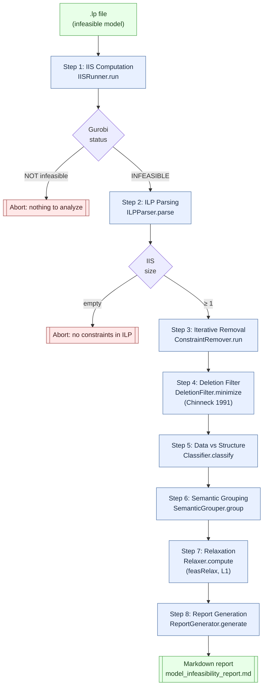
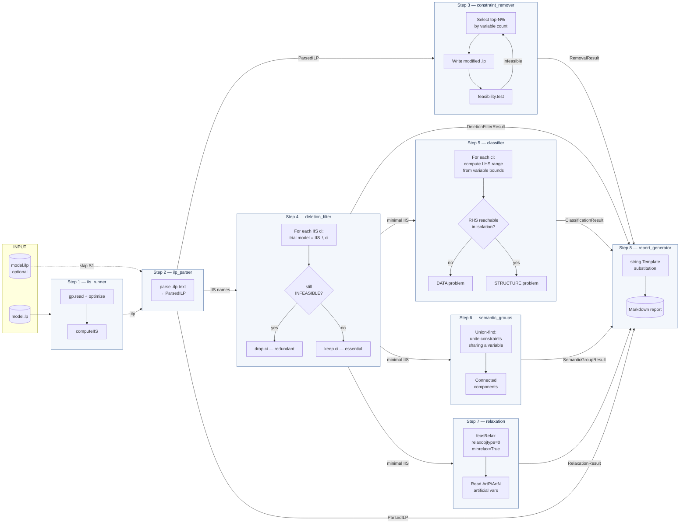

# IIS Summarization — Pipeline Flowchart

Visual reference for the 8-step analysis pipeline. Complements `SKILL.md` (skill-runner orchestration) and `README.md` (user-facing overview).

---

## High-level pipeline (Mermaid)



---

## Detailed data flow



---

## ASCII pipeline (rendering-agnostic)

```
[ model.lp ]
     │
     ▼
┌─────────────────────────────────────────────────────────────┐
│ Step 1 — IIS Computation          (iis_runner)              │
│   • gp.read(lp) → model                                     │
│   • model.optimize() — confirm status == INFEASIBLE         │
│   • MIP? solve LP relaxation first; if relaxation is        │
│     infeasible, compute the IIS on it (all-LP, faster)      │
│   • computeIIS() — on "Cannot compute IIS on a feasible     │
│     model", retry once with NumericFocus=3 + Presolve=0     │
│   • query IISConstr / IISLB / IISUB / IISMinimal attrs;     │
│     flag default-LB=0 variables in the IIS                  │
│   • model.write(model_iis.ilp)                              │
└─────────────────────┬───────────────────────────────────────┘
                      ▼
┌─────────────────────────────────────────────────────────────┐
│ Step 2 — ILP Parsing              (ilp_parser)              │
│   • tokenize .ilp line-by-line                              │
│   • extract constraint names/bodies, bounds, integrality    │
│   • return ParsedILP dataclass                              │
└─────────────────────┬───────────────────────────────────────┘
                      ▼
┌─────────────────────────────────────────────────────────────┐
│ Step 3 — Iterative Removal        (constraint_remover)      │
│   • select top-N% constraints by variable-reference count   │
│   • write modified .lp, test feasibility, iterate           │
│   • legacy heuristic path, kept for backward compat         │
└─────────────────────┬───────────────────────────────────────┘
                      ▼
┌─────────────────────────────────────────────────────────────┐
│ Step 4 — Deletion Filter          (deletion_filter)         │
│   for each ci in IIS:                                       │
│     trial = IIS ∖ {ci}  (retain only those constraints)     │
│     optimize(trial)                                         │
│     if INFEASIBLE → ci was redundant, drop permanently      │
│     else          → ci is essential, keep                   │
│   ⇒ provably minimal IIS (Chinneck 1991)                    │
└─────────────────────┬───────────────────────────────────────┘
                      ▼
┌─────────────────────────────────────────────────────────────┐
│ Step 5 — Data vs Structure        (classifier)              │
│   for each ci:                                              │
│     compute [lhs_min, lhs_max] using variable bounds alone  │
│     if RHS unreachable in that interval → DATA problem      │
│     else (conflict with other constraint) → STRUCTURE       │
└─────────────────────┬───────────────────────────────────────┘
                      ▼
┌─────────────────────────────────────────────────────────────┐
│ Step 6 — Semantic Grouping        (semantic_groups)         │
│   • build bipartite graph: constraints ↔ variables          │
│   • weighted quick-union with path compression              │
│   • project → disjoint "conflict subsystems"                │
└─────────────────────┬───────────────────────────────────────┘
                      ▼
┌─────────────────────────────────────────────────────────────┐
│ Step 7 — Relaxation Analysis      (relaxation)              │
│   • model.feasRelax(obj=L1, minrelax=True, crelax=True)     │
│   • penalty = 1.0 for IIS constraints, 0 elsewhere          │
│   • read back ArtP_<c>, ArtN_<c> variable values            │
│   ⇒ minimum RHS Δ per constraint                            │
└─────────────────────┬───────────────────────────────────────┘
                      ▼
┌─────────────────────────────────────────────────────────────┐
│ Step 8 — Report Generation        (report_generator)        │
│   • build template substitutions dict                       │
│   • string.Template.safe_substitute()                       │
│   • write {model}_infeasibility_report.md                   │
└─────────────────────┬───────────────────────────────────────┘
                      ▼
            [ Markdown report ]
```

---

## Data-contract reference

Each step produces a typed dataclass. The analyzer orchestrator holds references to all of them and hands them to the report generator.

| Step | Module | Input type(s) | Output dataclass | Key fields |
|------|--------|---------------|-------------------|------------|
| 1 | `iis_runner` | `Path`, `int` | `IISRunResult` | `success`, `ilp_file`, `elapsed_seconds`, `timed_out` |
| 2 | `ilp_parser` | `Path` | `ParsedILP` | `constraints`, `variable_refs`, `bounds`, `binary_vars` |
| 3 | `constraint_remover` | `ParsedILP`, `Path` | `RemovalResult` | `success`, `culprit_constraints`, `iterations_performed` |
| 4 | `deletion_filter` | `Path`, `list[str]` | `DeletionFilterResult` | `minimal_iis`, `dropped_as_redundant`, `reduction_ratio` |
| 5 | `classifier` | `Path`, `list[str]` | `ClassificationResult` | `classifications`, `counts`, `data_problems`, `structure_problems` |
| 6 | `semantic_groups` | `Path`, `list[str]` | `SemanticGroupResult` | `groups[].constraints`, `groups[].variables`, `group_count` |
| 7 | `relaxation` | `Path`, `list[str]` | `RelaxationResult` | `constraint_relaxations[]`, `total_violation`, `success` |
| 8 | `report_generator` | all of the above | `Path` | (report file path) |

---

## Control-flow switches

The analyzer accepts runtime flags to skip expensive stages. Useful for large models or iterative debugging:

```
┌──────────────────────────┬────────────────────────────────────────┐
│ CLI flag                 │ Effect                                 │
├──────────────────────────┼────────────────────────────────────────┤
│ --ilp PATH               │ Skip Step 1; use provided .ilp file    │
│ --skip-minimize          │ Skip Step 4 (deletion filter)          │
│ --skip-classify          │ Skip Step 5 (DATA/STRUCTURE diagnosis) │
│ --skip-grouping          │ Skip Step 6 (semantic grouping)        │
│ --max-iter N             │ Cap Step 3 iterations                  │
│ --batch-fraction F       │ Fraction removed per Step 3 iteration  │
│ --iis-timeout SEC        │ Step 1 wall-clock limit                │
│ --feasibility-timeout    │ Per-trial limit for Steps 3/4          │
│ --iis-method N           │ Gurobi IISMethod (0-3) for Step 1      │
│ --numeric-focus N        │ Gurobi NumericFocus (0-3) for Step 1   │
│ --threads N              │ Gurobi Threads for Step 1 sub-solves   │
│ --seed-ilp PATH          │ Warm-start from a previous IIS (the    │
│                          │ seed is verified against today's data; │
│                          │ stale seeds fall back to computeIIS)   │
└──────────────────────────┴────────────────────────────────────────┘
```

---

## Failure modes & fallbacks

```
Step 1 fails (Gurobi unavailable / model not infeasible)
    → pipeline aborts; no report produced.

Step 2 fails (empty ILP)
    → pipeline aborts.

Step 3 does not reach feasibility within max_iter
    → removal.success = False; pipeline continues;
      report marked "incomplete"; Steps 4–8 still run.

Step 4 fails (gurobipy missing)
    → deletion.success = False; effective_iis_names falls back to raw IIS;
      Steps 5–7 continue using the un-minimized set.

Step 5 fails
    → classification.success = False; report shows "unavailable".

Step 6 fails
    → grouping.success = False; report shows "unavailable".

Step 7 fails
    → relaxation.success = False; Remediation Plan shows "unavailable".

Step 8 always runs (never gated) — produces a report even on partial results.
```
